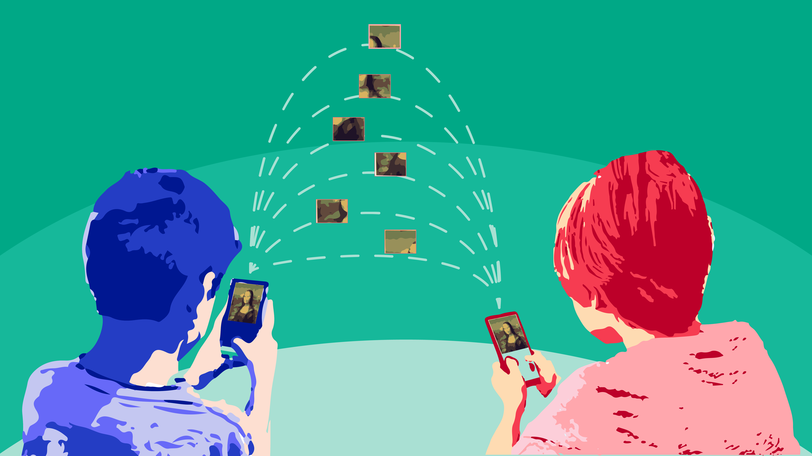
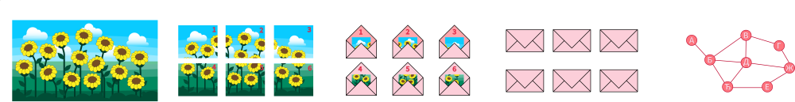
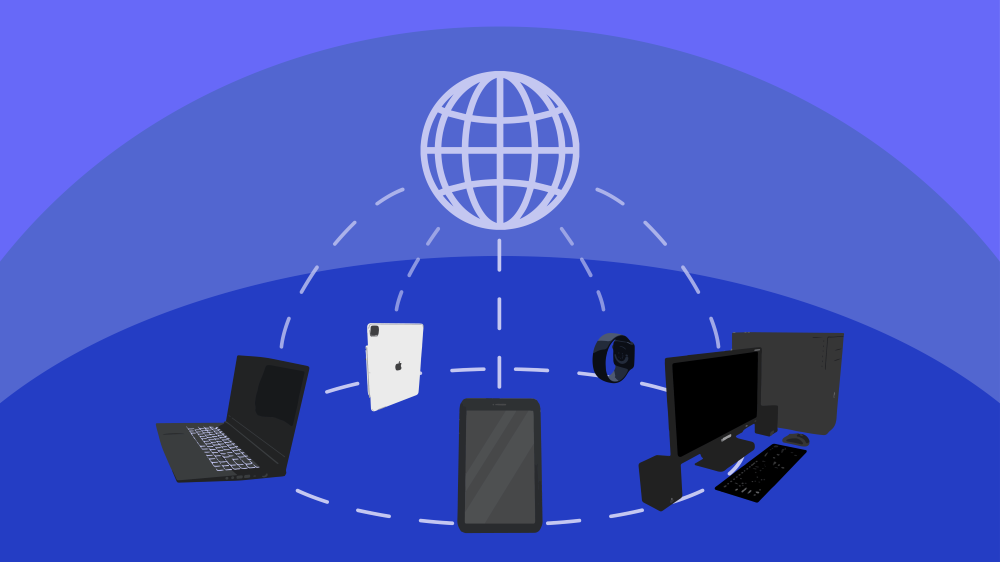
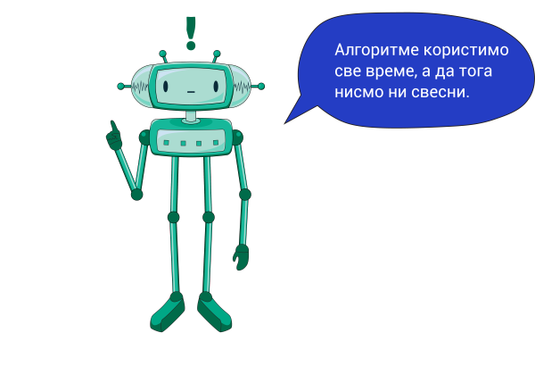

Добродошли у Дигитални свет!
============================

Заједни ћемо кренути на узбудљиво путовање кроз технолошке тајне и истражити која је твоја улога у дигиталном свету. Да ли си икада размишљао/ла о томе како да паметно користиш дигиталне уређаје? Спреми се за обиље забаве и нових сазнања!

Замисли да су дигитални уређаји твоји чаробни савезници који ти помажу да учиш и ствараш на потпуно нов начин. Прво ћемо заједно научити како да користиш онлајн платформу за учење уз подршку твојих наставника или чланова породице. А затим, ћемо истраживати како самостално можеш да користиш дигиталне уџбенике и откријеш све чаролије новог сазнања које они у себи носе.

Ако си икада желео/ла да сликаш и уређујеш слике, научићемо те како то да радиш уз помоћ одговарајуће апликације. Такође, истражићеш тајанствени свет покретних слика и како да их креираш, додајући им забавне елементе.

Али то није све! Разговараћемо и о томе зашто се уређаји повезују на мреже, као што је интернет, и како ти то може помоћи да делиш информације и садржаје и сарађујеш са другима. Наравно, важно је и да научиш како да се заштитиш док истражујеш дигитални свет размењујући садржаје и комуницирајући са другима користећи дигиталне уређаје.

На овом путовању, упознаћеш се са добрим странама и изазовима комуникације путем дигиталних уређаја. Такође, ћемо разговарати о разликама између прихватљивог и неприхватљивог понашања на интернету и како да се заштитиш од неприхватљивих садржаја и ситуација. А, ако се икада нађеш у неугодној ситуацији на интернету, сретнеш се са неприкладним садржајем или особама, знаћеш како да адекватно реагујеш.

И не заборави, твоји лични подаци су драгоцени! Научићемо те како да их чуваш док истражујеш дигитални свет. А када се играш и учиш онлајн, научићемо те и како да очуваш своје здравље и како на безбедан начин да чуваш дигиталне уређаје.

Уз све ово, упознаћеш се са појмом "алгоритам" и научићеш како ћеш да креираш једноставне рачунарски програме користећи визуелни програмски језик. Разумећеш како програми управљају дигиталним уређајима. Очекује те много изазова, али не брини - заједно ћемо сваки проблем успешно савладати!

Како бисмо ти олакшали истраживање дигиталног света, поред материјала које пружа овај курс, ту је и твоја **радна свеска**. У њој ћеш решавати разноврсне задатке које смо посебно припремили за тебе. Било би одлично да уз сваку лекцију имаш и своју радну свеску. Ако ти је потребна помоћ, нека ти родитељ или блиска одрасла особа помогне да је одштампаш и припремиш. 

Дакле, спремни смо да заједно откријемо чуда дигиталног света? Сјајно! Кроз истраживање, учење и стварање, заједно ћемо проћи кроз ову неодољиву дигиталну авантуру.
