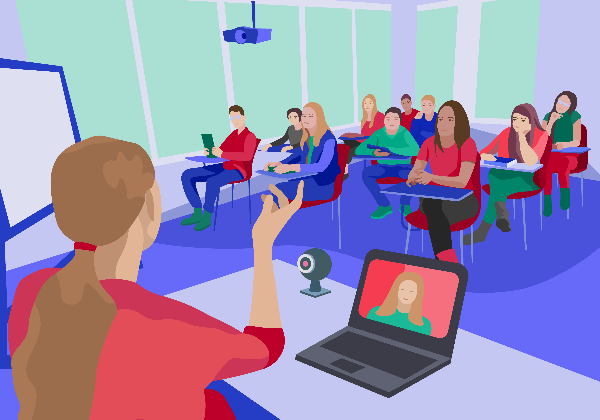

Учење помоћу дигиталних уређаја
===============================

.. infonote::

 .. image:: ../../_images/robot11.png
    :height: 120
    :align: left

 У овој лекцији ћемо видети на које све начине можеш да учиш као и које дигиталне уређаје користиш током учења. Сазнаћеш шта је то **учење на даљину** и када ти оно све може бити корисно. Када урадиш све задатке и одговориш на сва питања у лекцији знаћеш да упоредиш начин на који учиш у школи са онлајн учењем односно учењем на даљину.

|

Хајде да се подсетимо! У радној свесци на страници **2** oбој и именуј све дигиталне уређаје на слици. 

|

.. image:: ../../_images/bojanka2.png
    :width: 700
    :align: center

|

Одабери један дигитални уређај са слике и у радној свесци на страници **3**  опиши како га користиш.

-----------

Пажљиво погледај слику. 

.. questionnote::

 .. image:: ../../_images/robot12.png
    :height: 110
    :align: left

 Вероватно си до сада приметио/ла да сви ми учимо на различите начине. Неко од нас више воли да учи чим устане, а неко прво мора да доручкује и тек онда је спреман/на за учење. Твој задатак је да опишеш како учиш у школи, а како код куће. У радној свесци на страници **3** пронаћи ћеш простор где можеш да нацрташ или речима опишеш како све учиш.

.. questionnote::

 .. image:: ../../_images/robot12.png
    :height: 110
    :align: left

 Размисли које активности радиш помоћу дигиталног уређаја. У радној свесци на страници **3** ћеш пронаћи табелу. Сада је твој задатак да заокружиш све активности за које можеш да користиш дигиталне уређаја за учење. Опиши како користиш дигиталне уређаје?

Вероватно си до сада приметио/ла да дигитални уређај мора да буде **повезан на интернет** да бисмо га користили за учење. Такође, дигитални уређај можеш да користиш када ниси у могућности да идеш у 
школу, када ти је потребна подршка у учењу, за решавање домаћих задатака и припрему за рад у школи. Када користиш дигитални уређај и 
интернет за учење такав начин учења назива се **онлајн учење** (или учење на даљину).

.. questionnote::

 Да ли си некад учио/ла онлајн? Ако јеси, опиши како је то изгледало. Да ли ти се допало? Зашто?

 

.. image:: ../../_images/robot13.png
    :height: 200
    :align: right

------------

**Домаћи задатак**

|

Твој задатак када дођеш кући је да отвориш своју радну свеску на страни **3** и да нацрташ или својим речима опишеш један свој дан у школи. На пример, покажи шта волиш да радиш у школи? 

|