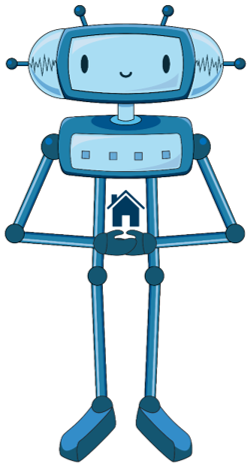

Учење помоћу дигиталних уређаја
===============================

.. infonote::

 .. image:: ../../_images/robot11.png
    :height: 120
    :align: left

 Када урадиш све задатке и одговориш на сва питања у лекцији знаћеш да упоредиш начин на који учиш у школи са онлајн учењем путем 
 школске платформе.

|

Хајде да се подсетимо! У радној свесци на страници **XX** oбој и именуј све дигиталне уређаја на слици. 

|

.. image:: ../../_images/bojanka2.png
    :width: 780
    :align: center

|

Одабери један дигитални уређај са слике и у радној свесци на страници **XX**  опиши како га користиш.

-----------

Пажљиво погледај слику. 

|

.. image:: ../../_images/slika.png
    :width: 780
    :align: center

.. questionnote::

 .. image:: ../../_images/robot12.png
    :height: 110
    :align: left

 Како уче деца  у школи? А, како код  куће?

|

Сви ми учимо на различите начине. Опиши како учиш у школи, а како код куће. У радној свесци на страници **XX** напиши како све учиш.

|

Размисли које активности радиш помоћу дигиталног уређаја. У радној свесци на страници **XX** заокружи све активности из горње 
табеле за које можеш да користиш дигиталне уређаја за учење. Опиши како користиш дигиталне уређаје?

Дигитални уређај мора да буде повезан на интернет да би га користили за учење. Можеш да га користиш када ниси у могућности да идеш у 
школу, када ти је потребна подршка у учењу, за решавање домаћих задатака и припрему за рад у школи. Када користиш дигитални уређај и 
интернет за учење такав начин учења назива се **онлајн учење** (или учење на даљину).

.. questionnote::

 Да ли си некад учио онлајн? Ако јеси, опиши како је то изгледало. Да ли ти се допало? Зашто?

Ако ниси, шта мислиш, како би изгледало онлајн учење? Да ли би ти се допало? Зашто?

Опиши како учиш онлајн.  

|

------------

**Домаћи задатак**

|

Опиши један свој дан у школи. Шта волиш да радиш у школи? 

|