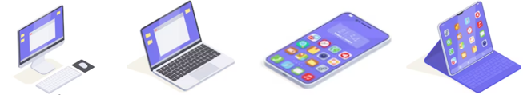
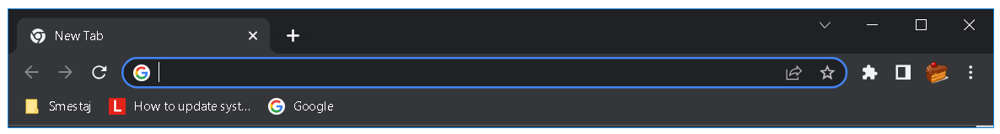
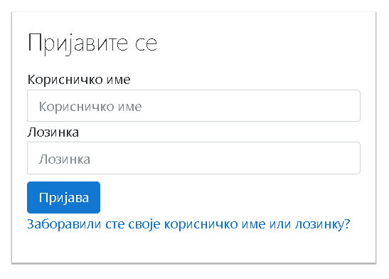
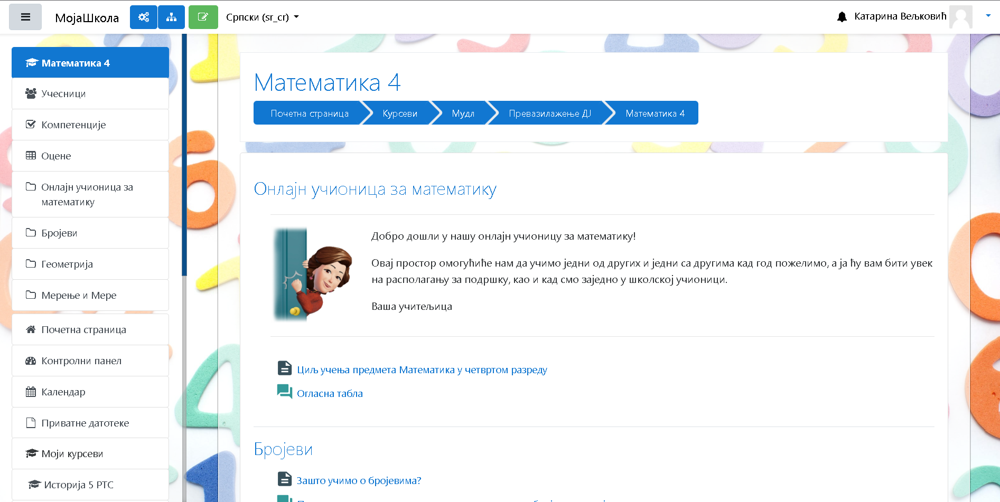

Школска платформа за онлајн час
===============================

.. |google| image:: ../../_images/google.png
            :width: 100px

.. |kv| image:: ../../_images/kv.png
            :width: 15px

.. infonote::

 .. image:: ../../_images/robot11.png
    :height: 120
    :align: left

 Да ли си некада користио/ла школску онлајн платформу за учење? У случају да ниси, када урадиш све задатке и одговориш на сва питања у лекцији сазнаћеш да постоји више онлајн платформи које можеш да користиш за учење, а сазнаћеш и како да их користиш.

|

Школска платформа је место на интернету на коме можеш безбедно да учиш. Уз помоћ учитеља или блиске особе приступи школској 
платформи. Постоје различите платформе за учење. 

Испод можеш видети сличице које представљају такозване **иконице** различитих онлајн платформи. **Икона** или како се чешће може чути у говору **иконица** је сличица на коју кликнеш када желиш да покренеш неку апликацију или рачунарски програм на свом дигиталном уређају. 

 

.. csv-table:: 
   :widths: auto
   :align: center
   
   "|google|", "|teams|", "|moodle|"
   Гугл класрум, Мајкрософт тимс, Мудл
   (енг. *Google classroom*), (енг. *Microsoft Teams*), (енг. *Moodle*)

.. questionnote::

 .. image:: ../../_images/robot12.png
    :height: 110
    :align: left

 Твој задатак је да у радној свесци на страни **4** пронађеш исту овакву табелу која приказује различите онлајн платформе. Када пронађеш табелу, твој задатак је да обојиш квадратић испод оне онлајн платформе коју користиш у својој школи. Уколико у школи не користиш ни једну од приказаних онлајн платформи немој да се бринеш, сигурно ћеш се у старијим разредима сусрести са неком од њих.

|

Важно је да знаш да без обзира коју онлајн платформу у школи користиш, поступак којим се приступа платформи је скоро увек исти. У наставку можеш да видиш на који начин приступаш онлајн платформи. 

|

.. csv-table:: 
   :widths: auto
   :align: left

   "1. Потребно је да користиш дигитални уређај који је повезан на интернет."
   "|p1|"
   "2. Затим покрени интернет прегледач, кликом на сличицу. На слици испод можеш да видиш иконице неких од најпознатијих интернет прегледача."
   "|p2|"
   "3. Уз помоћ учитеља или учитељице или теби блиске одрасле особе у адресној линији прегледача унеси адресу школске платформе за учење."
   "|p3|"
   "4. Када се отвори прозор за приступ онлајн платформи за учење потребно је да унесеш корисничко име и шифру. Ово такође радиш уз помоћ учитеља или учитељице или теби блиске одрасле особе."
   "|p4|"
   "5. Притисни дугме за приступ школској платформи."
   "|p5|"

Без обзира на то коју онлајн платформу за учење твоја школа користи **поступак за приступ је врло сличан**. 

.. questionnote::

 .. image:: ../../_images/robot12.png
    :height: 110
    :align: left

 Да ли твоја школа има онлајн платформу за учење?  
 
 Ако има, у радној свесци на страници **5** напиши шта се све на онлајн платформи налази од садражаја. Такође, опиши и како је ти и твоји другари користите за учење од куће.

|

.. image:: ../../_images/robot13.png
    :height: 200
    :align: right

------------

**Домаћи задатак**

|

Уз помоћ родитеља или теби блиске одрасле особе приступи школској платформи. Истражи школску платформу. Прегледај материјал који је 
поставио учитељ или учитељица. 

|

У случају да твоја школа нема онлајн платформу за учење нека ти родитељи или теби блиска одрасла особа 
помогну да истражиш Петљину платформу на којој се налазе материјали за учење.

|