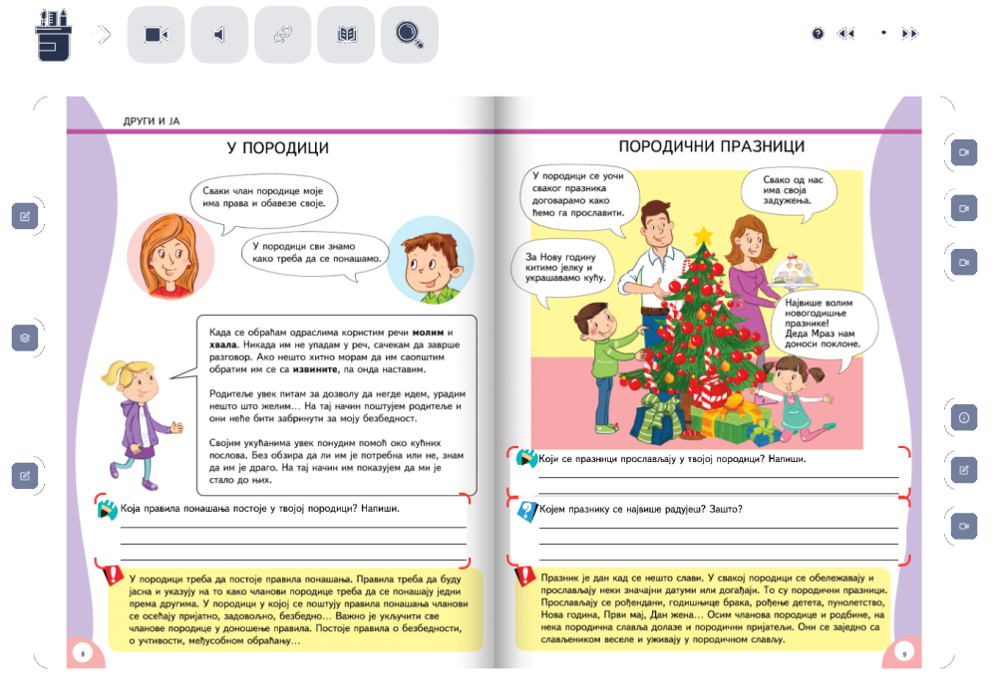

Учење помоћу дигиталних уџбеника
================================

.. infonote::

 .. image:: ../../_images/robot11.png
    :height: 120
    :align: left

 Када урадиш све задатке и одговориш на сва питања у лекцији знаћеш да самостално користиш дигиталне уџбенике за учење

|

За коришћење дигиталног уџбеника потребан је дигитални уређај повезан на интернет.

Дигитални уџбеник можеш да користиш за самостално учење и ван школе. Ови уџбеници садрже различите дигиталне садржаје, 
тачније имају поред текста и слике и видео-записе и аудио-записе. Помоћу дигиталног уџбеника лако можеш да  провериш своје знање.

    
    *Изглед једног дигиталног уџбеника*

У папирном и дигиталном уџбенику из Природе и друштва пронађи лекцију коју сте последњу радили. Користи оба уџбеника да урадиш све 
задатке, тако што ћеш прво задатке да урадиш у папирном уџбенику, а затим у дигиталном. 

|

.. У радној свесци на страници **XX** напиши која је разлика између папирног и дигиталног уџбеника. 

Које су предности, а који недостаци? Попуни одговарајуће колоне.

.. csv-table:: 
   :header: "**Папирни уџбеник**", **Дигитални уџбеник**
   :widths: auto
   :align: center

   "", ""

   |

--------------

.. questionnote::

    Како учиш, радиш задатке, провераваш тачност урађеног у папирном и дигиталном уџбенику? 
    
    Да ли ти је потребна помоћ родитеља? Објасни због чега?

