Дигитална слика
===============

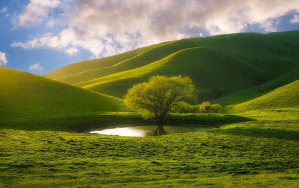

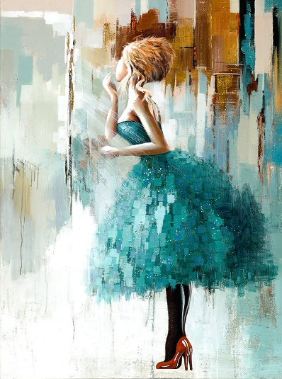

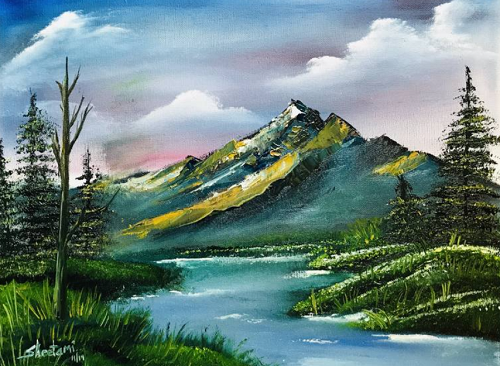

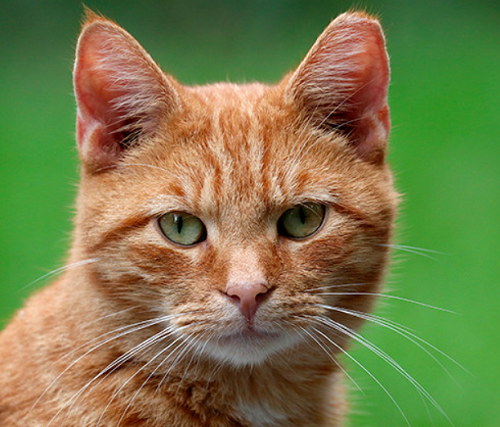

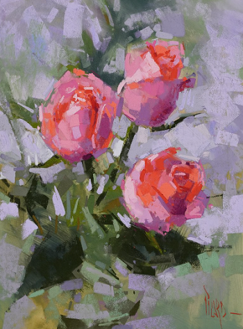

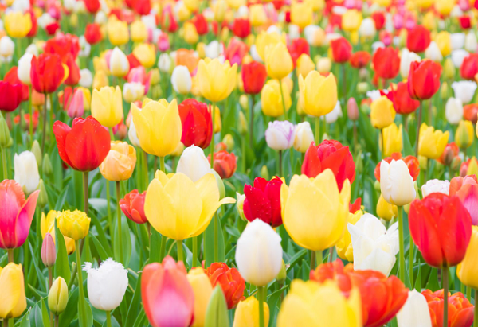

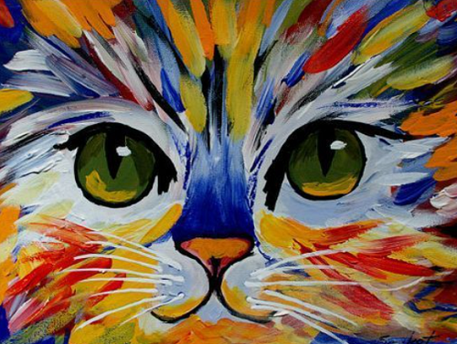

.. |kv| image:: ../../_images/kv.png
            :width: 15px

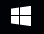

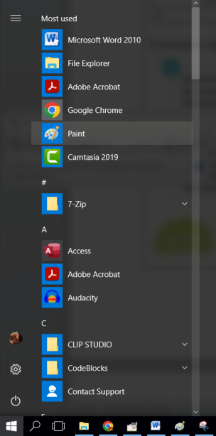

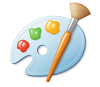

.. |lk| image:: ../../_images/lk.png
            :width: 50px

.. |pip| image:: ../../_images/pip.png
            :width: 50px

.. |o| image:: ../../_images/o.png
            :width: 50px

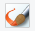

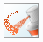

.. infonote::

 .. image:: ../../_images/robot11.png
    :height: 120
    :align: left

 Да ли се на зидовима твоје учионице или унутар школе налазе неке слике? Шта мислиш како су оне настале? Да ли их је неко руком цртао или су настале уз помоћ фотоапарата или их је неко нацртао уз помоћ дигиталног уређаја као што је то на пример рачунар? Када урадиш све задатке и одговориш на сва питања у лекцији моћи ћеш да препознаш слике које су настале употребом дигиталног 
 уређаја, као и да креираш, чуваш и поново уређујеш дигиталну слику користећи одговарајућу апликацију. 

Хајде да видимо како твоја слика која је настала на папиру на папиру постаје дигитална слика.

.. infonote::

 .. image:: ../../_images/robot14.png
    :height: 110
    :align: left

 Твој први задатак је да у радној свесци на страници број **7** пронађеш простор за цртање. Следећи корак је да припремиш бојице или фломастере или водене боје и онда пусти машти на вољу и нацртај парк у којем волиш да се играш. Када завршиш свој цртеж, замоли учитеља или учитељицу или неку теби блиску одраслу особу да твој цртеж фотографише уз помоћ дигиталног уређаја.

.. mchoice:: p111a
   :hide_labels:
   :answer_a: Да
   :answer_b: Не
   :feedback_a: Браво, ово је тачан одговор. Када цртеж на папиру сликамо дигиталним уређајем, тај исти цртеж добија нови облик и постаје дигитална слика.
   :feedback_b: Нетачан одговор! Размисли још мало. 
   :correct: a

   Да ли је твој цртеж постао дигиталан, када га је учитељ или учитељица фотографисала помоћу дигиталној уређаја? Означи кружић испред тачног одговора.

Видео/ла си да када слику са папира фотографишемо уз помоћ дигиталног уређаја, она добија свој нови облик и постаје **дигитална слика**. Важно је да знаш да постоји много алата које људи користе да би направили дигиталну слику. 

Као што си у радној свесци нацртао/ла слику парка у којем се играш, тако и цртање и сликање можеш да радиш и коришћењем дигиталног уређаја уз помоћ различитих програма за цртање. 
У наредним лекцијама упознашеш се са једним таквим програмом уз помоћ којег ћеш моћи да правиш, мењаш и чуваш своје дигиталне слике. Тај програм се зове **Бојанка** (енг. *Paint*). 

.. suggestionnote::

 Важно је да запамтиш да слике које настају коришћењем дигиталних уређаја називају се **дигиталне слике**.

-------------

У радној свесци на страници **7** се налази иста оваква табела са сликама коју видиш и овде. Твој задатак је да пажљиво погледаш све слике и онда зеленом бојом обојиш квадратић испод слике за коју мислиш да је настала коришћењем дигиталног уређаја, а црвеном бојом квадратић испод слике за коју сматраш да је руком осликана.

.. csv-table:: 
   :widths: auto
   :align: center
   
   "|s2|", "|s1|", "|s3|","|s4|"
   "|s5|", "|s6|", "|s7|", "|s8|"

-------------

Сада када си успешно обележио/ла све слике које су осликане руком и оне које то нису, хајде да видимо како да у програму Бојанка ти направиш своју прву дигиталну слику. За почетак је потребно да покренемо програм Бојанка, а то радиш на следећи начин уз помоћ учитеља или учитељице или теби блиске одрасле особе: 

|

1. Кликни на иконицу |b1|. Тада ће ти се отварити листа са списком свих програма. 

2. Из спискa свих програма одабери програм Бојанка(енг. *Paint*). |b2|

3. Кликни на иконицу |b3| да покренеш програм.

Уколико ти се отворио прозор као овај на слици испод, браво! Покренуо/ла си програм Бојанка. Хајде да видимо шта све у овом програму за цртање можемо да радимо.

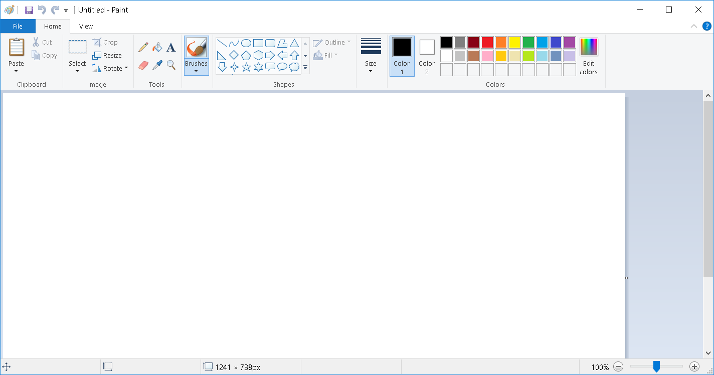

 

У следећим табелама можеш да видиш неке о могућности које ти програм Бојанка пружа. У наредним лекцијама ћемо их све или већину испробати. 

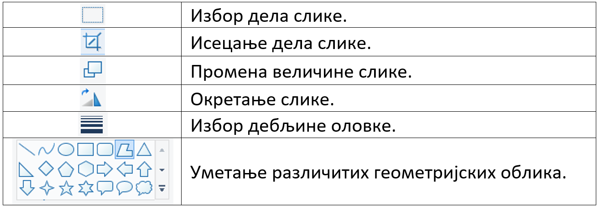

|

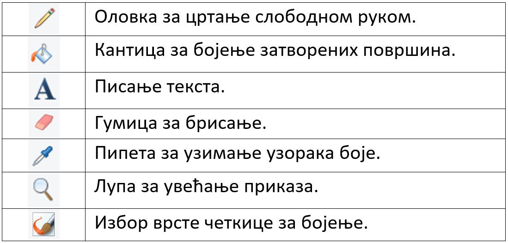

|

Такође, за цртање у програму Бојанка користићеш неколико команди миша као што је то показано на сликама испод.

|

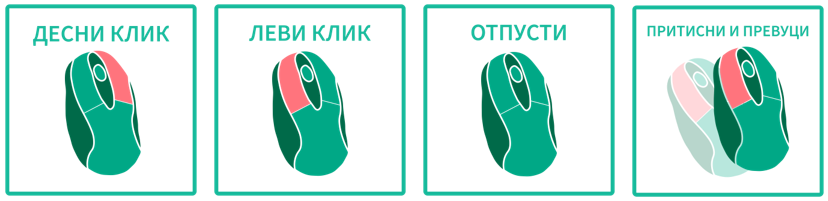

-------------

На доњој слици нацртан је плави облак. 

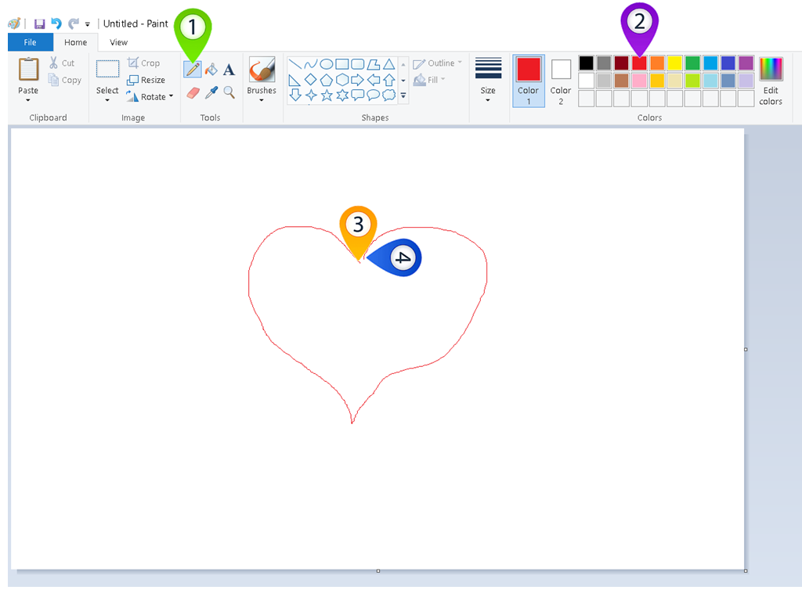

Облак црташ тако што кликнеш левим тастером миша |lk| на оловку (1), затим кликнеш левим тастером миша |lk| на црвену 
боју (2), а онда, (3) држећи притиснут леви тастер миша |pip| црташ облак. Када завршиш са цртањем (4), отпусти леви 
тастер миша |o|.

.. infonote::

 .. image:: ../../_images/robot14.png
    :height: 110
    :align: left

 Сада када си видео/ла како изгледа програм Бојанка време је да ти нацрташ свој први цртеж. Уз помоћ учитеља или учитељице покрени Бојанку, и затим нацртај срце по датом упутству. Ако желиш можеш да изабереш било коју другу боју за своје срце.

|

Нацртај различите врсте линија зелене боје коришћењем алата |cet1|. У падајућој листи овог алата можеш да пронађеш различите 
врсте алате (четкицу за бојење |cet1|, перо за лепо писање (калиграфија) |cet2|, спреј |cet3|, четкицу за уљане боје |cet4|, 
воштане боје |cet5|, фломастер |cet6|, обичну оловку |cet7|, четкицу за водене боје |cet8|)

----

Сада када си се упознао/ла са различитим четкицама које можеш да користиш за своје дигиталне цртеже хајде да их искористимо за следеће задатке. 

.. infonote::

 .. image:: ../../_images/robot14.png
    :height: 110
    :align: left

 Поново отвори програм Бојанка уз помоћ учитеља или учитељице. Користећи перо за лепо писање |cet2| напиши своје име. Име напиши ћириличним и латиничним писмом. Одабери боју коју желиш.

.. infonote::

 .. image:: ../../_images/robot14.png
    :height: 110
    :align: left

 Твој следећи задатак је да нацрташ цвет. Одабери своју омиљену боју за цвет. Такође, можеш да користиш коју год четкицу желиш. Ако желиш да твој цвет буде шарен предлажемо ти да за сваку латицу изабереш другу боју. Уз помоћ учитеља или учитељице покрени програм Бојанка и пусти машти на вољу.

|

.. image:: ../../_images/robot13.png
    :height: 200
    :align: right

------------

**Домаћи задатак**

|

Уз помоћ родитеља или друге блиске одрасле особе пронађи неко уметничко дело које ти се свиђа – то може да буде и слика 
која је окачена на зиду дневне собе твоје баке, у твојој кући или у школи, а може да буде и слика коју си видео/ла и у неком музеју. 

------------

У радној свесци на страници **8** се налази одвојен део где можеш да нацрташ уметничко дело које ти се свиђа. Пажљиво размишљај о облицима на слици и бојама које користиш. 

.. questionnote::

 Сада када си завршио/ла свој цртеж у радној свесци, шта мислиш, да ли можеш овај цртеж да нацрташ користећи рачунарски програм Бојанка?

|
