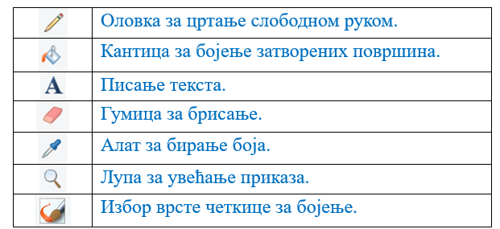

Дигитална слика
===============

.. |s2| image:: ../../_images/s2.png
            :height: 150px

.. |s4| image:: ../../_images/s4.png
            :height: 150px

.. |s7| image:: ../../_images/s7.png
            :height: 150px

.. |kv| image:: ../../_images/kv.png
            :width: 15px

.. |b1| image:: ../../_images/b1.png
            :width: 30px

.. |b3| image:: ../../_images/b3.png
            :width: 30px

.. |lk| image:: ../../_images/lk.png
            :width: 50px

.. |pip| image:: ../../_images/pip.png
            :width: 50px

.. |o| image:: ../../_images/o.png
            :width: 50px

.. |cet1| image:: ../../_images/cet1.png
            :width: 50px

.. |cet2| image:: ../../_images/cet2.png
            :width: 100px

.. |cet6| image:: ../../_images/cet6.png
            :width: 50px

.. |cet7| image:: ../../_images/cet7.png
            :width: 50px

.. |cet8| image:: ../../_images/cet8.png
            :width: 50px

.. infonote::

 .. image:: ../../_images/robot11.png
    :height: 120
    :align: left

 Када урадиш све задатке и одговориш на сва питања у лекцији моћи ћеш да препознаш слике које су настале употребом дигиталног 
 уређаја, ако и да креираш, чуваш и поново уређујеш дигиталну слику користећи одговарајућу апликацију. 

Цртање и сликање можеш да радиш и коришћењем дигиталног уређаја уз помоћ различитих програма за цртање. 
Један од таквих програма је и **Бојанка** (енг. *Paint*). 

Слике које настају коришћењем дигиталних уређај називају се **дигиталне слике**.

-------------

У радној свесци на страници **XX** обој зеленом бојом квадратић испод слике која је дигитална, а црвеном бојом квадратић испод слике 
која није дигитална.

.. csv-table:: 
   :widths: auto
   :align: center
   
   "|s2|", "|s1|", "|s3|","|s4|"
   "|kv|", "|kv|", "|kv|", "|kv|"
   "|s5|", "|s6|", "|s7|", "|s8|"
   "|kv|", "|kv|", "|kv|", "|kv|"

-------------

Програм Бојанка покрећеш на следећи начин:

|

1. Кликни на иконицу |b1|. Oтвара се списак програма. 

2. Из спискa свих програма |b2| одабери програм Бојанка.

3. Кликни на иконицу |b3| да покренеш програм.

.. image:: ../../_images/b4.png
    :width: 780
    :align: center

|

.. image:: ../../_images/t1.png
    :width: 550
    :align: center

|

|

За цртање у програму Бојанка користићеш неколико команди миша. 

|

-------------

На доњој слици нацртан је плави облак. 

Облак црташ тако што кликнеш левим тастером миша |lk| на четкицу (1), затим кликнеш левим тастером миша |lk| на плаву 
боју (2), а онда, (3) држећи притиснут леви тастер миша |pip| црташ облак. Када завршиш са цртањем (4), отпусти леви 
тастер миша |o|.

.. questionnote::

 .. image:: ../../_images/robot14.png
    :height: 110
    :align: left

 Уз помоћ учитеља или учитељице покрени Бојанку, и затим нацртај облак по датом упутству.

|

Нацртај различите врсте линија зелене боје коришћењем алата |cet1|. У падајућој листи овог алата можеш да пронађеш различите 
врсте алате (четкицу за бојење |cet1|, перо за лепо писање (калиграфија) |cet2|, спреј |cet3|, четкицу за уљане боје |cet4|, 
воштане боје |cet5|, фломастер |cet6|, обичну оловку |cet7|, четкицу за водене боје |cet8|)

----

Користећи перо за лепо писање |cet2| напиши своје име. Име напиши ћириличним и латиничним писмом. Одабери боју коју желиш.

.. questionnote::

 .. image:: ../../_images/robot14.png
    :height: 110
    :align: left

 Уз помоћ учитеља и учитељице покрени програм Бојанка. Нацртај цвет.

|

.. image:: ../../_images/robot13.png
    :height: 200
    :align: right

------------

**Домаћи задатак**

|

Уз помоћ родитеља или друге блиске одрасле особе треба да пронађеш  неко уметничко дело које ти се свиђа – то може да буде и слика 
која је окачена на зиду дневне собе твоје баке, у твојој кући или у школи, може да буде и слика коју си видео/ла и у неком музеју. 

------------

У радној свесци на страници **XX** нацртај слику у простору испод, пажљиво размишљајући о облицима на слици и боји која се користи. 

.. questionnote::

 Можеш ли овај цртеж да нацрташ користећи рачунарски програм?

|
