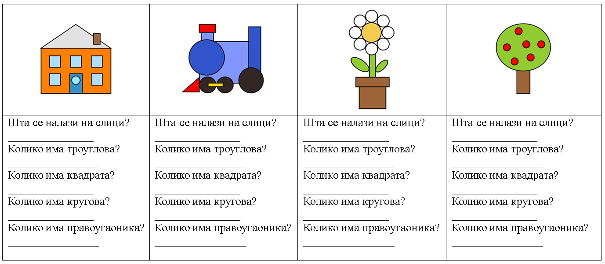

Исцртавање и бојење облика
==========================

.. |lk| image:: ../../_images/lk.png
            :width: 50px

.. |pip| image:: ../../_images/pip.png
            :width: 50px

.. |o| image:: ../../_images/o.png
            :width: 50px

.. |shift| image:: ../../_images/shift.png
            :width: 70px

.. |kantica| image:: ../../_images/kantica.png
            :width: 40px

.. infonote::

 .. image:: ../../_images/robot11.png
    :height: 120
    :align: left

 Када урадиш све задатке и одговориш на сва питања у лекцији моћи ћеш да исцртаваш и бојиш различите облике креирајући дигиталну 
 слику коришћењем одговарајуће апликације.

У програму Бојанка поред цртања слободном руком, можеш да црташ и различите геометријске облике 
(квадрат, круг, правоугаоник, троугао..). За то користиш алате 

.. image:: ../../_images/alati.png
    :height: 100
    :align: center

----------------

На доњој слици је нацртан црвени круг.

.. image:: ../../_images/crveni_krug.png
    :width: 780
    :align: center

Круг црвене боје црташ тако што кликнеш левим тастером миша |lk| на црвену боју у палети боја (1), затим, кликнеш левим тастером 
миша |lk| на алату за уметање геометријских облика (2), а онда, (3) држећи притиснут леви тастер миша |pip| и притиснут тастер |shift| са тастатуре црташ круг. Када завршиш са цртањем (4), отпусти леви тастер миша |o|

|

.. suggestionnote::

 Уколико не држиш тастер |shift| са тастатуре можеш нацртати и елипсу.

|

.. questionnote::

 .. image:: ../../_images/robot14.png
    :height: 110
    :align: left

 Уз помоћ учитеља или учитељице покрени Бојанку, и затим нацртај црвени круг по датом упутству.

|

Замоли учитељицу или учитеља да покрене програм Бојанка.

Нацртај све облике приказане на доњој слици.

|

.. image:: ../../_images/oblici1.png
    :width: 780
    :align: center

.. suggestionnote::

 Квадрат црташ такође коришћењем тастера |shift| са тастатуре.

|

У програму Бојанка можеш и обојити облике. За то користиш алатку |kantica|. Веома је важно да ти облици буду затворене контуре.

|

На доњој слици приказан је обојени квадрат црвене боје са зеленим страницама.

.. image:: ../../_images/crveni_kvadrat.png
    :width: 780
    :align: center

Црвени квадрат зелених ивица црташ тако што кликнеш левим тастером миша |lk| на зелену боју у палети боја (1), затим, 
кликнеш левим тастером миша |lk| на алат за уметање геометријских облика (2), а онда од (3) држећи притиснут леви тастер миша |pip| 
и притиснут тастер |shift| са тастатуре црташ квадрат. Када завршиш са цртањем (4), отпусти леви тастер миша |o| . З
атим, кликнеш левим тастером миша |lk| на алат кантица (5), па левим тастером миша |lk| на црвену боју у палети боја (6), и 
затим левим тастером миша |lk| унутар облика (7).

.. questionnote::

 .. image:: ../../_images/robot14.png
    :height: 110
    :align: left

 Уз помоћ учитеља или учитељице покрени Бојанку, и затим нацртај црвени круг по датом упутству.

|

Замоли учитељицу или учитеља да покрене програм Бојанка.

Нацртај све облике приказане на доњој слици.

|

.. image:: ../../_images/oblici2.png
    :width: 780
    :align: center

.. image:: ../../_images/robot13.png
    :height: 200
    :align: right

------------

**Домаћи задатак**

|

Пажљиво погледај следеће слике. У радној свесци на страници **XX** попуни доњу табелу.

|

