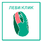
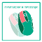
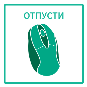
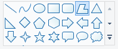
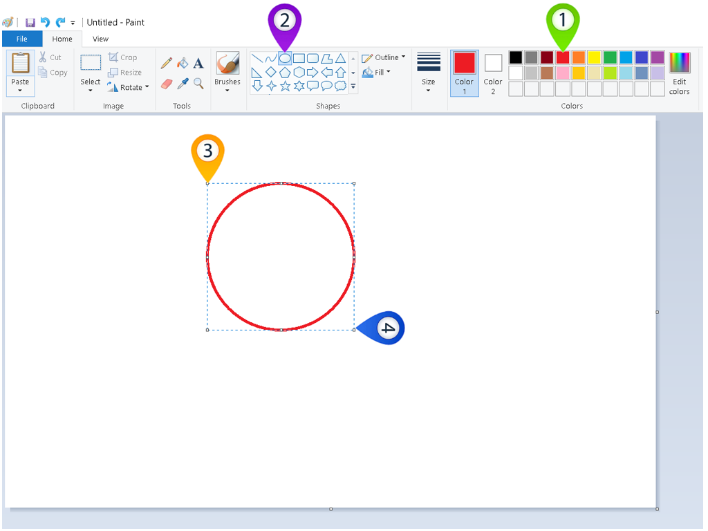
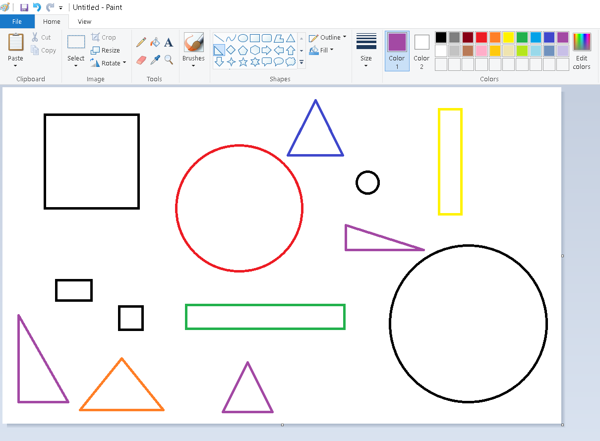
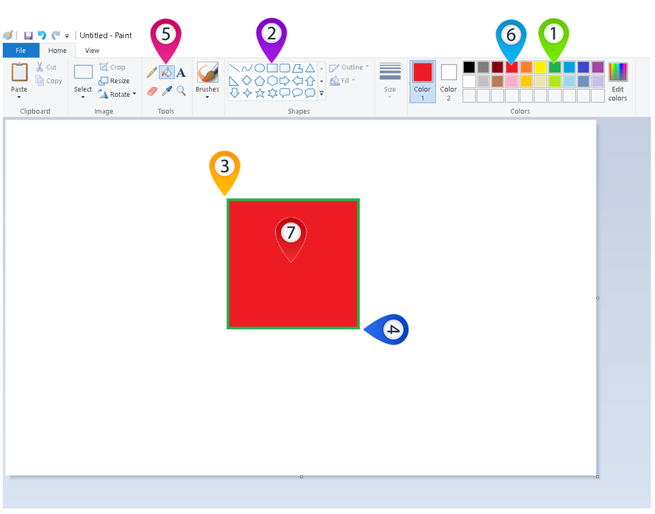
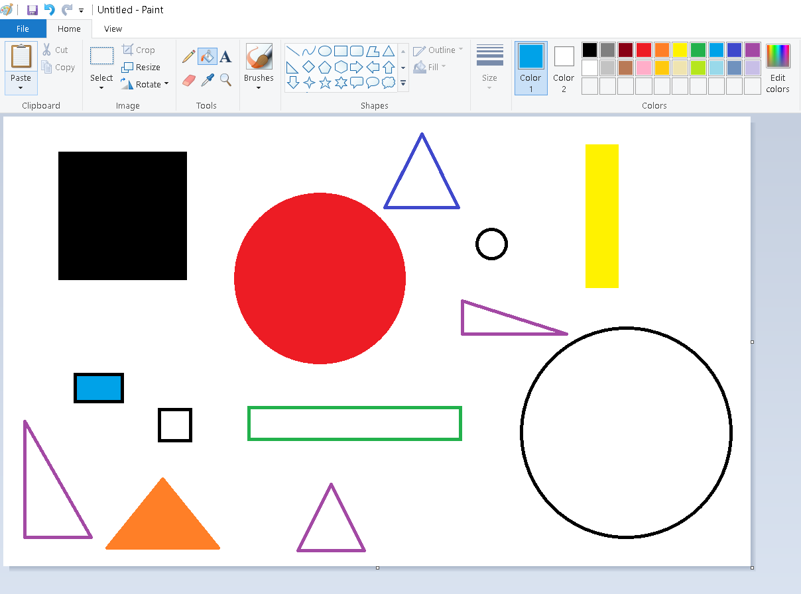

Исцртавање и бојење облика
==========================

.. infonote::

 .. image:: ../../_images/robot11.png
    :height: 120
    :align: left

 Да се подсетимо. У претходној лекцији си научио/ла шта је то дигитална слика и како она настаје, а потом си се упознао/ла и са програмом за цртање **Бојанка**. И не само то, него си научио/ла како да покренеш Бојанку и које алате за цртање можеш да користиш. У овој лекцији ћеш научити још могућности које ти програм Бојанка пружа. На пример, научићеш како да исцртаваш и бојиш различите облике креирајући дигиталну слику.

У програму Бојанка поред цртања слободном руком, можеш да црташ и различите геометријске облике 
(квадрат, круг, правоугаоник, троугао и слично). За то користиш следеће алате који су приказани на слици испод: 

----------------

На доњој слици је нацртан црвени круг.

Круг црвене боје црташ тако што кликнеш левим тастером миша |lk| на црвену боју у палети боја (1), затим, кликнеш левим тастером 
миша |lk| на иконицу алата за уметање геометријских облика (2), а онда, (3) држећи притиснут леви тастер миша |pip| и притиснут тастер |shift| са тастатуре црташ круг. Када завршиш са цртањем (4), отпусти леви тастер миша |o|

|

.. suggestionnote::

 Важно је да запамтиш да уколико не држиш тастер |shift| са тастатуре можеш нацртати и елипсу. Испробај.

|

.. infonote::

 .. image:: ../../_images/robot14.png
    :height: 110
    :align: left

 Сада је твој ред да провежбаш. Уз помоћ учитеља или учитељице покрени Бојанку, и затим нацртај црвени круг према упутству које је дато у горњем делу текста. Када завршиш са цртањем црвеног круга имамо још један задатака за тебе. Нацртај све облике приказане на доњој слици.

|

|

.. suggestionnote::

 Важно је да запамтиш да квадрат црташ такође коришћењем тастера |shift| са тастатуре.

|

Да ли си знао/ла да у програму Бојанка можеш и да обојиш облике? За то користиш алатку **кантица** |kantica|. Веома је важно да ти облици које бојиш буду затворене контуре.

|

На доњој слици можеш видети како изгледа обојени квадрат црвене боје са зеленим страницама.

Црвени квадрат зелених ивица црташ тако што кликнеш левим тастером миша |lk| на зелену боју у палети боја (1), затим, 
кликнеш левим тастером миша |lk| на алат за уметање геометријских облика (2), а онда (3) држећи притиснут леви тастер миша |pip| 
и притиснут тастер |shift| са тастатуре црташ квадрат. Када завршиш са цртањем (4), отпусти леви тастер миша |o| . Затим, кликни левим тастером миша |lk| на алат кантица (5), па левим тастером миша |lk| на црвену боју у палети боја (6), и 
затим левим тастером миша |lk| кликни унутар облика (7). Ово је баш лако!

.. infonote::

 .. image:: ../../_images/robot14.png
    :height: 110
    :align: left

 Сада када смо ти показали како да нацрташ црвени квадрат зелених ивица корак по корак хајде да и ти пробаш. Уз помоћ учитеља или учитељице покрени Бојанку, и затим нацртај црвени квадрат по датом упутству. Баш је лако зар не? Када си нацртао/ла црвени квадрат са зеленим ивицама, можеш да пређеш на следећи задатак. Нацртај све облике приказане на доњој слици.

|

|

.. image:: ../../_images/robot13.png
    :height: 200
    :align: right

------------

**Домаћи задатак**

|

У радној свесци на страници **9** ћеш пронаћи исту слику као што је ова доле. Твој задатак је да напишеш шта видиш на слици, а онда и да пажљиво одговориш на питања која се налазе испод слике. Води рачуна да се можда на некој слици не налазе сви геометријски облици. 

|

 .. image:: ../../_images/tabela106.png
    :width: 780
    :align: center