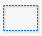
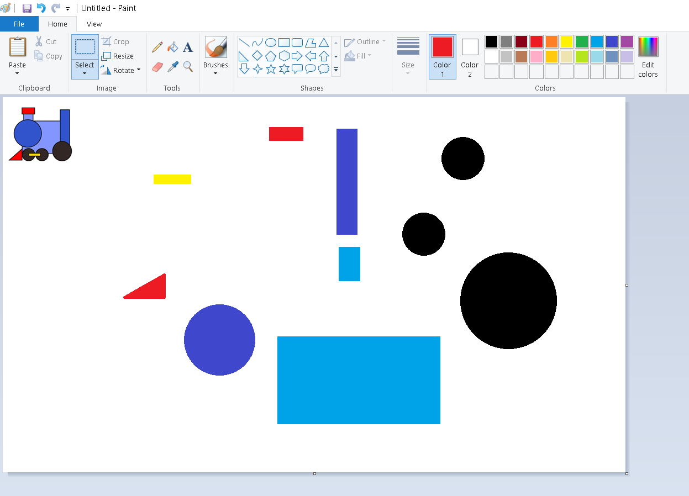
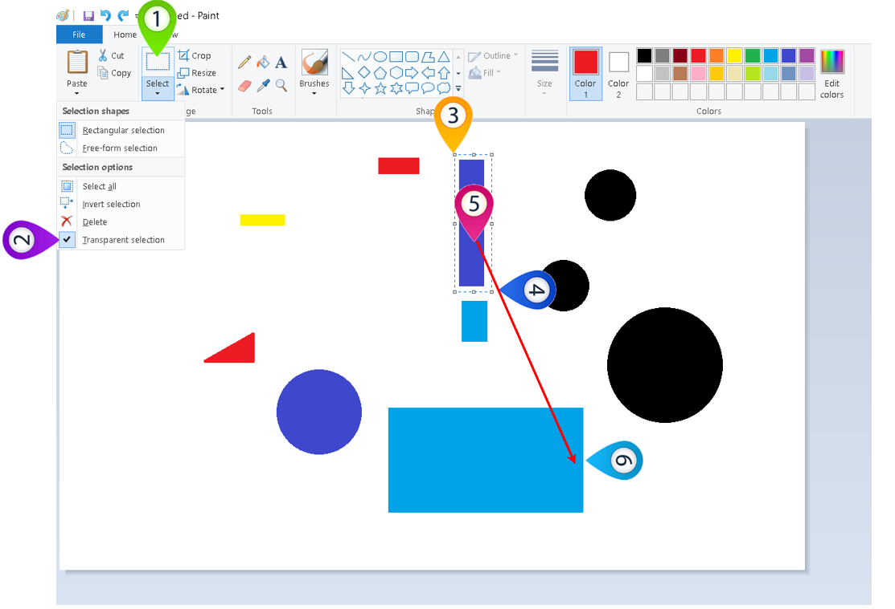
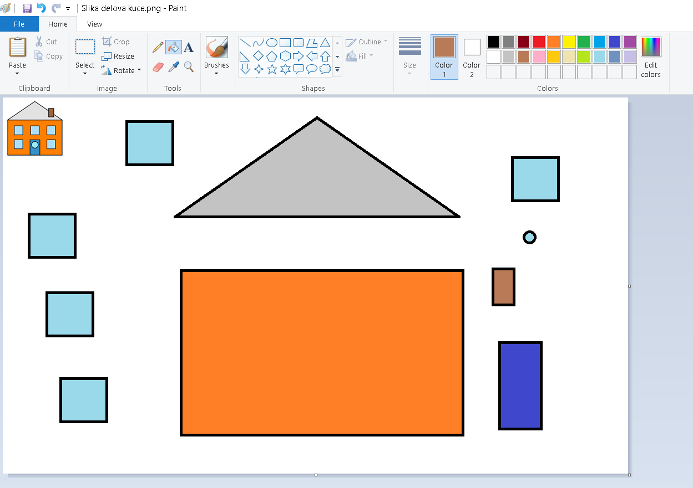
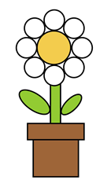
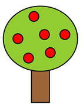

Одабир дела слике и премештање
==============================

.. |lk| image:: ../../_images/lk.png
            :width: 50px

.. |pip| image:: ../../_images/pip.png
            :width: 50px

.. |o| image:: ../../_images/o.png
            :width: 50px

.. infonote::

 .. image:: ../../_images/robot11.png
    :height: 120
    :align: left

 У претходним лекцијама си научио/ла да покренеш програм Бојанка, потом да користиш различите четкице и да црташ и бојиш различите облике као што су то квадрат, круг или троугао. Када урадиш све задатке и одговориш на сва питања у овој лекцији знаћеш како да промениш величину дела дигиталне слике и преместиш 
 је на жељено место користећи одговарајућу апликацију. 

|

У програму Бојанка имаш могућност да одабереш и преместиш нацртане облике. За то користиш алат за одабир дела слике |select|.

-----------

На доњој слици приказани су облици од којих је нацртана локомотива. Најпре хајде да видимо од којих геометријских облика се састоји наша локомотива. Твој први задатак је да именујеш сваки геометријски облик, а потом да избројиш колико различитих геометријских облика видиш на слици испод. 

|

|

Сада када знаш од којих делова се састоји наша локомотива, хајде да ти покажемо како можеш да је саставиш у програму Бојанка, користећи геометријске облике које си већ нацртао/ла и алат за одабир дела слике који смо ти показали на почетку ове лекције.

|

|

Плави правоугаоник означаваш тако што кликнеш левим тастером миша |lk| алат за одабир дела слике (1), затим, кликнеш левим тастером миша |lk| 
на алат за одабир дела слике без позадине (2), а онда од (3) држећи притиснут леви тастер миша |pip|, уоквириш облик. 
Када завршиш са означавањем (4), отпусти леви тастер миша |o|. Затим, кликнеш левим тастером миша |lk| и (5) држећи притиснут леви 
тастер миша |pip|, превлачиш облик до (6) и затим, отпусти леви тастер миша |o|.

|
 

Ако си успешно нацртао/ла слику локомотиве из претходног задатке, време је да пређеш на следећи задатак за вежбу.

.. infonote::

 .. image:: ../../_images/robot14.png
    :height: 110
    :align: left

 Самостално или уз помоћ учитеља или учитељице покрени Бојанку. Нацртај делове куће приказане на доњој слици. Затим, примењујући алатке за премештање и одабир сложи кућу. Веома је важно да водиш рачуна о редоследу којим одабираш и премешташ делове слике.

|

 

|

.. image:: ../../_images/robot13.png
    :height: 200
    :align: right

------------

**Домаћи задатак**

Сада је време да мало провежбаш све оно што си научио/ла. На следећем сликама које се налазе испод или у радној свесци на страницама **10-11** можеш видети како изгледају слике које треба да нацрташ у програму Бојанка. Предлажемо ти да пре него што покренеш програм Бојанку пажљиво погледаш сваку слику, видиш од којих делова се састоји и тек онда кренеш да црташ у програму Бојанка. 

|

Уз помоћ родитеља или теби блиске особе покрени Бојанку. Прво нацртај појединачно делове слике, а затим их споји у целину како би добио/ла диван цвет. 

|

Уз помоћ родитеља или теби блиске особе покрени програм Бојанка. Прво нацртај појединачно делове слике, а затим их споји у целину.

|

А да ли знаш да је у програму Бојанка могуће променити величину слике? Ако ниси до сада ово знао/ла, прати наставак ове лекције и врло брзо ћеш сазнати како да неку слику увеличаш, а како неку другу да умањиш.  

