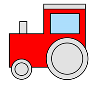

Одабир дела слике и манипулација њиме – премештање и промена величине
=====================================================================

.. |select| image:: ../../_images/select.png
            :width: 40px

.. |lk| image:: ../../_images/lk.png
            :width: 50px

.. |pip| image:: ../../_images/pip.png
            :width: 50px

.. |o| image:: ../../_images/o.png
            :width: 50px

.. infonote::

 .. image:: ../../_images/robot11.png
    :height: 120
    :align: left

 Када урадиш све задатке и одговориш на сва питања у лекцији бићеш у стању да промениш величину дела дигиталне слике и преместиш 
 је на жељено место користећи одговарајућу апликацију. 

|

У програму Бојанка имаш могућност да одабереш и преместиш нацртане облике. За то користиш алат |select|.

-----------

На доњој слици приказани су облици од којих је нацртана локомотива. 

|

.. image:: ../../_images/odabir1.png
    :width: 780
    :align: center

.. questionnote::

 Користећи опцију за премештање облика склопи слику локомотиве.

.. image:: ../../_images/odabir2.png
   :width: 780
   :align: center

|

Плави правоугаоник означаваш тако што кликнеш левим тастером миша |lk| алат за селектовање (1), затим, кликнеш левим тастером миша |lk| 
на алат за селектовање без позадине (2), а онда од (3) држећи притиснут леви тастер миша |pip|, оивичаваш облик. 
Када завршиш са означавањем (4), отпусти леви тастер миша |o|. Затим, кликнеш левим тастером миша |lk| и (5) држећи притиснут леви 
тастер миша |pip|, превлачиш облик до (6) и затим, отпусти леви тастер миша |o|.

|

.. questionnote::

 .. image:: ../../_images/robot14.png
    :height: 110
    :align: left

 Уз помоћ учитеља или учитељице покрени Бојанку. Најпре нацртај све облике као на горњој слици, и затим премести све облике како би успешно била сложена слика локомотиве.

Уз помоћ учитеља или учитељице покрени Бојанку. Нацртај делове куће приказане на доњој слици. 

|

.. image:: ../../_images/odabir3.png
   :width: 780
   :align: center

Затим, примењујући алатке за премештање и одабир сложи кућу. Веома је важно да водиш рачуна о редоследу којим одабираш и премешташ 
делове слике. Облик који је премештен последњи налази се на врху слике. 

|

.. image:: ../../_images/robot13.png
    :height: 200
    :align: right

------------

.. **Домаћи задатак**

|

.. У радној свесци на страници **XX** можеш преузети слике које треба да нацрташ у програму Бојанка.

|

.. Уз помоћ родитеља или теби блиске особе покрени Бојанку. Прво нацртај појединачно делове слике, а затим их споји у целину.

.. image:: ../../_images/cvet.png
   :width: 150
   :align: center

|

Уз помоћ родитеља или теби блиске особе покрени програм Бојанка. Прво нацртај појединачно делове слике, а затим их споји у целину.

|

.. image:: ../../_images/drvo.png
   :width: 150
   :align: center

У програму Бојанка могуће је променити величину слике.

--------------

Промена величине слике
~~~~~~~~~~~~~~~~~~~~~~

На доњој слици приказан је шестоугао. 

.. image:: ../../_images/odabir4.png
   :width: 780
   :align: center

.. image:: ../../_images/odabir5.png
   :width: 780
   :align: center

Шестоугао означаваш тако што кликнеш левим тастером миша |lk| алат за селектовање (1), затим, од (2), држећи притиснут леви тастер 
миша |pip|, оивичаваш облик. Када завршиш са означавањем (3), отпусти леви тастер миша |o|. Затим кликнеш левим тастером миша |lk| 
и од (3), држећи притиснут леви тастер миша |pip| превлачиш облик до (5) а на крају, отпусти леви тастер миша |o|.

.. questionnote::

 .. image:: ../../_images/robot14.png
    :height: 110
    :align: left

 Уз помоћ учитеља или учитељице покрени Бојанку. Нацртај најпре шестоугао, а затим га увећај.

|

Уз помоћ учитеља или учитељице покрени Бојанку. Нацртај следеће облике. 

|

.. image:: ../../_images/odabir6.png
   :width: 780
   :align: center

.. questionnote::

 Обој одговарајуће облике. Умањи плави квадрат. Увећај муњу. Повећај зелени квадрат заобљених ивица. Позадину обој у црну боју.

 
.. image:: ../../_images/robot13.png
    :height: 200
    :align: right

------------

**Домаћи задатак**

|

.. У радној свесци на страници **XX** можеш преузети слику коју треба да нацрташ у програму Бојанка.

Уз помоћ родитеља или теби блиске одрасле особе покрени Бојанку. Нацртај доњу слику.

----------

----------------

|

