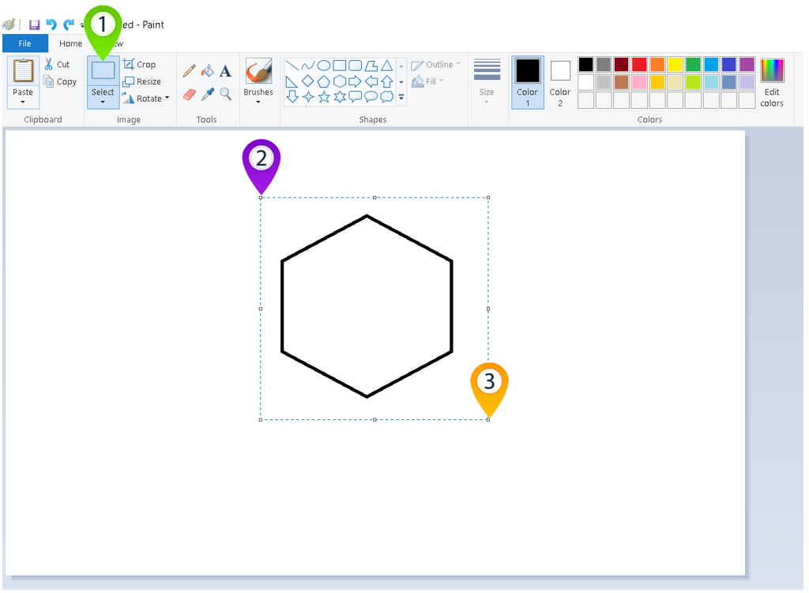
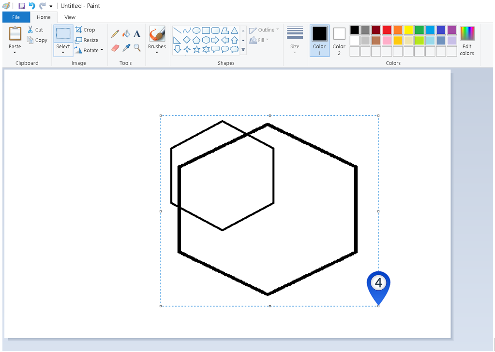
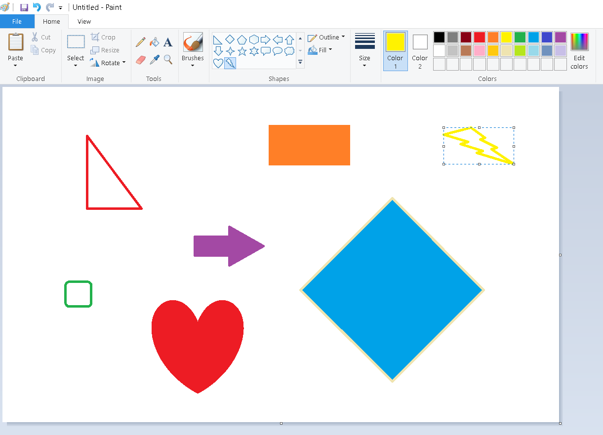

Одабир дела слике и манипулација њиме – премештање и промена величине
=====================================================================

.. |select| image:: ../../_images/select.png
            :width: 40px

.. |lk| image:: ../../_images/lk.png
            :width: 50px

.. |pip| image:: ../../_images/pip.png
            :width: 50px

.. |o| image:: ../../_images/o.png
            :width: 50px

.. infonote::

 .. image:: ../../_images/robot11.png
    :height: 120
    :align: left

 У претходним лекцијама си научио/ла да покренеш програм Бојанка, потом да користиш различите четкице и да црташ и бојиш различите облике као што су то квадрат, круг или троугао. Када урадиш све задатке и одговориш на сва питања у овој лекцији знаћеш како да промениш величину дела дигиталне слике и преместиш 
 је на жељено место користећи одговарајућу апликацију. 

|

У програму Бојанка имаш могућност да одабереш и преместиш нацртане облике. За то користиш алат |select|.

-----------

На доњој слици приказани су облици од којих је нацртана локомотива. 

|

.. questionnote::

 Користећи опцију за премештање облика склопи слику локомотиве.

.. image:: ../../_images/odabir2.png
   :width: 780
   :align: center

|

Плави правоугаоник означаваш тако што кликнеш левим тастером миша |lk| алат за селектовање (1), затим, кликнеш левим тастером миша |lk| 
на алат за селектовање без позадине (2), а онда од (3) држећи притиснут леви тастер миша |pip|, оивичаваш облик. 
Када завршиш са означавањем (4), отпусти леви тастер миша |o|. Затим, кликнеш левим тастером миша |lk| и (5) држећи притиснут леви 
тастер миша |pip|, превлачиш облик до (6) и затим, отпусти леви тастер миша |o|.

|

.. infonote::

 .. image:: ../../_images/robot14.png
    :height: 110
    :align: left

 Твој први задатак је да самостално или уз помоћ учитеља или учитељице покренеш Бојанку. Најпре нацртај све облике као на горњој слици, и затим премести све облике како би успешно била сложена слика локомотиве. 

Ако си успешно нацртао/ла слику локомотиве из претходног задатке, време је да пређеш на следећи задатак за вежбу.

.. infonote::

 .. image:: ../../_images/robot14.png
    :height: 110
    :align: left

 Самостално или уз помоћ учитеља или учитељице покрени Бојанку. Нацртај делове куће приказане на доњој слици. Затим, примењујући алатке за премештање и одабир сложи кућу. Веома је важно да водиш рачуна о редоследу којим одабираш и премешташ делове слике. Облик који је премештен последњи налази се на врху слике.

|

 

|

.. image:: ../../_images/robot13.png
    :height: 200
    :align: right

------------

**Домаћи задатак**

Сада је време да мало провежбаш све оно што си научио/ла. На следећем сликама које се налазе испод или у радној свесци на страницама **10-11** можеш видети како изгледају слике које треба да нацрташ у програму Бојанка. Предлажемо ти да пре него што покренеш програм Бојанку пажљиво погледаш сваку слику, видиш од којих делова се састоји и тек онда кренеш да црташ у програму Бојанка. 

|

Уз помоћ родитеља или теби блиске особе покрени Бојанку. Прво нацртај појединачно делове слике, а затим их споји у целину како би добио/ла диван цвет. 

|

Уз помоћ родитеља или теби блиске особе покрени програм Бојанка. Прво нацртај појединачно делове слике, а затим их споји у целину.

|

.. image:: ../../_images/drvo.png
   :width: 150
   :align: center

А да ли знаш да је у програму Бојанка могуће променити величину слике? Ако ниси до сада ово знао/ла, прати наставак ове лекције и врло брзо ћеш сазнати како да неку слику увеличаш, а како неку другу да умањиш.  

--------------

Промена величине слике
~~~~~~~~~~~~~~~~~~~~~~

На доњој слици приказан је шестоугао. Хајде да видимо како да увећамо шестоугао.

Шестоугао означаваш тако што кликнеш левим тастером миша |lk| алат за селектовање (1), затим, од (2), држећи притиснут леви тастер 
миша |pip|, оивичаваш облик. Када завршиш са означавањем (3), отпусти леви тастер миша |o|. Затим кликнеш левим тастером миша |lk| 
и од (4), држећи притиснут леви тастер миша |pip| превлачиш облик до (5) а на крају, отпусти леви тастер миша |o|.

|

Прилично је једноставно да у програму Бојанка неку слику увећаш зар не? 

.. infonote::

 .. image:: ../../_images/robot14.png
    :height: 110
    :align: left

 Сада је твој ред да испробаш могућност увећавања слике у програму Бојанка. Најпре, уз помоћ учитеља или учитељице покрени Бојанку. Твој задатак је да нацрташ шестоугао, а затим и да га увећаш као што смо ти показали на горњим сликама. Сада када си нацртао/ла шестоугао спреман/на си за следећи задатак!

.. infonote::

 .. image:: ../../_images/robot14.png
    :height: 110
    :align: left

 Твој други задатак је да нацрташ све облике као на слици испод. Да ли си нацртао/ла све облике? Браво! Сада пробај следеће: умањи плави квадрат, увећај муњу, повећај зелени квадрат заобљених ивица. Позадину обој у црну боју. Полако постајеш прави експерт за прављење слика у Бојанци!

|

|

 
.. image:: ../../_images/robot13.png
    :height: 200
    :align: right

------------

**Домаћи задатак**

|

На следећој слици која се налази испод или у радној свесци на страници **12** можеш видети слику локомотиве коју треба да нацрташ у програму Бојанка. Поново ти предлажемо да прво пажљиво погледаш делове из који се слика састоји па тек онда да направиш своју слику локомотиве у Бојанци.

Уз помоћ родитеља или теби блиске одрасле особе покрени Бојанку.

----------

----------------

|

