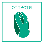

Промена величине слике
======================

.. |lk| image:: ../../_images/lk.png
            :width: 50px

.. |pip| image:: ../../_images/pip.png
            :width: 50px

       
Некада ћеш имати потребу да неки облик увећаш или умањиш. То наравно у програму Бојанка можеш врло лако да урадиш. Хајде да видимо на једном примеру како се то ради. 

На доњој слици приказан је шестоугао. Хајде да видимо како да га увећамо. Подсећамо те да шестоугао црташ тако што из алата за бирање облика изабереш шестоугао.

.. image:: ../../_images/odabir4.png
   :width: 780
   :align: center

Шестоугао означаваш тако што кликнеш левим тастером миша |lk| алат за одабир дела слике (1), затим, од (2), држећи притиснут леви тастер 
миша |pip|, оивичаваш облик. Када завршиш са означавањем (3), отпусти леви тастер миша |o|.

.. image:: ../../_images/odabir5.png
   :width: 780
   :align: center

Затим кликнеш левим тастером миша |lk| 
и од (3) као што је на горњој слици, држећи притиснут леви тастер миша |pip| превлачиш облик до (4) и на крају, отпусти леви тастер миша |o|.

|

Прилично је једноставно да у програму Бојанка неку слику увећаш зар не? 

.. infonote::

 .. image:: ../../_images/robot14.png
    :height: 110
    :align: left

 Сада је твој ред да испробаш могућност увећавања слике у програму Бојанка. Најпре, уз помоћ учитеља или учитељице покрени Бојанку. Твој задатак је да нацрташ шестоугао, а затим и да га увећаш као што смо ти показали на горњим сликама. Сада када си нацртао/ла шестоугао спреман/на си за следећи задатак!

.. infonote::

 .. image:: ../../_images/robot14.png
    :height: 110
    :align: left

 Твој други задатак је да нацрташ све облике у програму Бојанка као на слици испод. Да ли си нацртао/ла све облике? Браво! Сада пробај следеће: умањи плави квадрат, увећај муњу, повећај зелени квадрат заобљених ивица. Полако постајеш прави експерт за прављење слика у Бојанци!

|

.. image:: ../../_images/odabir6.png
   :width: 780
   :align: center

|

 

