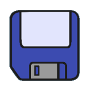
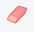
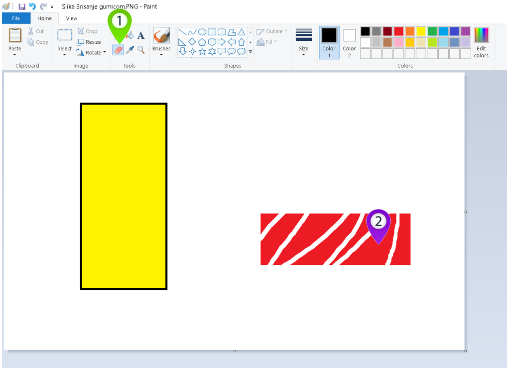
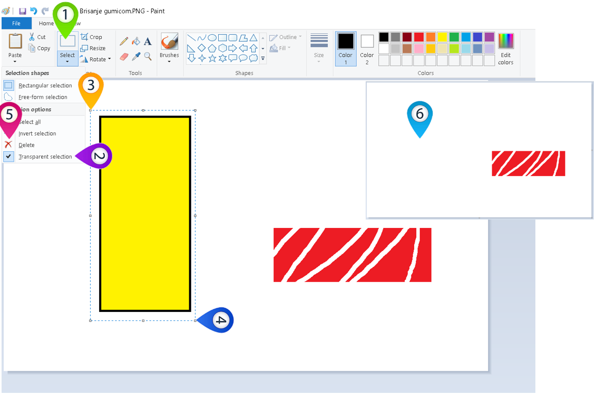
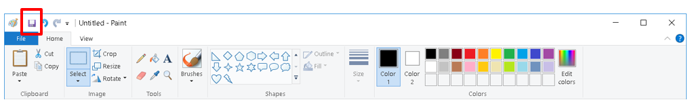
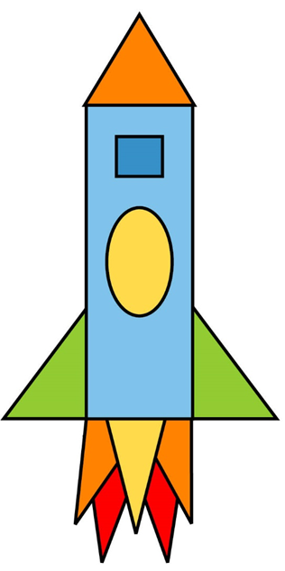

Одабир дела слике и манипулација њиме – чување и брисање делова слике
=====================================================================

.. |lk| image:: ../../_images/lk.png
            :width: 50px

.. |pip| image:: ../../_images/pip.png
            :width: 50px

.. |o| image:: ../../_images/o.png
            :width: 50px

.. infonote::

 .. image:: ../../_images/robot11.png
    :height: 120
    :align: left

 Као и када црташ на папиру па ти се неки део цртежа не свиди и желиш да га обришеш тако и када црташ своју дигиталну слику можеш целу слику или неке делове слике који ти се не допадају да обришеш. У наредној лекцији научићеш између осталог и да креираш дигиталну слику брисањем делова слике, 
 као и да је сачуваш користећи одговарајућу апликацију.

|

Пре него што наставимо даље са лекцијом важно је да те подсетимо да је једна од предности цртања помоћу дигиталног уређаја у томе што са лакоћом можеш да мењаш све оно што урадиш. 
Можеш да измениш своје креације тако што мењаш величину и премешташ делове слике или их једноставно бришеш. На тај начин добијаш потпуно нове дигиталне слике.

|

У програму Бојанка можеш брисати делове слике на два начина.

|

**Први начин**

|

|

Део слике бришеш тако што кликнеш левим тастером миша |lk| на гумицу (1), затим држећи притиснут леви тастер миша |pip| прелазиш 
преко дела слике који желиш да обришеш. Када завршиш са брисањем отпусти леви тастер миша |lk| (2). 

Сада је твој ред да пробаш да уз помоћ гумице обришеш део дигиталне слике. Уз помоћ учитеља или учитељице покрени Бојанку. Нацртај најпре оба правоугаоника, а затим црвени правоугаоник обриши 
коришћењем алатке |gumica|.

----------

**Други начин**

|

Део слике бришеш тако што кликнеш левим тастером миша |lk| на алат за селектовање (1), затим кликнеш левим тастером миша |lk| на 
алат за селектовање без позадине (2), а онда, од (3), држећи притиснут леви тастер миша |pip|,  оивичаваш облик. 
Када завршиш са означавањем (4), отпусти леви тастер миша |o| и кликнеш левим тастером миша |lk| на алат *Delete* (5) и тиме је 
правоугаоник обрисан (6).

.. infonote::

 .. image:: ../../_images/robot14.png
    :height: 110
    :align: left
    
 Ако ти се не допада слика у Бојаци можеш јако лако да је обришеш. Користећи већ отворену слику обриши жути правоугаоник користећи опцију *Delete*. Баш је лако зар не? Сада можеш поново да нацрташ нову дигиталну слику на другачији начин. 

|

.. infonote::

 Ако пожелиш да свој цртеж сачуваш у програму Бојанка је то баш лако. Све што је потребно да урадиш је да кликнеш на ову сличицу |save|. Сада је твоја дигитална слика сачувана на дигиталном уређају. 

.. suggestionnote::
 Веома је важно да слику чуваш увек уз присуство учитеља или учитељице, или теби блиске одрасле особе.

Уз присуство учитеља или учитељице покрени програм Бојанка. Нацртај следећу слику ракете. 

.. questionnote::

 Размисли шта још можеш да направиш од облика од којих је састављена ракета.

|

Направи нову слику која ће бити састављена само од облика од којих је састављена ракета. Не мораш да искористиш за свој цртеж све облике, али немој да уводиш нове.

|

Уз присуство учитеља или учитељице сачувај дату слику.

|

.. image:: ../../_images/robot13.png
    :height: 200
    :align: right

------------

**Домаћи задатак**

|

Уз помоћ родитеља или блиске одрасле особе пронађи на интернету уметничка дела која су заснована на геометријских облицима. 
Затим, када одабереш слику, уз помоћ родитеља или блиске одрасле особе покрени програм Бојанка и нацртај одабрану слику. На крају сачувај слику на свом дигиталном уређају.

|

