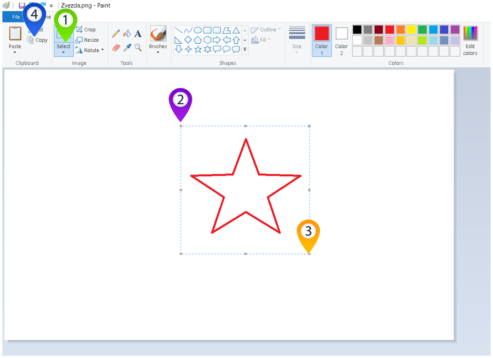
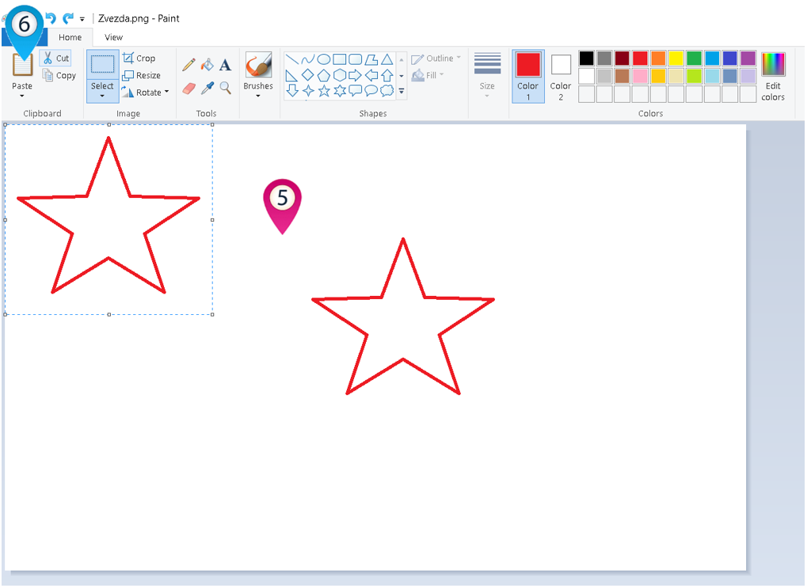
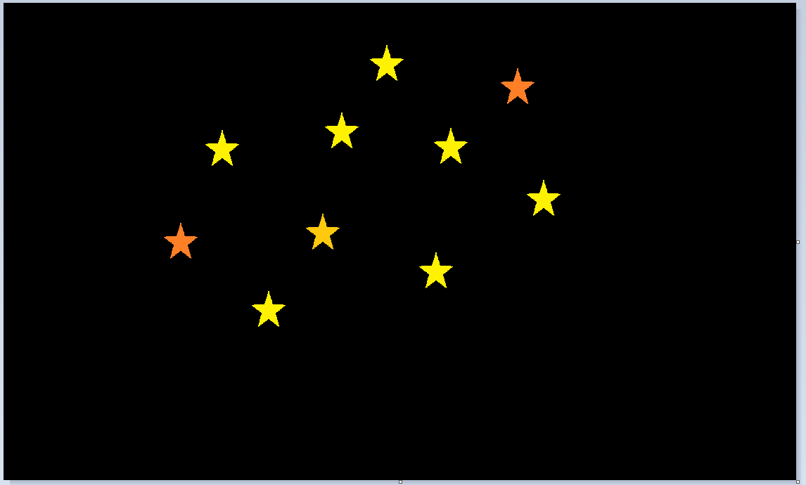
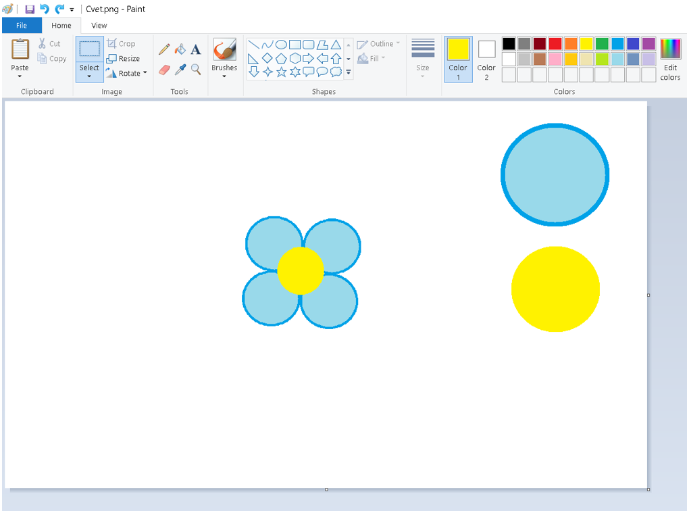
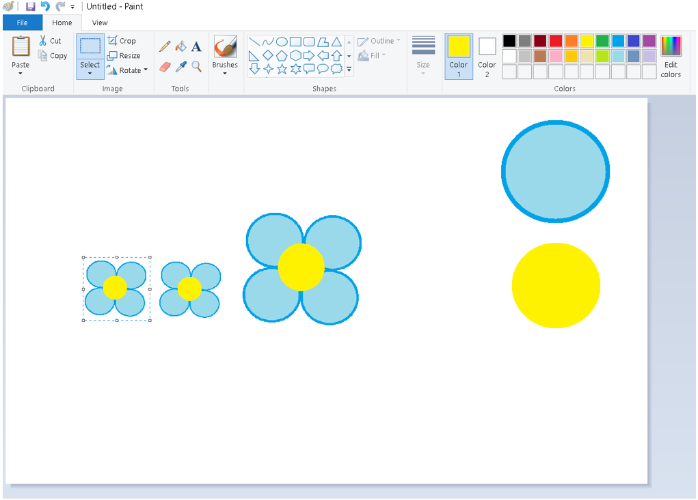
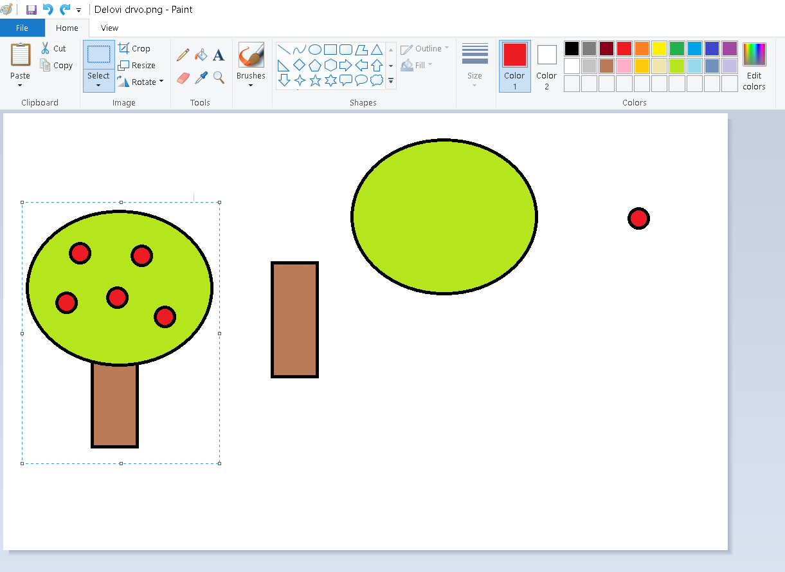
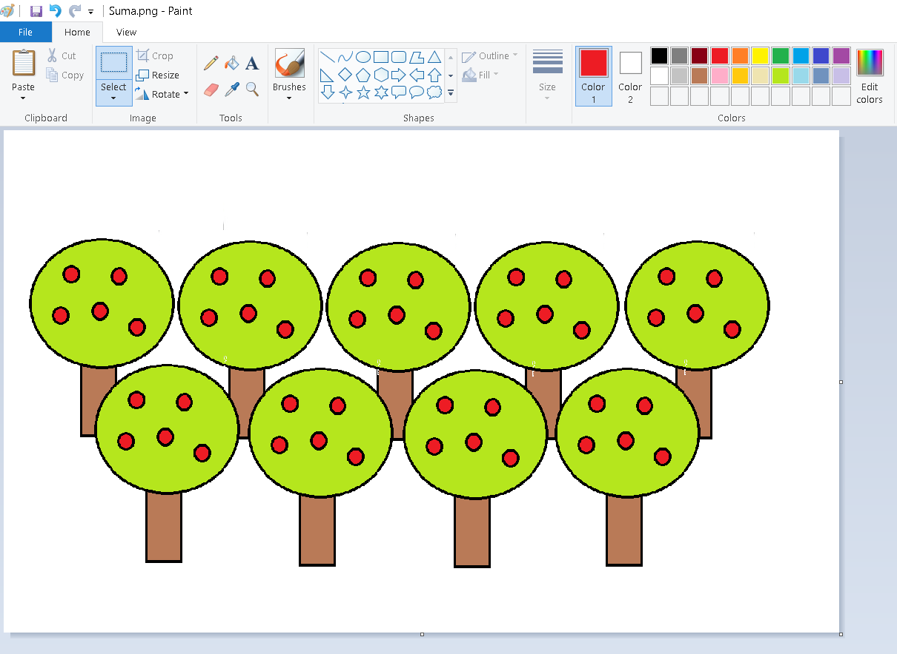

Копирање одабраног дела слике
=============================

.. |lk| image:: ../../_images/lk.png
            :width: 50px

.. |pip| image:: ../../_images/pip.png
            :width: 50px

.. |o| image:: ../../_images/o.png
            :width: 50px

.. infonote::

 .. image:: ../../_images/robot11.png
    :height: 100
    :align: left

 У претходној лекцији си сазнао/ла како да обришеш целу слику или неке њене делове и како да своју слику сачуваш на дигиталном уређају. Али шта ако пожелиш да се неки део слике више пута понови, на пример ако желиш да нацрташ шуму која има пуно дрвећа? Када урадиш све задатке из ове лекције моћи ћеш да креираш и уређујеш дигиталну слику копирањем делова слике 
 користећи одговарајући програм. Хајде заједно да видимо како то да урадимо!

|

Некада ће ти бити потребно да за слику коју црташ умножиш неке делове слике више пута. На пример, ако црташ звездано небо, 
требаће ти пуно звездица или као што смо већ поменули ако црташ шуму – на твојој слици ће бити пуно дрвећа.

Програм Бојанка ти омогућава да то урадиш на веома једноставан начин. Хајде за видимо како.

На доњој слици је приказана слика звезде.

|

Део слике копираш тако што кликнеш левим тастером миша |lk| на алат за одабир дела слике (1), а онда, од (2), држећи притиснут леви 
тастер миша |pip| уоквириш облик. Када завршиш са означавањем (3), отпусти леви тастер миша |o| па кликнеш левим тастером миша |lk| 
на алат (4).

Затим, кликнеш левим тастером миша |lk| било где унутар платна за цртање (5), а онда, кликнеш левим тастером миша |lk| 
на алат за лепљење (6), и део слике је умножен, тачније ископиран. Превуци звезду било где унутар простора за цртање.

.. infonote::

 .. image:: ../../_images/robot14.png
    :height: 110
    :align: left

 Уз помоћ учитеља или учитељице покрени Бојанку. Најпре, нацртај наранџасту звезду и умножи је једанпут. Браво! Хајде сада да пробамо да нацртамо звездано небо? Најпре нацртај звезду, обој је у жуту боју, потом је умањи, умножи је 8 пута и распореди по простору за цртање као на слици. И не заборави да позадину обојиш у тамну боју јер звезде можемо да видимо само када је напољу мрак. На крају ако ти се твоје звездано небо свиђа уз помоћ учитеља или учитељице сачувај слику.

|

|

|

Да ли си спреман/на да направимо ову слику цвета? Уз помоћ учитеља или учитељице покрени Бојанку. На основу облика датих на слици испод сложи цвет.

|

|

Нацртај жути и плави круг. Умножи плави круг. Поређај кругове. Добијену слику умањи, па затим, копирај цвет. Налепи слику и 
премести је да стоји поред постојећег цвета. Умањи слику. Умањени цвет копирај, налепи и премести да стоји поред малог цвета. 

|

|

На крају, ако ти се твоја слика допада, уз помоћ учитеља или учитељице сачувај слику.

.. image:: ../../_images/robot13.png
    :height: 200
    :align: right

--------------

**Домаћи задатак**

На следећој слици која се налази испод или у радној свесци на страници **13** можеш да видиш слику коју треба да нацрташ у програму Бојанка.

Уз помоћ родитеља или теби блиске особе покрени Бојанку. Нацртај доњу слику. 

До сада си већ нацртао/ла звездано небо и цвеће. Твој следећи задатак је нацрташ дрво уз помоћ облика које можеш да видиш на слици испод. Пре него што покренеш програм Бојанка, размисли како ћеш да поређаш дате облике. 

Сада када си нацртао/ла једно дрво зашто не бисмо нацртали целу шуму. Пошто већ знаш како да користиш опције да умањиш или увећаш слику као и да копираш делове слике искористи своје знање за цртање шуме.

|

Ако желиш да сачуваш слику шуме, нека ти помогне блиска одрасла особа да сачуваш своју слику на дигиталном уређају.

|

|

