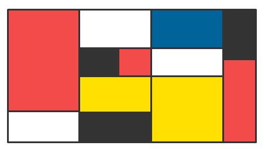

Копирање одабраног дела слике
=============================

.. |lk| image:: ../../_images/lk.png
            :width: 50px

.. |pip| image:: ../../_images/pip.png
            :width: 50px

.. |o| image:: ../../_images/o.png
            :width: 50px

.. infonote::

 .. image:: ../../_images/robot11.png
    :height: 100
    :align: left

 Када урадиш све задатке и одговориш на сва питања у лекцији моћи ћеш да креираш и уређујеш дигиталну слику копирањем делова слике 
 користећи одговарајућу апликацију.

|

Некада ће ти бити потребно да за слику коју црташ умножиш неке делове слике више пута. На пример, ако црташ звездано небо, 
требаће ти пуно звездица или ако црташ шуму – на твојој слици ће бити пуно дрвећа.

Програм Бојанка ти омогућава да то урадиш.

На доњој слици је приказана слика звезде.

|

.. image:: ../../_images/kopiranje1.png
    :width: 780
    :align: center

.. image:: ../../_images/kopiranje2.png
    :width: 780
    :align: center

Део слике копираш тако што кликнеш левим тастером миша |lk| на алат за селектовање (1), а онда, од (2), држећи притиснут леви 
тастер миша |pip| оивичаваш облик. Када завршиш са означавањем (3), отпусти леви тастер миша |o|  па кликнеш левим тастером миша |lk| 
на алат (4), затим, кликнеш левим тастером миша |lk| било где унутар платна за цртање (5), а онда, кликнеш левим тастером миша |lk| 
на алат за лепљење (5), и део слике је умножен, тачније ископиран. Превуци звезду било где унутар простора за цртање.

.. questionnote::

 .. image:: ../../_images/robot14.png
    :height: 110
    :align: left

 Уз помоћ учитеља или учитељице покрени Бојанку. Нацртај црвену звезду и умножи је.

|

Нацртај звездано небо. Најпре нацртај звезду, обој је, умањи је, умножи је 10 пута и распореди по простору за цртање, као на слици.

|

.. image:: ../../_images/kopiranje3.png
   :width: 780
   :align: center

|

Обој позадину у црно. Уз помоћ учитеља или учитељице сачувај слику.

.. questionnote::

 .. image:: ../../_images/robot14.png
    :height: 110
    :align: left

 Уз помоћ учитеља или учитељице покрени Бојанку. На основу облика датих на слици испод сложи слику.

.. image:: ../../_images/kopiranje4.png
   :width: 780
   :align: center

|

Нацртај жути и плави круг. Умножи плави круг. Поређај кругове. Добијену слику умањи, па затим, копирај цвет. Налепи слику и 
премести је да стоји поред постојећег цвета. Умањи слику. Умањени цвет копирај, налепи и премести да стоји поред малог цвета. 

|

.. image:: ../../_images/kopiranje5.png
   :width: 780
   :align: center

|

Уз помоћ учитеља или учитељице сачувај слику.

.. questionnote::

 .. image:: ../../_images/robot14.png
    :height: 110
    :align: left

 Уз помоћ учитеља или учитељице покрени Бојанку. На основу облика датих на слици испод сложи слику дрвета. 

.. image:: ../../_images/kopiranje6.png
   :width: 780
   :align: center

|

Користећи опцију умањења, копирања и лепљења делова слике направи доњу слику.

.. image:: ../../_images/kopiranje7.png
   :width: 780
   :align: center

Уз помоћ учитеља или учитељице сачувај слику.

|

.. image:: ../../_images/robot13.png
    :height: 200
    :align: right

--------------

**Домаћи задатак**

|

У радној свесци на страници **XX** можеш преузети слике које треба да нацрташ у програму Бојанка.

Уз помоћ родитеља или теби блиске особе покрени Бојанку. Нацртај доњу слику. 

|

|

