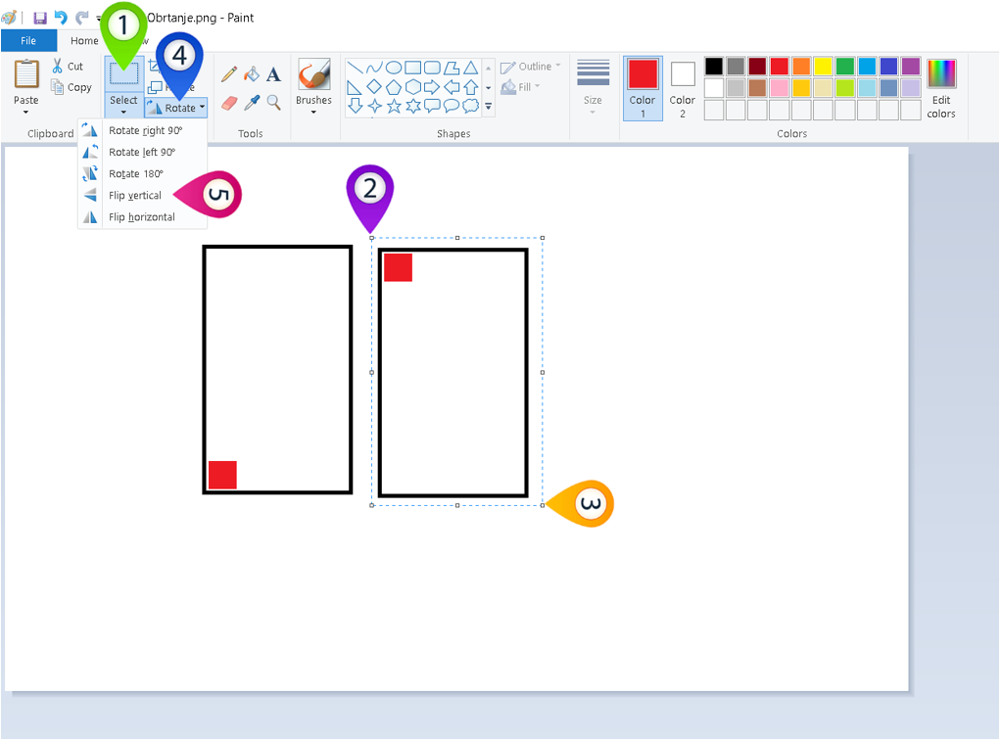
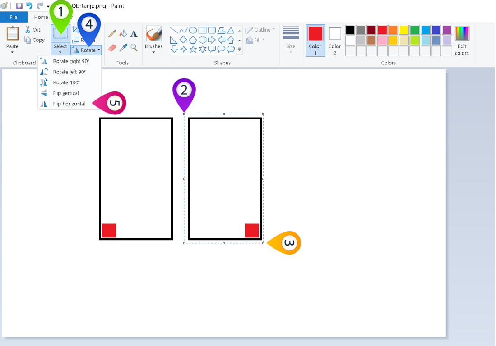
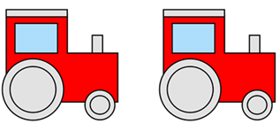
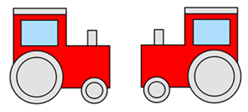

Обрни свет наглавачке
=====================

.. |lk| image:: ../../_images/lk.png
            :width: 50px

.. |pip| image:: ../../_images/pip.png
            :width: 50px

.. |o| image:: ../../_images/o.png
            :width: 50px

.. infonote::

 .. image:: ../../_images/robot11.png
    :height: 120
    :align: left

 До сада си већ сазнао/ла много о томе на које све начине можеш да црташ своју дигиталну слику и да је даље уређујеш. Али постоји још корисних ствари које вреди да знаш. У овој лекцији научићеш како да своју слику обрнеш на леву или десну страну или нагоре или надоле. Звучи супер зар не?

Често се дешава да се дигиталне слике састоје из делова који су окренути на различите стране, било да је један окренут улево, 
а други удесно, или нагоре или надоле.

У програму Бојанка можеш да обрћеш делове слике. 
На доњој слици приказане су две идентичне слике правоугаоника у којем се налази црвени квадрат.

|

.. image:: ../../_images/obrni1.png
    :width: 780
    :align: center

|

Хајде да видимо како црвене квадрате можемо да обрнемо. Постоје два начина обртања слике.

Ако желиш да обрнеш део дигиталне слике тако да доња страна постане горња, програм Бојанка има ту могућност, и то је наредба обртање 
слике по **вертикали**. 

|

**Први начин – обртање дела слике по вертикали**

|

Део слике обрћеш по вертикали тако што кликнеш левим тастером миша |lk| на алат за одабир дела слике (1), а онда, од (2) држећи притиснут 
леви тастер миша |pip|, уоквириш облик. Када завршиш са означавањем (3), отпусти леви тастер миша |o| па затим кликнеш левим 
тастером миша |lk| на алат (4) и кликнеш левим тастером миша |lk| на опцију (5).

.. infonote::

 .. image:: ../../_images/robot14.png
    :height: 110
    :align: left

 Хајде сада ти обрни своју слику. Уз помоћ учитеља или учитељице покрени Бојанку. Нацртај правоугаонике као на слици горе. Затим обрни десни правоугаоник по вертикали. 
 
|

Сачувај слику уз помоћ учитеља или ичитељице.

|

Ако желиш да обрнеш део дигиталне слике тако да лева страна постане десна, програм Бојанка има ту могућност. 
За то можеш да користиш наредбу обртање слике по **хоризонтали**. 

|

**Други начин – обртање дела слике по хоризонтали**

|

Део слике обрћеш по хоризонтали тако што кликнеш левим тастером миша |lk| на алат за одабир дела слике (1), а онда, од (2) држећи притиснут 
леви тастер миша |pip|, уоквириш облик. Када завршиш са означавањем (3), отпусти леви тастер миша |o| па затим, кликнеш левим 
тастером миша |lk| на алат (4) и кликнеш левим тастером миша |lk| на опцију (5).

.. infonote::

 .. image:: ../../_images/robot14.png
    :height: 110
    :align: left

 Хајде сада провежбај обртање слике по хоризонтали. Уз помоћ учитеља или учитељице покрени Бојанку. Нацртај правоугаонике као на слици. Затим обрни десни правоугаоник по хоризонтали. 

|

Сачувај слику уз помоћ учитеља или учитељице.

.. infonote::

 .. image:: ../../_images/robot14.png
    :height: 110
    :align: left

 Сада када си научио/ла како да обрћеш своје слике по вертикали и хоризонтали имамо задатак за тебе. Уз помоћ учитеља или учитељице покрени Бојанку. Када отвориш Бојанку твој задатак је да нацрташ двa иста трактора као што се налазе на слици испод. Боју трактора можеш да изабереш по жељи. 

|

|

Сада када си нацртао/ла тракторе, следећи задатак је да их окренеш тако да иду у сусрет један другоме, слично као на доњој слици.

|

Када завршиш свој задатак можеш да уз помоћ учитеља или учитељице сачуваш слику.

|

.. image:: ../../_images/robot13.png
   :height: 200
   :align: right

------------

**Домаћи задатак**

|

Уз помоћ родитеља или блиске одрасле особе у програму Бојанка нацртај две идентичне слике. Затим их окрени. На сликама испод или у радној свесци на страници **14** пронаћи ћеш како слике треба да изгледају када их окренеш.

|

|

    .. image:: ../../_images/obrni4.png
     :width: 600
     :align: center

Потребно је да их окренеш као на слици. 

    .. image:: ../../_images/obrni5.png
     :width: 600
     :align: center

Уз помоћ родитеља или блиске одрасле особе сачувај слику.