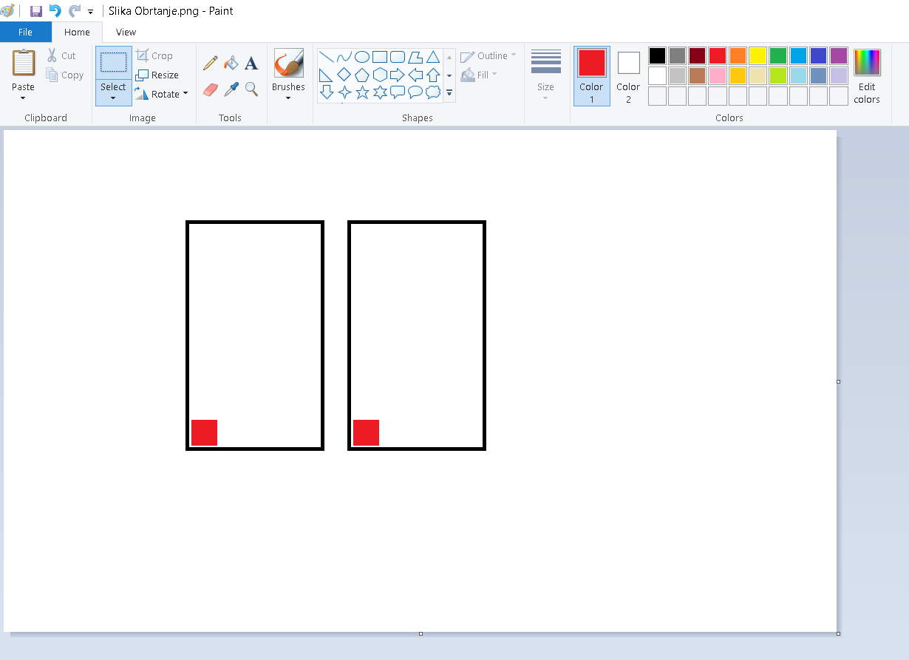

Обрни свет наглавачке
=====================

.. |pip| image:: ../../_images/pip.png
            :width: 50px

.. |o| image:: ../../_images/o.png
            :width: 50px

.. infonote::

 .. image:: ../../_images/robot11.png
    :height: 120
    :align: left

 Када урадиш све задатке и одговориш на сва питања у лекцији моћи ћеш да креираш и уредиш дигиталну слику тако што ћеш је 
 обрнути на леву или десну страну, нагоре или надоле користећи одговарајућу апликацију. 

|

Често се дешава да се дигиталне слике састоје из делова који су окренути на различите стране, било да је један окренут улево, 
а други удесно, или нагоре или надоле.
 
|

У програму Бојанка можеш да обрћеш делове слике. 
На доњој слици приказане су две идентичне слике квадрата.

|

Постоје два начина обртања слике.

Ако желиш да обрнеш део дигиталне слике тако да доња страна постане горња, програм Бојанка има ту могућност, и то је наредба обртање 
слике по вертикали. 

|

**Први начин – обртање дела слике по вертикали**

|

.. image:: ../../_images/obrni2.png
    :width: 780
    :align: center

Део слике обрћеш по вертикали тако што кликнеш левим тастером миша |lk| на алат за селектовање (1), а онда, од (2) држећи притиснут 
леви тастер миша |pip|, оивичаваш облик. Када завршиш са означавањем (3), отпусти леви тастер миша |o| па затим кликнеш левим 
тастером миша |lk| на алат (4) и кликнеш левим тастером миша |lk| на опцију (5).

.. questionnote::

 .. image:: ../../_images/robot14.png
    :height: 110
    :align: left

 Уз помоћ учитеља или учитељице покрени Бојанку. Нацртај правоугаонике као на слици. Затим обрни десни правоугаоник по вертикали. 
 
|

Сачувај слику уз помоћ наставника.

|

Ако желиш да обрнеш део дигиталне слике тако да лева страна постане десна, програм Бојанка има ту могућност. 
За то можеш да користиш наредбу обртање слике по хоризонтали. 

|

**Други начин – обртање дела слике по хоризонтали**

|

Део слике обрћеш по хоризонтали тако што кликнеш левим тастером миша |lk| на алат за селектовање (1), а онда, од (2) држећи притиснут 
леви тастер миша |pip|, оивичаваш облик. Када завршиш са означавањем (3), отпусти леви тастер миша |o| па затим, кликнеш левим 
тастером миша |lk| на алат (4) и кликнеш левим тастером миша |lk| на опцију (5).

.. questionnote::

 .. image:: ../../_images/robot14.png
    :height: 110
    :align: left

 Уз помоћ учитеља или учитељице покрени Бојанку. Нацртај правоугаонике као на слици. Затим обрни десни правоугаоник по хоризонтали. 

|

Сачувај слику уз помоћ наставника.

.. questionnote::

 .. image:: ../../_images/robot14.png
    :height: 110
    :align: left

 Уз помоћ учитеља или учитељице покрени Бојанку. Нацртај два идентична трактора. 

|

|

Окрени их тако да иду у сусрет један другоме, слично као на доњој слици.

|

.. image:: ../../_images/traktori3.png
    :width: 500
    :align: center

Уз помоћ учитеља или учитељице сачувај слику.

|

.. image:: ../../_images/robot13.png
   :height: 200
   :align: right

------------

.. **Домаћи задатак**

|

.. Уз помоћ родитељ аили блиске одрасле особе ученик треба да нацрта две идентичне слике. У радној свесци на страници **XX** нацртај 
   две идентичне слике.

|

|

..
    .. image:: ../../_images/obrni4.png
    :width: 600
    :align: center

.. Потребно је да окрене као на слици. 

..
    .. image:: ../../_images/obrni5.png
    :width: 600
    :align: center

.. Уз помоћ родитеља или блиске одрасле особе сачувај слику.