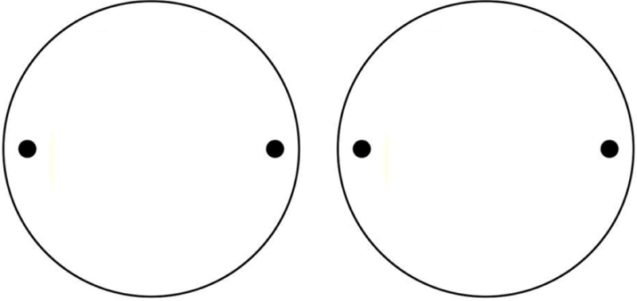
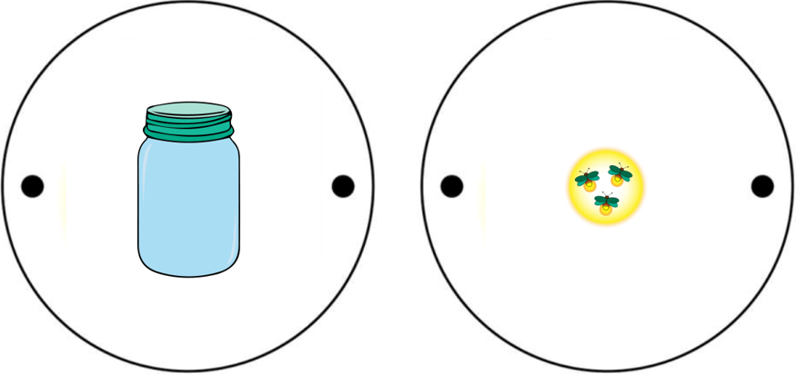

Покретне слике
==============

.. infonote::

 .. image:: ../../_images/robot11.png
    :height: 100
    :align: left

 Када урадиш све задатке и одговориш на сва питања у лекцији разумећеш шта су то покретне слике и моћи ћеш да објасниш онима 
 који то не знају. 

|

.. questionnote::

 Шта мислиш, шта су покретне слике? И да ли уопште слике могу да се крећу? 

Покретна слика се састоји од више непокретних слика које се смењују одређеном брзином тако да нам се ствара утисак да се слике крећу. Нама се чини да се слике крећу, али оно што се уствари догађа је да се слике само брзо смењују али наш мозак то види као покрет, а не као брзу смену појединачних слика.

.. suggestionnote::

 **Занимљивост**: Људско око не може да види више од 70 слика у једној секунди. 

-----------

Сада када смо разумели шта су покретне слике хајде да пробамо да направимо нашу покретну слику. Да бисмо то урадили потребно је да направимо нешто што се зове **Тауматроп**. Немој да те уплаши компликован назив. Тауматроп је играчка која ствара утисак да се слика креће. 

|

**Корак 1**. Потребно је да исечеш два круга исте величине.

|

|

**Корак 2**. Пробуши рупице на крајевима круга – места где треба да пробушиш рупице су означена црним круговима. 

**Корак 3**. На једном кругу нацртај теглу, а на другом свице. Као на слици. 

|

|

**Напомена**. Уместо датих слика, можеш да нацрташ и нешто друго, ако желиш. Рецимо, птицу и кавез, рибицу и куглу са водом, 
фудбалера и гол.

|

**Корак 4**. Кроз рупе провуци конац тако да празне стране круга буду окренут једна ка другој. Други начин је да залепиш један круг 
на врх сламке. Сламка треба да буде залепљена на белој страни круга. Залепи други круг тако да сламка буде између два круга.

**Корак 5**. Држи конац између прстију и окрећи га. У случају да користиш сламку, држи сламку између дланова и окрећи је.

.. questionnote::
    
    Шта примеђујеш док окрећеш конац или сламку? У радној свесци на страници **17** опиши шта си приметио/ла. 

Можда си некада чуо/ла за реч **анимација**. Анимација је начин да направиш филм од великог броја непокретних слика. Слике се мењају једна за другом великом брзином како би 
изгледало као да се слике крећу. А да ли си знао/ла да на овај начин настају и цртани филмови? 

|

У радној свесци на страници **18** напиши који је твој омиљени цртани филм и зашто баш тај цртани филм волиш. А, затим нацртај главне јунаке свог омиљеног цртаног филма.

|