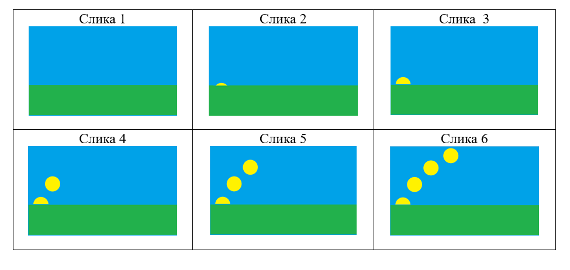

Направи свој анимирани филм
===========================

.. infonote::

 .. image:: ../../_images/robot11.png
    :height: 100
    :align: left

 У овој лекцији ћеш ти пробати да направиш свој анимирани филм. Пре него што почнемо важно је да се подсетимо да је покретна слика или анимација направљена од више непокретних слика које се смењују одређеном брзином. На тај начин имаш 
 осећај да се слике померају. До краја ове лекције моћи ћеш да креираш елементе покретне слике користећи одговарајући програм.

Како би направио/ла покретне слике, потребно је да урадиш неколико ствари:

- **да осмислиш причу**. У нашем примеру то је прича о изласку Сунца.
- **да припремиш позадинске слике** цртањем или фотографисањем. За наш пример то је трава и небо које смо нацртали у програму Бојанка.
- **да припремиш непокретне делове ликова** цртањем или фотографисањем. Нацртали смо у програму Бојанка половину круга који представља Сунце.
- **да одредиш колико ће бити слика, али и различите положаје покретних делова ликова.** Ми смо направили укупно 6 слика. 
- **да припремиш покретне делове слике цртањем или фотографисањем**.  У нашем примеру потребно нам је неколико слика које ће приказати Сунце у различитим положајима.
- **да поређаш слике у одговарајући редослед, прелисташ слике, и тако ћеш добити привид покрета.** Ако си све претходне кораке урадио/ла добићеш покретну слику излaска Сунца. 

У радној свесци на страници **19** нацртај позадину, непокретне делове слике, као и све покретне делове слике.

Замоли учитеља или учитељицу или неку теби блиску одраслу особу да уз помоћ паметног телефона направиш покретне слике. 

Коришћењем дигиталног уређаја процес израде покретне слике може да буде једноставан и брз.

.. questionnote::

 .. image:: ../../_images/robot12.png
    :height: 110
    :align: left

 Хајде да направимо још неку покретну слику, али овај пут уз помоћ програма Бојанка. Уз помоћ учитеља или учитељице покрени Бојанку. Потом, нацртај слику Чича Глише који се креће по улици града.

|

Потребно је да осмислиш следеће слике:

- нацртај позадину – цртеж улице и зграда;
- нацртај непокретне делове твог лика;
- уз помоћ учитеља или учитељице сачувај слику;
- нацртај сваки од положаја покретних делова лика и сачувај их као засебне слике (нека ти помогне учитељ или учитељица);
- нека ти учитељ или учитељица покажу како смењивање твојих цртежа изгледа.

Опиши како изгледа израда елемената покретне слике, цртање руком или коришћењем програма Бојанка. У чему је сличност, 
а у чему разлика. У радној свесци на страници **20** у сваку од одговарајућих колона упиши своја запажања. 
