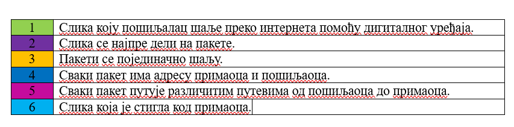

Повезивање дигиталних уређаја са другим дигиталним уређајима
============================================================

.. |klima| image:: ../../_images/klima.png
            :width: 120px

.. |sporet| image:: ../../_images/sporet.png
            :width: 80px

.. |televizor| image:: ../../_images/televizor.png
            :width: 100px

.. |frizider| image:: ../../_images/frizider.png
            :width: 60px

.. |ajfon| image:: ../../_images/ajfon.png
            :width: 50px

.. |pametni_sat| image:: ../../_images/pametni_sat.png
            :width: 100px

.. |racunar| image:: ../../_images/komp.png
           :width: 100px

.. |laptop| image:: ../../_images/laptop.png
            :width: 120px

.. |tablet| image:: ../../_images/tablet.png
            :width: 100px

.. |kv| image:: ../../_images/kv.png
            :width: 15px

.. infonote::

 .. image:: ../../_images/robot11.png
    :height: 100
    :align: left

 Када урадиш све задатке и одговориш на сва питања у лекцији моћи ћеш да својим речима објасниш због чега дигиталне уређаје 
 повезујемо на мреже, укључујући и интернет. Такође, моћи ћеш да наведеш начине за размену материјала, комуникацију и 
 заједнички рад (учење) који су настали захваљујући умрежавању дигиталних уређаја.

|

Пре него што су се појавили рачунари и интернет људи су комуницирали на нешто другачији начин. На пример, писали су и слали писма или разгледнице, телефонирали су користећи фиксне телефоне и телефонске говорнице. Важно је да знаш да је пре интернета било 
веома тешко делити музику, видео-записе и слике.

Данас, повезивањем дигиталних уређаја можемо брзо да размењујемо дигитални садржај (поруке, докумената, слике, звучне и 
видео записе). Интернет је мрежа која повезује велики број  дигиталних уређаја. Појава интернета је променила начин како учимо, 
радимо и дружимо се. 

|

.. image:: ../../_images/povezivanje.png
    :width: 700
    :align: center

|

Присети се како смо у првом разреду говорили о животу људи пре постојања дигиталних уређаја, а како смо говорили о животу након појаве дигиталних уређаја.

У радној свесци на страници **21** напиши опиши занимање којим желиш да се бавиш када порастеш. Да ли је за то занимање потребно коришћење интернета? 
 

------------

Пажљиво погледај табелу са сликама дигиталних уређаја. У радној свесци на страници **22** се налази иста слика као и ова испод. Обој све квадратиће испод уређаја који је повезан на интернет и 
који користиш за учење, играње и комуникацију.

.. csv-table:: 
   :widths: auto
   :align: center
   
   "|laptop|", "|sporet|", "|ajfon|"
   
   "|frizider|", "|pametni_sat|", "|racunar|"
   
   "|klima|", "|televizor|", "|tablet|"
   

Како путује твоја порука?
-------------------------

Слика или порука коју шаљеш другу или другарици преко интернета помоћу дигиталног уређаја дели се на мале пакете. 
Сваки од ових пакета путује различитим путем између два дигитална уређаја на интернету. 

|

Такође, сваки од ових пакета садржи и адресу пошиљаоца и примаоца.

|

.. image:: ../../_images/povezivanje2.png
    :width: 700
    :align: center

|

**Поступак слања дигиталног садржаја коришћењем дигиталних уређаја повезаних на интернет.**

|

.. image:: ../../_images/povezivanje3.png
    :width: 780
    :align: center

------------

|

.. image:: ../../_images/robot13.png
    :height: 200
    :align: right

--------------

**Домаћи задатак**

|

У радној свесци на страници **23** нацртај елементе 
покретне слике која приказује путовање дигиталне слике кроз мрежу од једног до другог дигиталног уређаја.

|