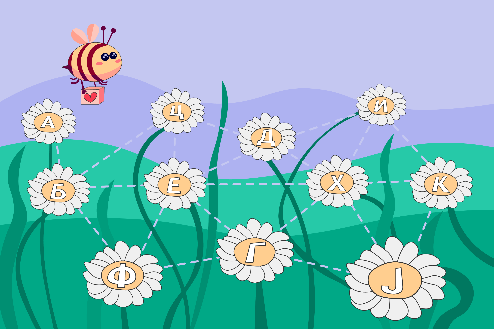
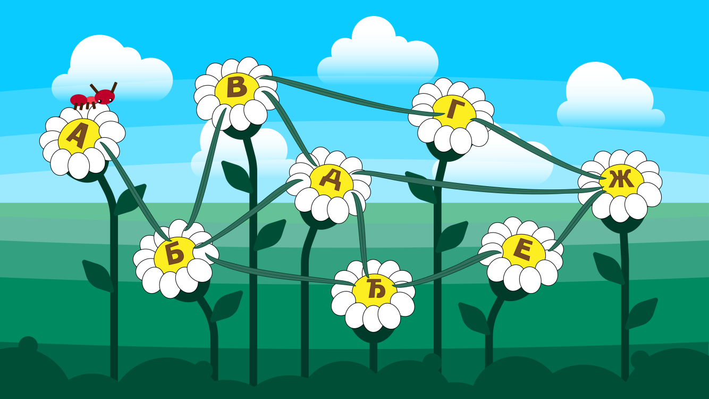
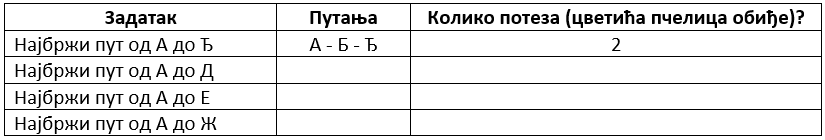

Повезивање дигиталних уређаја са другим дигиталним уређајима
============================================================

.. |klima| image:: ../../_images/klima.png
            :width: 120px

.. |sporet| image:: ../../_images/sporet.png
            :width: 80px

.. |televizor| image:: ../../_images/televizor.png
            :width: 100px

.. |frizider| image:: ../../_images/frizider.png
            :width: 60px

.. |pametni_sat| image:: ../../_images/pametni_sat.png
            :width: 100px

.. |tablet| image:: ../../_images/tablet.png
            :width: 100px

.. |kv| image:: ../../_images/kv.png
            :width: 15px

.. infonote::

 .. image:: ../../_images/robot11.png
    :height: 100
    :align: left

 Када урадиш све задатке и одговориш на сва питања у лекцији моћи ћеш да својим речима објасниш због чега дигиталне уређаје 
 повезујемо на мреже, укључујући и интернет. Такође, моћи ћеш да наведеш начине за размену материјала, комуникацију и 
 заједнички рад (учење) који су настали захваљујући умрежавању дигиталних уређаја.

|

Пре интернета, људи су писали и слали писма, телефонирали користећи фиксне телефоне и телефонске говорнице. Људи су слали поруке користећи 
факс-машину. Факс је машина која прави слику поруке и шаље копију другој факс-машини која је штампа. Пре интернета било је 
веома тешко делити музику, видео-записе и слике.

Данас, повезивањем дигиталних уређаја можемо брзо да размењујемо дигитални садржај (поруке, докумената, слике, звучне и 
видео записе). Интернет је мрежа која повезује велики број  дигиталних уређаја. Појава интернета је променила начин како учимо, 
радимо и дружимо се. 

|

|

Присети се како смо у првом разреду говорили о животу људи пре постојања дигиталних уређаја, а како смо говорили о животу након појаве дигиталних уређаја. 
Опиши занимање којим желиш да се бавиш када порастеш. Да ли је за то занимање потребно коришћење интернета? 
У радној свесци на страници **21** напиши. 

------------

Пажљиво погледај табелу са сликама дигиталних уређаја. У радној свесци на страници **22** се налази иста слика као и ова испод. Обој све квадратиће испод уређаја који је повезан на интернет и 
који користиш за учење, играње и комуникацију.

.. csv-table:: 
   :widths: auto
   :align: center
   
   "|laptop|", "|sporet|", "|ajfon|"
   
   "|frizider|", "|pametni_sat|", "|racunar|"
   
   "|klima|", "|televizor|", "|tablet|"
   

У радној свесци на страници **23** се налази иста слика као и ова испод. Твој задатак је да обојиш све квадратиће испред тврдњи које описује како користиш интернет на дигиталним уређајима.

--------------

Слика или порука коју шаљеш другу или другарици преко интернета помоћу дигиталног уређаја дели се на мале пакете. 
Сваки од ових пакета путује различитим путем између два дигитална уређаја на интернету. 

|

|

Такође, сваки од ових пакета садржи и адресу пошиљаоца и примаоца.

|

.. image:: ../../_images/povezivanje2.png
    :width: 700
    :align: center

|

**Поступак слања дигиталног садржаја коришћењем дигиталних уређаја повезаних на интернет.**

|

------------

Петра је послала поруку Наји. Порука је подељена на пакете. У радној свесци на страници **24** у квадратиће испод сваког 
пакета упиши број тако да на крају пакете поређаш у исправан редослед како би Наја примила праву поруку коју је послала Петра. 

Такође, попуните и елементе који недостају у појединим пакетима како би они исправно били послати.

|

.. image:: ../../_images/povezivanje4.png
    :width: 250
    :align: center

.. questionnote::

 Коју поруку је Наја примила? Води рачуна о правопису. Реченица почиње великим словом. 

-------

Пажљиво погледај слику која представља путеве којима путују пакети дигиталног садржаја. 

|

|

Најбржи пут којим пчелица пређе пут до цветића Ђ је А - Б – Ђ. Она обиђе 2 цветића.
У радној свесци на страници **25** попуни табелу.

|

|

.. image:: ../../_images/robot13.png
    :height: 200
    :align: right

--------------

**Домаћи задатак**

|

Уз помоћ родитеља или теби блиске одрасле особе покрени програм Бојанка. У радној свесци на страници **26** нацртај елементе 
покретне слике која приказује путовање дигиталне слике кроз мрежу од једног до другог дигиталног уређаја.

|