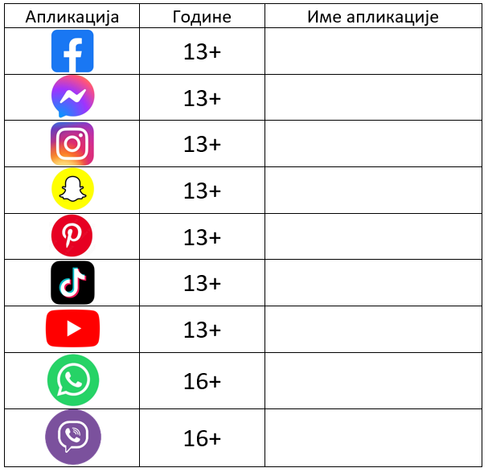
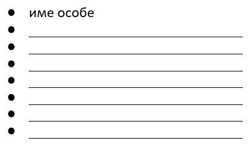

Дигитална комуникација
======================

.. infonote::

 .. image:: ../../_images/robot21.png
    :height: 120
    :align: left

 Када урадиш све задатке и одговориш на сва питања у лекцији знаћеш како да објасниш које су користи али и који су изазови у 
 комуникацији помоћу дигиталних уређаја.

|

Данас, људи комуницирају помоћу дигиталних уређаја користећи најразличитије апликације (програме). 

У доњој табели приказане су иконе најчешће коришћених апликација за комуникацију, као и старосна ограничења за њихово коришћење. 

   .. questionnote::
      У радној свесци на страници **29** попуни доњу табелу тако што ћеш уз помоћ блиске одрасле особе да именујеш апликације које се користе за комуникацију. 

|

|

Као што видиш, деци твог узраста није дозвољено коришћење апликација за комуникацију. 

.. infonote::

 .. image:: ../../_images/robot24.png
    :height: 120
    :align: left

 Веома је важно да **никада не наводиш лажни број година при регистрацији** на неку 
 од ових апликација. Такође, дигитални уређај увек користи уз надзор родитеља или теби блиске одрасле 
 особе.

------------------

Комуникација помоћу дигиталних уређаја обавља се путем интернета. При овој  комуникацији корисници остављају личне податке, а да тога 
најчешће нису ни свесни. 

|

У радној свесци на страници **30** допуни листу подацима који представљају личне податке:

|

------------------

Остављање личних података у дигиталном свету називамо дигитални отисак или траг. Дигитални отисак је назив за све информације које 
остављаш за собом када користиш интернет.  Дигитални трагови могу да имају утицај на будући живот. 
Када делиш слике, видео-записе и информације о себи на интернету, то остаје трајно на интернету. 
Касније, када порастеш, ови трагови могу утицати на начин како те други виде, укључујући и твоје будуће пријатеље.

|

Пажљиво погледај доњу мапу.

|

.. image:: ../../_images/slika.png
   :width: 600
   :align: center

|

.. questionnote::

 Гледајући Најин дигитални траг шта све можеш да сазнаш о њој? Да ли на основу мапе можеш да кажеш ко је Наја? 
 Шта воли да једе? Шта воли да ради? Опиши. 

.. suggestionnote::

 .. image:: ../../_images/robot25.png
    :height: 120
    :align: left

 Да ли знаш да сваки трећи корисник интернета има видљиву адресу електронске поште, адресу становања и број телефона?

|

Дигитални трагови имају велики значај зато што могу оставити дугорочне последице на твој живот. 

Они могу утицати на начин на који те други људи виде, како на интернету тако и у реалном свету. 
Такође, они могу имати утицај на твоју приватност, сигурност, образовање и будући посао. Зато, добро размисли пре него што објавиш било шта 
на интернету.

|

.. image:: ../../_images/robot23.png
   :height: 200
   :align: right

------------

**Домаћи задатак**

|

У радној свесци на страници **33** осмисли савете за безбедно коришћење апликација за комуникацију помоћу дигиталних уређаја. 

Нацртај или их напиши. 

|

