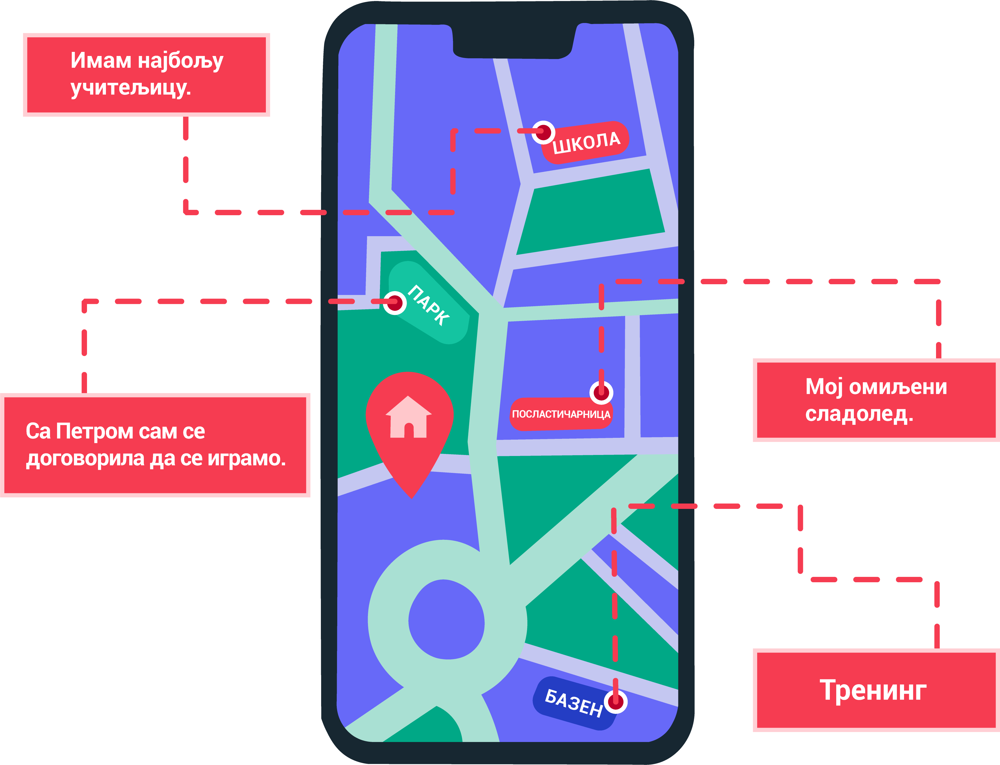

Дигитална комуникација
======================

.. infonote::

 .. image:: ../../_images/robot21.png
    :height: 120
    :align: left

 У наредним лекција имаћеш прилике да научиш више о томе шта је дигитална комуникација, на које све начина користимо дигиталне уређаје да бисмо комуницирали, али ћемо се позабавити и једном јако важном темом, а то је безбедност и правила лепог понашања на интернету. Када урадиш све задатке и одговориш на сва питања у лекцији знаћеш како да објасниш које су користи али и који су изазови у 
 комуникацији помоћу дигиталних уређаја.

|

Данас, људи комуницирају помоћу дигиталних уређаја користећи најразличитије апликације (програме). 

У доњој табели приказане су иконе најчешће коришћених апликација за комуникацију, као и старосна ограничења за њихово коришћење. 

|

.. image:: ../../_images/tabela221.png
   :width: 400
   :align: center

.. infonote::

 .. image:: ../../_images/robot24.png
    :height: 120
    :align: left

 Твој први задатак је да у радној свесци на страници **26** пронађеш исту ову табелу коју видиш изнад и онда да уз помоћ блиске одрасле особе за сваку приказану иконицу напишеш њен назив. Када то урадиш, питај себи блиску старију особу да ли користи неке од ових апликација за комуникацију и на који начин.  

|

Као што видиш, деци твог узраста није дозвољено коришћење апликација за комуникацију. Али не брини, постоји много других начина на које можеш да комуницираш са другима путем интернета.

.. suggestionnote::

 Веома је важно да **никада не наводиш лажни број година при регистрацији** на неку 
 од ових апликација. Такође, дигитални уређај увек користи уз надзор родитеља или теби блиске одрасле 
 особе.

------------------

Сада већ знаш да се комуникација помоћу дигиталних уређаја обавља путем интернета. Али оно о чему често не размишљамо када комуницирамо преко интернета или користимо неке апликације су наши **лични подаци** које том приликом делимо. Пре него што научиш више о томе да ли је добро или не да делиш своје личне податке преко интернета спремили смо задатак за тебе.

|

.. infonote::

 .. image:: ../../_images/robot24.png
    :height: 120
    :align: left

 У радној свесци на страници **27** можеш пронаћи табелу као што је ова на слици испод. Твој задатак је да допишеш у табелу листу са подацима за које мислиш да представљају личне податке. Ако за неке податке ниси сигуран/на слободно питај за помоћ учитеља или учитељицу или неку другу теби блиску одраслу особу.

|

.. image:: ../../_images/tabela221а.png
   :width: 300
   :align: center

------------------

Дигитални отисак
=================

Остављање личних података у дигиталном свету називамо **дигитални отисак** или **дигитални траг**.

.. suggestionnote::

 Дигитални отисак можеш да замислиш као када у стварном свету ходаш по мокром песку или неугаженом снегу и ако се окренеш видиш отисак односно траг својих стопала и правца кретања. 

У дигиталном свету, за **дигитални отисак** се каже да су то све све информације које 
остављаш за собом када користиш интернет. Због тога можеш да чујеш да дигитални трагови могу да имају утицај на будући живот и да је зато важно да водиш рачуна шта постављаш на интернет. 
Када делиш слике, видео-записе и информације о себи на интернету, то остаје трајно на интернету. 
Касније, када порастеш, ови трагови могу утицати на начин како те други виде, укључујући и твоје будуће пријатеље.

|

Хајде да видимо један пример. Пажљиво погледај доњу мапу која показује дигитални траг Најиног кретања.

|

|

.. questionnote::

 Гледајући Најин дигитални траг шта све можеш да сазнаш о њој? Да ли на основу мапе можеш да кажеш ко је Наја? 
 Шта воли да једе? Шта воли да ради? Опиши својим речима у радној свесци на страни број **28**. 

.. suggestionnote::

 Да ли знаш да сваки трећи корисник интернета има видљиву адресу електронске поште, адресу становања и број телефона?

|

Дигитални трагови имају велики значај зато што могу оставити дугорочне последице на твој живот. 

Они могу утицати на начин на који те други људи виде, како на интернету тако и у реалном свету. 
Такође, они могу имати утицај на твоју приватност, сигурност, образовање и будући посао. Зато, добро размисли пре него што објавиш било шта 
на интернету.

|

.. image:: ../../_images/robot23.png
   :height: 200
   :align: right

------------

**Домаћи задатак**

|

У радној свесци на страници **29** осмисли савете за безбедно коришћење апликација за комуникацију помоћу дигиталних уређаја. 

Нацртај или их напиши,а онда попричај о њима са себи блиском одраслом особом и онда провери да ли је потребно да допуниш свој списак савета иза разговора. 

|

