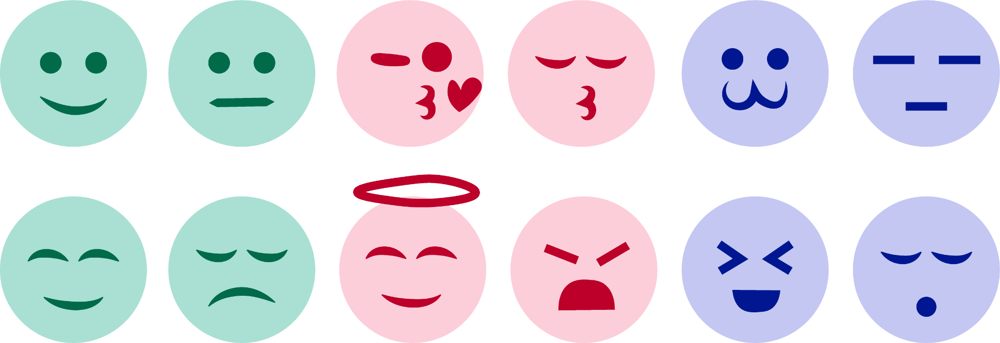
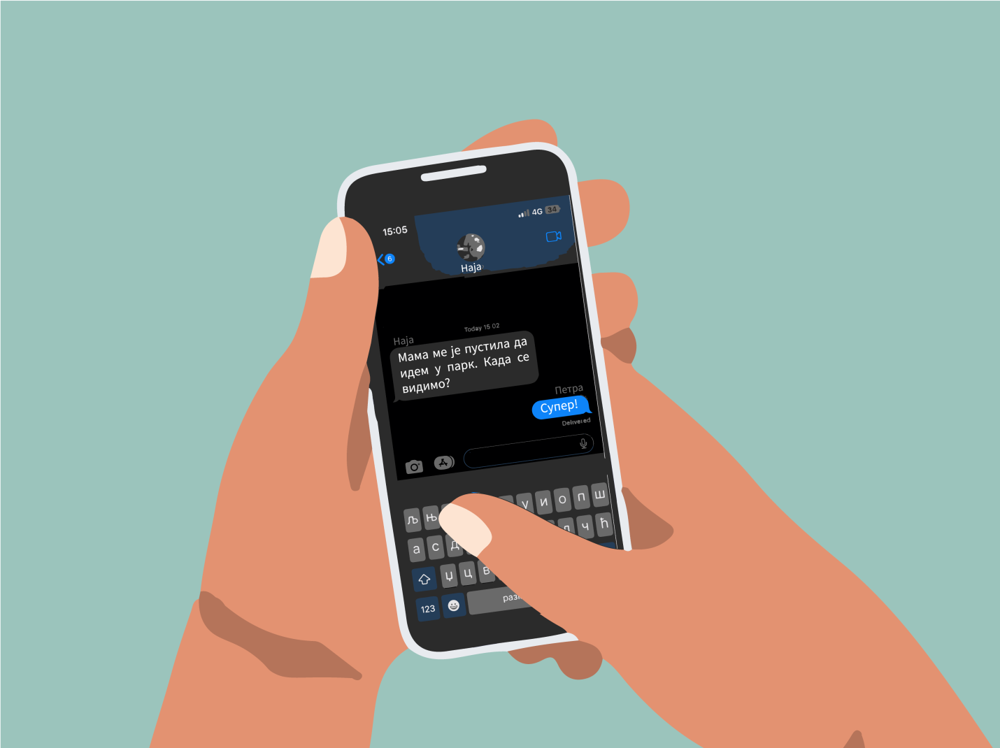

Добре и лоше стране комуникације путем дигиталних уређаја
=========================================================

.. infonote::

 .. image:: ../../_images/robot21.png
    :height: 120
    :align: left

 У претходној лекцији смо причали о комуникацији путем дигиталних уређаја, потом о личним подацима као и о томе да сваки пут када нешто поставимо на интернет ми правимо наш **дигитални отисак** или **дигитални траг**. Зато је важно да водимо рачуна о томе шта постављамо на интернет. Када урадиш све задатке и одговориш на сва питања у лекцији знаћеш да уочиш разлику између добрих и лоших страна комуникације 
 путем дигиталних уређаја. 

|

Пре него што упловимо даље у лекцију одговори на следеће питање.

.. mchoice:: p222а
   :hide_labels:
   :multiple_answers:
   :answer_a: Дигитална комуникација олакшава појединцима да анонимно малтретирају или узнемиравају друге на мрежи.
   :answer_b: Када се дописујеш са неким не можеш да видиш израз лица или чујеш глас друге особе, па можеш погрешно да разумеш поруку коју добијеш.
   :answer_c: Можеш лако да комуницираш са другима без обзира на то где се налазиш, што је погодно за рад на даљину.
   :answer_d: Током дигиталне комуникације можеш лако да организујеш и чуваш своје поруке, што ти олакшава да пратиш своје разговоре.    
   :answer_e: Дигиталном комуникацијом увек остављаш дигитални траг што значи да други могу видети твоје личне податке, а то може бити опасно.     
   :correct: c, d

   Означи квадратиће испред свих исказа којим се описује добра страна дигиталне комуникације.

Као и у стварном животу, и у дигиталној комуникацији мораш да водиш рачуна о 
томе да се правилно изражаваш, било да говориш или пишеш.

Свака особа за коју кажемо да је дигитално писмена комуницира преко интернета тако што:

- не пише само великим словима, јер зна да писање великим словима значи да галамимо или вичемо на другу особу која чита поруку коју смо послали;

- пише правилно користећи велика и мала слова као што то чини и у стварном животу; 

- пише знакове интерпункције (зарезе, тачке, узвичнике, упитнике) тако што после њих увек куца један размак (празан простор).

.. infonote::

 Није само важно како пишеш, још је важније оно шта пишеш или говориш.

Хајде да проверимо шта си до сада научио/ла када је реч о дигиталном правопису. Пажљиво прочитај следеће питање и одговори на њега. 

.. mchoice:: p222b
   :hide_labels:
   :multiple_answers:
   :answer_a: Пиши јасно и кратко!
   :answer_b: ПРИДРЖАВАЈ СЕ ГРАМАТИЧКИХ И ПРАВОПИСНИХ ПРАВИЛА
   :answer_c: Поштуј правила говора,као што радиш и у усменој комуникацији.
   :answer_d: Немој да пишеш само великим словима, јер писање великим словима значи да галамиш или вичеш.    
   :correct: a, d

   Означи квадратиће испред реченице која је написана у складу са дигиталним правописом.

Једна од великих предности дигиталне комуникације је та што ти даје могућност да брзо размењујеш информације са 
људима који нису поред тебе, на пример са својим другарима или укућанима. Међутим, када размењујеш поруке ти не можеш да чујеш и 
видиш израз лица особе са којом комуницираш па може да се деси да друга особа којој си послао/ла поруку погрешно доживи оно што си написао/ла.

.. suggestionnote::

 Важно је да увек имаш у виду да дигитална комуникација не може да замени лични контакт са другим људима. Зато је важно да не проводиш превише времена за дигиталним уређајима него да одвојиш време за дружење и време у природи.

Да бисмо у дигиталној комуникацији приказали људска осећања могу да се користе 
сличице – **емотиконе**. 

.. questionnote::
      Како би ти описао својим речима шта су емотикони? У радној свесци на страници **30**  се налази слика као што је ова испод. Заокружи све емотиконе који те ближе описују. Напиши испод сваког емотикона осећање које представља.

.. questionnote::
   Твој наредни задатак је да у радној свесци на страници **31** пробаш да осмислиш неке другачије, само твоје емотиконе. Нацртај три емотикона и опиши речима шта сваки од њих представља. 

-------------

Уз помоћ учитеља или учитељице покрени Бојанку, нацртај и сачувај своје емотиконе које си нацртао/ла у радној свесци.

Пажљиво проучи доњу слику разговора између две другарице.

|

|

.. questionnote::
   Који емотикон Петра треба да пошаље Наји? Нацртај га у радној свесци на страници **33**.

|

.. image:: ../../_images/robot23.png
   :height: 200
   :align: right

------------

**Домаћи задатак**

|

Размисли колико често комуницираш са родитељима или блиским особама користећи дигитални уређај?

----------------

У радној свесци на страници **34** напиши пар савета о томе како можеш најбоље да искористиш дигиталне уређаје за комуникацију са 
теби блиском одраслом особом?

|
