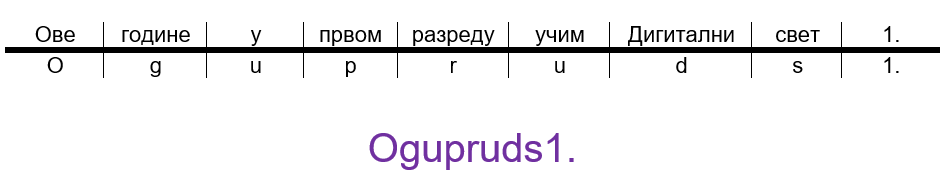
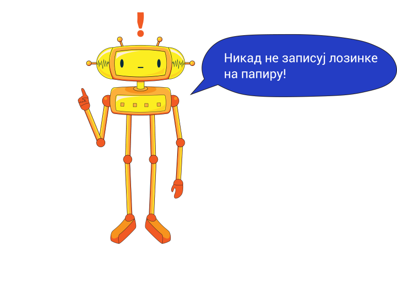
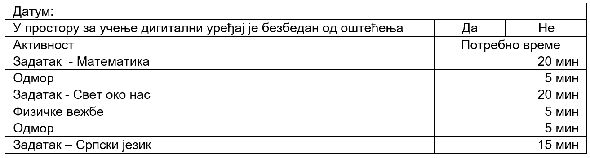
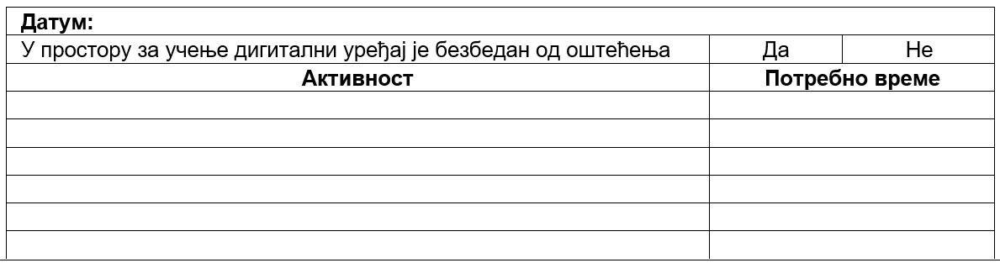

Безбедност информација сачуваних на дигиталном уређају
======================================================

.. infonote::

 .. image:: ../../_images/robot21.png
    :height: 120
    :align: left

 Када урадиш све задатке и одговориш на сва питања у лекцији знаћеш да наведеш неке од начина на које корисници дигиталних уређаја 
 остављају личне податке у дигиталном окружењу. Такође, бићеш у могућности да организујеш своје учење у онлајн окружењу на начин 
 који не угрожава твоје здравље, личну сигурност твог дигиталног уређаја. 

|

На различитим дигиталним уређајима можеш да користиш апликације за комуникацију. 
Да би информације које делиш кроз ове апликација остале заштиће непотребно је 
да буду заштићене лозинком, баш као и дигитални уређај. 

Јаку лозинку ћеш лакше да запамтиш ако искористиш ово једноставно правило, 
да користиш почетна слова речи у реченици за твоју лозинку. Лозинке се најчешће пишу 
латиницом.

|

|

.. questionnote::

 У радној свесци на страници **XX** креирај три јаке лозинку за све налоге и уређаје 
 које користиш. За сваку лозинку користи реченицу или фразу која ће ти помоћи 
 да је што лакше запамтиш. 

.. mchoice:: p224a
   :hide_labels:
   :multiple_answers:
   :answer_a: Лозинка треба да садржи мала и велика слова. Поред тога мораш да користиш најмање једно велико слово.
   :answer_b: Лозинка увек мора да има само 5 знакова.
   :answer_c: Лозинка треба да се састоји и од неких специјалних знакова, на пример, ?&#£$!@
   :answer_d: Свака лозинка треба да садржи имена и датуме теби блиских особа или кућних љубимаца
   :answer_e: Лозинка треба да се састоји од најмање 8 знакова.
   :correct: a, c, e

   Означи квадратиће испред тврдње о томе о чему треба да водимо рачуна да би лозинка заиста била јака.

.. mchoice:: p224b
   :hide_labels:
   :multiple_answers:
   :answer_a: Pera
   :answer_b: Im2B@h@2
   :answer_c: Suz@202!
   :answer_d: D@n@$j12
   :answer_e: Beograd
   :correct: b, c, d

   Означи квадратиће испред јаких лозинки.

.. mchoice:: p224c
   :hide_labels:
   :answer_a: Да
   :answer_b: Не
   :feedback_a: Неисправан одговор!
   :feedback_b: Исправан одговор!
   :correct: b

Увек користи различите лозинке за сваки од уређаја и налога које поседујеш.

Обрати се родитељу или блиској одраслој особи која ће ти помоћи да промениш лозинку, 
ако сумњаш да је твоја лозинка откривена.

.. questionnote::

 У радној свесци на страници **XX** нацртај скицу постера којим објашњаваш првацима 
 како треба да заштите своје податке када користе дигитални уређај.

.. questionnote::

 .. image:: ../../_images/robot24.png
    :height: 110
    :align: left
 
 Уз помоћ учитеља или учитељицу покрени Бојанку и на основу скице нацртај постер.

|

Ево неколико препорука које ће ти помоћи да органичиш време за екраном дигиталног 
уређаја:

- Искористи време за екраном дигиталног уређаја као награду за урађен домаћи задатак или сређену собу.

- Користи сат да провериш колико времена сваког дана проводиш за екраном дигиталног уређаја. 

- Разговарај са родитељима о времену које можеш да проведеш испред екрана дигиталног уређаја.

- Када се играш са друговима или другарицама немој да користиш дигитални уређај.

- Немој да користиш  дигиталне уређаје када имаш породична окупљања. 

- Води дневник о томе колико времена недељно проводиш за екраном дигиталног уређаја.

- Одмори очи од гледања у екран дигиталног уређаја.

- Редовно ради вежбе за врат, рамена и шаке. 
- Немој да користиш  дигиталне уређаје сат времена пре спавања.

- Одабери дан у недељикада нећеш да користиш дигиталне уређаје.

Осим заштите дигиталних уређаја и здравља, јако је важно да организујеш време током кога учиш.

Распоред времена за учење:

1. Организуј безбедан простор за учење  помоћу дигиталног уређаја. 
2. Направи листу са свим задацима које треба да урадиш.
3. За сваки задатак одреди време потребно за његову израду. 
4. Одреди колико пута ћеш да одмараш и колико ће трајати одмора током учења. 
5. Одреди колико ћеш пута правити паузе током којих ћеш радити физичке вежбе за очување здравља.
6. Прецизно одреди време и поштуј распоред. 
7. Распоред учења направи сваког дана.

Дат је пример распореда учења.

Користећи дату табелу направи свој распоред учења за данашњи дан. Потребно је да 
измериш време које проводиш радећи сваку активност и да онда када завршиш са свим 
активностима провери да ли ти је заиста требало онолоко времена колико си 
предвидео/ла за сваку активност и то затим, упиши у свој план рада. 

.. questionnote::

 У радној свесци на страници **XX** попуни доњу табелу.

