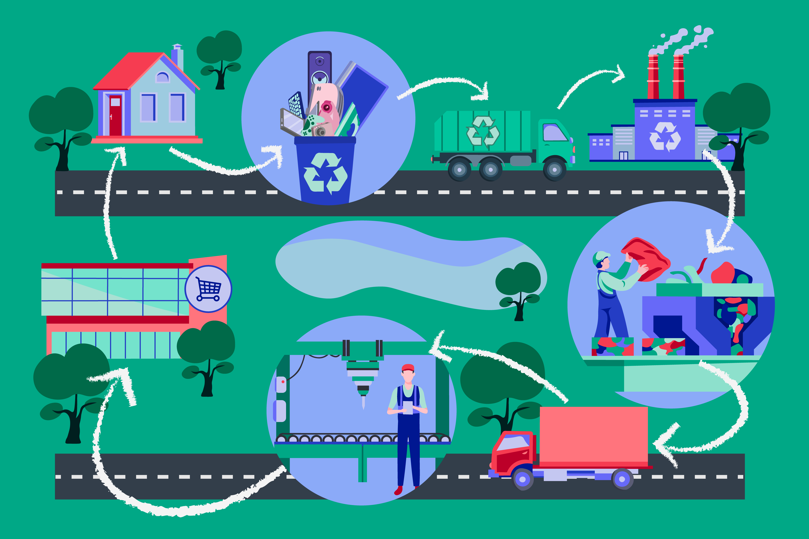

Електронски отпад је опасан
===========================

.. infonote::

 .. image:: ../../_images/robot21.png
    :height: 120
    :align: left

 У овој лекцији ћеш научити шта је то **електронски отпад** али и како да га правилно одложиш како не би угрозио/ла животну средину. Ово је важна лекција јер сви морамо да чувамо животну средину у којој живимо, а правилно одлагање сваког отпада па и електронског је један од начина како то да урадимо.

|

.. questionnote::

 Шта се дешава са дигиталним уређајем када се поквари? Опиши својим речима.

Старе и покварене дигиталне уређаје као што су то телевизори, рачунари, фрижидери, шпорети, веш машине и други апарати називамо **електронски отпад**.

.. suggestionnote::
 
 Важно је да запамтиш да електронски отпад никада не бацаш заједно са осталим смећем. Сви дигитални 
 уређаји су састављени од различитих материјала који загађују и уништавају нашу животну средину. **Веома је важно да све дигиталне уређаје правилно одлажеш.**

Да ли знаш шта је **рециклажа**? Рециклажом се може смањити количина отпада која се одлаже на депонијe.

|

Шта мислиш шта се дешава са отпадом од тренутка када га изнесемо из наше куће па док се не рециклира? Опиши поступак.

.. questionnote::

 Упореди поступак који си написао/ла са доњом сликом поступка одлагања и рециклаже електронског отпада.

-----------

Већ си у овој лекцији научио/ла да одговорно одлагање електронског отпада (е-отпада) има велики значај за животну средину и здравље.

Електронски уређаји су саставни део нашег савременог живота, али неправилно одлагање ових уређаја може изазвати низ негативних 
последица, а неке од њих су:

- Неки електронски уређаји садрже опасне материјале као што су жива, олово и други токсичне (штетне) хемикалије. Неправилно одлагање може довести до испуштања ових опасних материјала у околину, загађујући земљиште, воду и ваздух.
- Штетне хемикалије које се налазе у електронском отпаду могу имати штетан утицај на здравље људи. Олово и жива су примери супстанци које могу изазвати здравствене проблеме ако се изложимо њиховим испарљивим формама. Многи електронски уређаји садрже вредне ресурсе као што су злато, сребро и бакар.
- Одговорно рециклирање е-отпада омогућава поновну употребу и рециклирање ових материјала, што помаже у штедњи природних ресурса. Правилно одлагање и рециклирање електронског отпада доприноси очувању наше планете.
- Ограничавањем загађења и заштитом природних ресурса, ми штитимо околину за будуће генерације. Одговарно одлагање електронског отпада је неопходно како бисмо заштитили нашу природу, заштитили своје здравље и допринели одрживој будућности. 

.. questionnote::

    У радној свесци на страници **42** напиши шта можеш да учиниш да се количина дигиталног отпада смањи. Разговарај и са својим друговима и другарицама.

------------

**Домаћи задатак**

.. image:: ../../_images/robot23.png
    :width: 100
    :align: right

У радној свесци на страници **43** Нацртај скицу постера којим позиваш људе да електронски отпад не бацају заједно са осталим отпадом. 

Уз помоћ родитеља или теби блиске одрасле особе покрени Бојанку. Нацртај постер и сачувај.

