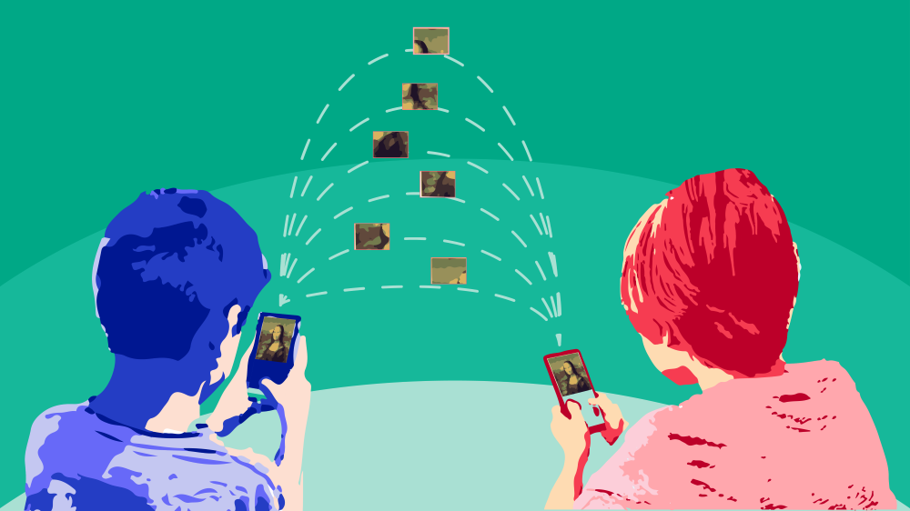
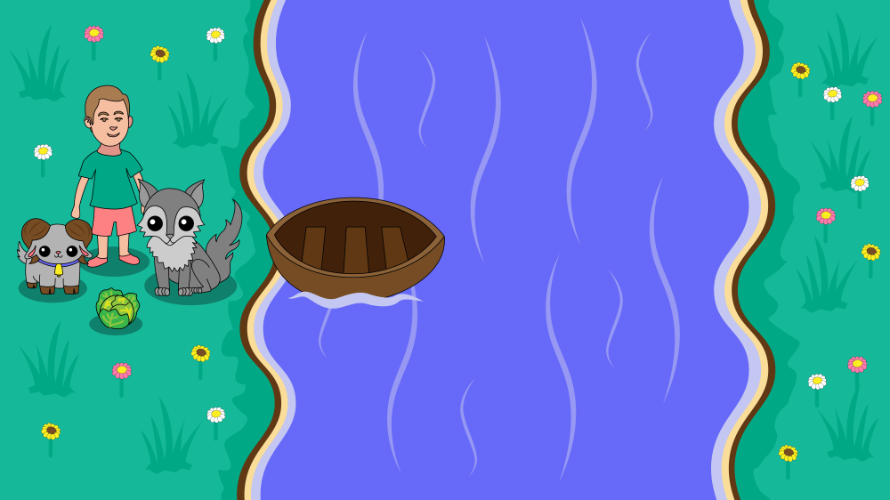

Алгоритам
=========

.. infonote::

 .. image:: ../../_images/robot31.png
    :height: 120
    :align: left

 Када урадиш све задатке и одговориш на сва питања у лекцији знаћеш да својим речима објасниш појам алгоритма.

|

Опиши поступак за прављење колача. 

|

.. image:: ../../_images/kolaci.png
   :height: 400
   :align: center

.. questionnote::

 Да ли је могуће прескочити неки од ових корака? Шта ће се десити? Опиши.

О алгоритму смо говорили у првом разреду. Алгоритам је низ корака помоћу којих се 
описује неки задатак. Тачније, то је упутство помоћу кога људи или машине могу да 
успешно решавају и обављају неки посао. Алгоритме користимо све време, а да тога нисмо ни свесни.

|

Сваки алгоритам било да га обављају људи или машине има следеће особине:

1.	Изводи се корак по корак.
2.	У сваком кораку је тачно одређено шта треба да се уради.
3.	После сваког корака следи тачно одређен следећи корак.
4.	Ниједан корак не траје бесконачно, већ се завршава након одређеног времена.

------------

Наја је кренула са родитељима на море. Помози Наји да се спакује. Сваки пут почни 
од Наје и прати алгоритам помоћу кога ћеш пронаћи сву опрему коју ће она носити на 
море. 

У радној свесци на страници **XX** нацртај у великој мрежи предмете које ће Наја носити.

|

.. image:: ../../_images/slika.png
   :height: 300
   :align: center

Упореди своје решење са решењима твојих другова и другарица.

------------

Наш робот разуме следеће кораке.

.. image:: ../../_images/simboli2.png
   :height: 170
   :align: center

Пажљиво проучи доњу слику.

|

.. image:: ../../_images/alg_oblici.png
   :height: 500
   :align: center

.. questionnote::
 
 Постави робота на браон срце. Окрени га ка зеленом ромбу. У радној свесци на 
 страници **XX** напиши алгоритам који ће омогућити роботу да посети све троуглове, 
 али тако да не пређе преко жутог круга.

 У радној свесци на страници **XX** напиши колико корака има твој алгоритам? 

Упореди своје решење са решењима твојих другова и другарица. 

Колико њихови алгоритми имају корака? Ако неки алгоритам има мање корака, 
покушај да пронађеш краћи пут и у радној свесци на страници **XX** напишеш нови алгоритам.

------------------

Као што смо говорили у првом разреду, дигитални уређаји могу да прате алгоритме, 
баш као и људи. Рад дигиталног уређаја контролише рачунар који је програмиран помоћу 
алгоритма. 

Пажљиво проучи слику.

|

.. questionnote::

 Опиши поступак за слање фотографије помоћу апликације Вајбер.

У радној свесци на страници **XX** поређај кораке у прави редослед којим се детаљно 
описује поступак слања фотографије помоћу Вајбера.

- Покрени Вајбер апликацију.
- Одабери име или групу.
- Одабери сличицу камере у апликацији.
- Камера је активна, кликни на централно дугме.
- - Слика је направљена, напишу кратак опис слике (по жељи). 
- Кликни на дугме у облику стрелице и слика ће бити послата.

.. questionnote::

 Да ли је могуће прескочити неки од ових корака? Шта ће се десити? Опиши.

|

.. image:: ../../_images/robot23.png
    :height: 200
    :align: right

--------------

**Домаћи задатак**

|

Нека ти родитељ или блиска одрасла особа помогне да на интернету понађеш оригами 
упутство за прављење жабе.

--------

Нека ти родитељ или одрасла особа покаже како функционише пакетомат или банкомат. 

У радној свесци на страници **XX** напиши алгоритам на основу кога он правилно ради.

------

**ЗАГОНЕТКА**

|

Перица треба преко реке да превезе вука, козу и купус. Има чамац, којим може да 
превезе себе и још само једног путника (вука, козу или купус). Вук и коза не смеју 
да остану сами на обали, јер ће вук појести козу. Ако коза и купус заједно остану 
сами на обали, коза ће појести купус. (*Извор: Математички лист из 1969. године*)

|

.. questionnote::

 У радној свесци на страници **XX** напиши алгоритам помоћу кога ће Перица превести и 
 вука, и козу, и купус на другу страну обале.
