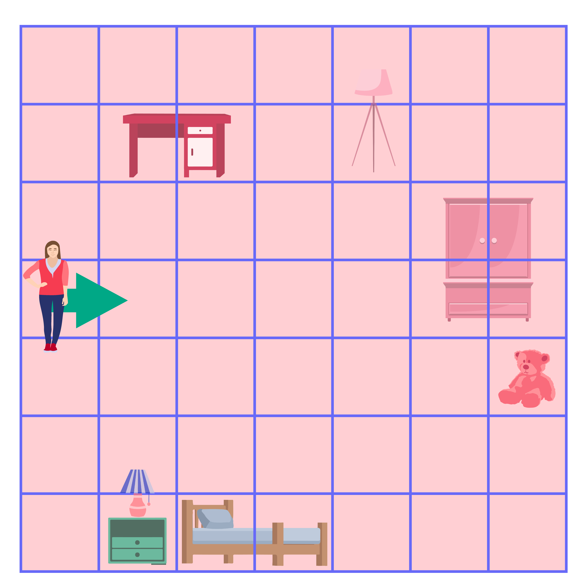

Алгоритам
=========

.. infonote::

 .. image:: ../../_images/robot31.png
    :height: 120
    :align: left

 У наредним лекцијама ћеш се подсетити како да користиш **алгоритамски начин размишљања** како би успешно решио/ла задатак и како да за решавање задатка користиш **алгоритме**. Док будеш читао/ла лекције које се налазе пред тобом, приметићеш да алгоритми постоје свуде око нас и да нам често живот чине лакшим. То је баш супер зар не?

|

Сви волимо да једемо колаче и торту зар не? Али да ли си знао/ла да о прављењу торте можеш да размишљаш као о једном алгоритму? На шта тачно мислимо? Да бисмо направили торту морамо да пратимо тачно одређене кораке у супротном нам торта неће успети. Хајде да видимо који су кораци потребни да бисмо направили торту. Сада је твој ред да опишеш својим речима поступак за прављење торте. 

|

.. questionnote::

 Шта мислиш, да ли је могуће прескочити неки од ових корака? Шта ће се онда десити? Опиши.

О алгоритму смо говорили у првом разреду. Тада си научио/ла да је **алгоритам** низ корака помоћу којих се 
решава неки задатак. Тачније, то је упутство помоћу кога људи или машине могу да 
успешно решавају и обављају неки посао. Алгоритме користимо све време, а да тога нисмо ни свесни.

|

Сваки алгоритам било да га обављају људи или машине има следеће особине:

1.	Изводи се корак по корак.
2.	За сваки корак је тачно одређено шта треба да се уради.
3.	После сваког корака следи тачно одређен следећи корак.
4.	Ниједан корак не траје бесконачно, већ се завршава након одређеног времена.

Ако се сетиш како смо описали кораке за прављење торте видећеш да је то један алгоритам.

------------

Наја је кренула са родитељима на море. Помози Наји да се спакује. Сваки пут почни 
од Наје и прати алгоритам помоћу кога ћеш пронаћи сву опрему коју ће она носити на 
море. 

.. У радној свесци на страници **XX** нацртај у великој мрежи предмете које ће Наја носити.

|

Упореди своје решење са решењима твојих другова и другарица.

------------

Наш робот разуме следеће кораке.

.. image:: ../../_images/simboli2.png
   :height: 170
   :align: center

Пажљиво проучи доњу слику.

|

.. image:: ../../_images/alg_oblici.png
   :height: 500
   :align: center

.. Постави робота на браон срце. Окрени га ка зеленом ромбу. У радној свесци на страници **XX** напиши алгоритам који ће омогућити роботу да посети све троуглове, али тако да не пређе преко жутог круга.

.. У радној свесци на страници **XX** напиши колико корака има твој алгоритам? 

.. Упореди своје решење са решењима твојих другова и другарица. 

.. Колико њихови алгоритми имају корака? 

.. Ако неки алгоритам има мање корака, покушај да пронађеш краћи пут и у радној свесци на страници **XX** напишеш нови алгоритам.

------------------

Као што смо говорили у првом разреду, дигитални уређаји могу да прате алгоритме, 
баш као и људи. Рад дигиталног уређаја контролише рачунар који је програмиран помоћу 
алгоритма. 

|

.. image:: ../../_images/robot23.png
    :height: 200
    :align: right

--------------

**Домаћи задатак**

|

--------

.. У радној свесци на страници **XX** напиши алгоритам на основу кога он правилно ради.

------

.. learnmorenote::

 **МОЗГАЛИЦА**

 Перица треба преко реке да превезе вука, козу и купус. Има чамац, којим може да 
 превезе себе и још само једног путника (вука, козу или купус). Вук и коза не смеју 
 да остану сами на обали, јер ће вук појести козу. Ако коза и купус заједно остану 
 сами на обали, коза ће појести купус. (*Извор: Математички лист из 1969. године*)

 .. image:: ../../_images/perica.png
   :width: 600
   :align: center

..
   .. questionnote::

 У радној свесци на страници **XX** напиши алгоритам помоћу кога ће Перица превести и 
 вука, и козу, и купус на другу страну обале.
