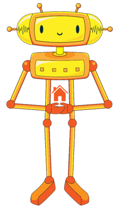

Алгоритми понављања
===================

.. infonote::

 .. image:: ../../_images/robot31.png
    :height: 120
    :align: left

 Када урадиш све задатке и одговориш на сва питања у лекцији моћи ћеш да анализираш 
 једноставан познати поступак који садржи понављања одређених радњи и представиш их 
 алгоритамски.

|

Пажљиво проучи доњу слику. 

|

.. image:: ../../_images/zaba.png
    :width: 600
    :align: center

.. fillintheblank:: f328a

    Шта жабац користи да би прескочио реку и уловио инсекта? Напиши свој одговор тако да сва слова буду мала написана ћирилицом. 

    Одговор: |blank|

    - :^\s*[Лл]оквањ|[Лл]оквање\s*$: Одговор је тачан.
      :x: Одговор није тачан.

.. fillintheblank:: f328b

    Колико пута жабац треба да скочи да би прешао реку? |blank|

    - :^\s*[Шш]ест|6|[Šš]est\s*$: Одговор је тачан.
      :x: Одговор није тачан.

|

.. fillintheblank:: f328c

    Колико најмање пута дечак треба да скочи на једну ногу да би дошао до броја 4? |blank|

    - :^\s*[Тт]ри|3|[Tt]ri\s*$: Одговор је тачан.
      :x: Одговор није тачан.

.. fillintheblank:: f328d

    Колико пута дечак треба да скочи на једну ногу да би дошао до броја 7? |blank|

    - :^\s*[Пп]ет|5|[Pp]et\s*$: Одговор је тачан.
      :x: Одговор није тачан.

-----------------

Пажљиво проучи слику. 

.. fillintheblank:: f328е

    Како се зове геометријски облик приказан на слици? 
    
    Напиши свој одговор тако да сва слова буду мала написана ћирилицом |blank|

    - :^\s*[Пп]правоугаоник|[Pp]ravougaonik\s*$: Одговор је тачан.
      :x: Одговор није тачан.

-----

Цртање почињеш од плавог кружића. Користи следеће наредбе:

|

..
    .. questionnote::

 У радној свесци на слици **XX** напиши алгоритам за цртање геометријског облика приказаног на горњој слици. 

.. mchoice:: p328а
   :answer_a: Има
   :answer_b: Нема
   :correct: a

    Да ли у написаном алгоритму има корака који се понављају? 

.. У радној свесци на слици **XX** заокружи све кораке који се понављају.

------------

Да бисмо поједноставили писање корака који се понављају, можеш да их напишеш на следећи начин:

|

|

.. На основу тога, у радној свесци на страници **XX** исправи горњи алгоритам.

..
    .. questionnote::

 У радној свесци на слици **XX** нацртај и обој геометријски облик. Након тога, 
 напиши алгоритме за цртање описаних геометријских облика.

|

--------------

**Домаћи задатак**

|

.. image:: ../../_images/slika.png
    :width: 400
    :align: center

|

У природи постоје процеси који се непрестано или с времена на време понављају. 

.. questionnote::

 Да ли препознајеш природну појаву са слике? Како се зове?

 Колико се често она понавља? 

.. У радној свесци на страници **XX** напишеш још неке природне појаве или радње које се понављају.

