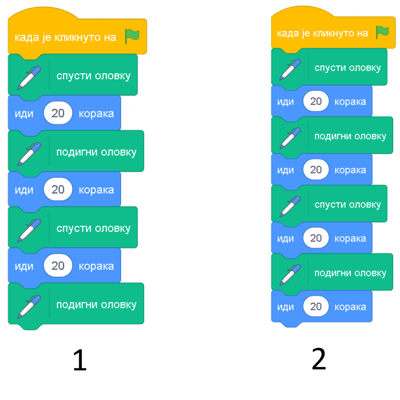
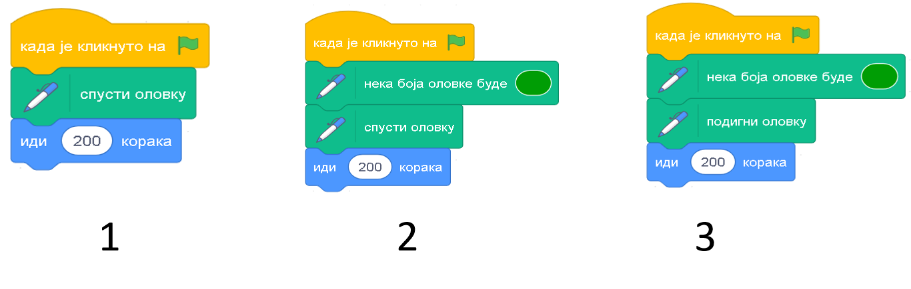
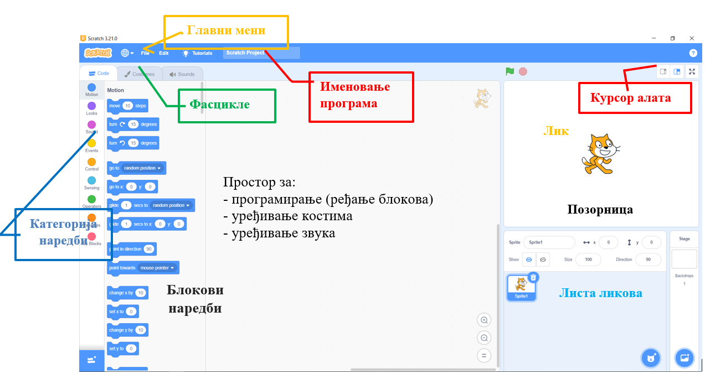
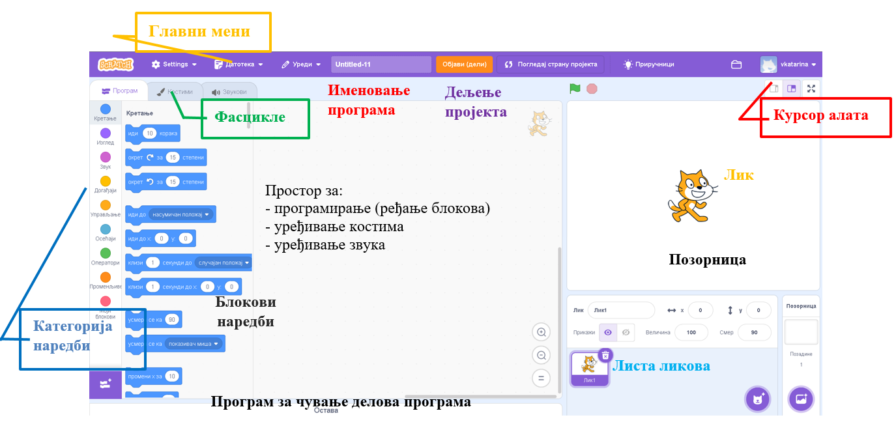
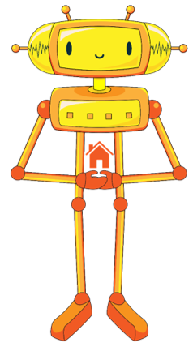

Од алгоритма до програма за дигиталне уређаје
=============================================

.. infonote::

 .. image:: ../../_images/robot31.png
    :height: 120
    :align: left

 Када урадиш све задатке и одговориш на сва питања у лекцији знаћеш да креираш 
 одговарајући рачунарски програм у визуелном програмском језику.

|

Да се подсетимо: алгоритaм је низ корака који воде до решења неког задатка. 
Да би дигитални уређај могао да решава задатке потребно је да кораке алгоритма 
претворимо у наредбе које он разуме. Уствари, ми правимо рачунарски програм. 
Те програме пишу људи, користећи различите програмске језике. Постоје текстуални и визуелни програмски језици. У другом разреду ћеш се бавити програмирањем користећи визуелни програмски језик, као што је Скреч (енг. Scratch). 
У Скречу програмираш тако што уклапаш наредбе на прави начин, слично као слагалица.

-------

Скреч можеш да користиш на два начина: 

→ Ако имаш дигитални уређај који није повезан на интернет, можеш да инсталираш Скреч окружење тако што га преузмеш са адресе: https://scratch.mit.edu/download и уз помоћ родитеља или блиске одрасле особе инсталираш на свој дигитални уређај.

→ Ако имаш дигитални уређа повезан на интернет, можеш да користиш онлајн верзију Скреч окружења, на адреси: https://scratch.mit.edu/, користећи било који дигитални уређај (код куће, у школи, код рођака...).

--------

Без обзира на то да ли радиш на интернету или користиш Скреч окружење на свом 
дигиталном уређају начин на који програмираш је исти. 

.. infonote:: 

 Веомаје важно да увек када користиш Скреч окружење потражиш помоћ родитеља или блиске одрасле особе.

Радно окружење у обе верзије изгледа скоро исто. 

   *Радно окружење инсталиранo на рачунару*

   *Радно окружење на онлајн платформи*

Уз помоћ учитеља, учитељице или блиске одрасле особе погледај видео-запис са детаљним 
описом Скреч радног окружења.

|

Скреч окружење 

.. ytpopup:: xB4VMIIKXj0
    :width: 735
    :height: 415
    :align: center

----------------

Пред тобом се налази алгоритам којим се исцртава испрекидана линија која се састоји 
од 2 линије дужине 20 корака (центиметра), а растојање између линија је 20 корака.

-----------

1. корак: Спусти оловку
2. корак: Иди право 20 корака
3. корак: Подигни оловку
4. корак: Иди право 20 корака
5. корак: Спусти оловку
6. корак: Иди право 20 корака
7. корак: Подигни оловку

---------

.. questionnote::

 Пратећи горњи алгоритам (упутство), у радној свесци на страници **XX** нацртај 
 одговарајући облик.

.. fillintheblank:: f329a

    Колика је дужина испрекидане линије?

    Одговор: |blank|

    - :^\s*[Шш]ездесет|60\s*$: Одговор је тачан.
      :x: Одговор није тачан.

.. quizq::

    Анализирај програм направљен у Скречу. Означи кружић испред броја програма који одговара корацима алгоритма којим се исцртава испрекидана линија.

        .. image:: ../../_images/alg1.png
           :width: 350
           :align: center

    .. mchoice:: p329a
        :hide_labels:
        :answer_a: 1
        :answer_b: 2
        :correct: a

У радној свесци на страници **XX** напиши алгоритам на основу кога ће бити исцртана 
линија зелене боје дужине 200 корака (центиметара).

Користи следеће наредбе:

**И** - иди право 200 корака

**С** - спусти оловку

**П** - подигни оловку

**З** - постави зелену боју оловке

-----------

.. quizq::
    
    Анализирај програм направљен у Скречу. Означи кружић испред броја програма који одговара корацима алгоритма којим се исцртава линије.
    
    .. image:: ../../_images/alg2.png
        :width: 700
        :align: center
    
    .. mchoice:: p329b
        :hide_labels:
        :answer_a: 1
        :answer_b: 2
        :answer_c: 3
        :correct: c

|

--------------

**Домаћи задатак**

|

У радној свесци на страници **XX** напиши алгоритам на основу кога ће бити исцртана 
линија зелене боје која се састоји од три линије дужине 20 корака (центиметара). 
Размак између линија је 20 корака.

Користи следеће наредбе:

**И** - иди право 20 корака

**С** - спусти оловку

**П** - подигни оловку

**З** - постави зелену боју оловке

.. questionnote::

 Да ли уочаваш кораке који се понављају? Заокружи их.

