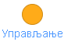
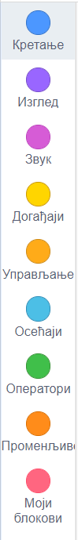

Низање наредби у програмском језику Скреч
=========================================

.. |zastava| image:: ../../_images/zastava.png
            :width: 40px

.. infonote::

 .. image:: ../../_images/robot31.png
    :height: 120
    :align: left

 Када урадиш све задатке и одговориш на сва питања у лекцији знаћеш да анализираш 
 једноставан програм креиран у визуелном програмском језику и објасниш шта и на који 
 начин тај програм ради. Такође, моћи ћеш да уочиш и исправиш грешке у једноставном 
 програму, провериш ваљаност новог решења и по потреби га додатно поправиш.

Наредбе у Скреч окружењу подељене су у девет група. Свака група има свој назив 
(нпр. Кретање) који нам ближе описује која врста блокова наредби се у њој налазе. Сви блокови који припадају једној групи обојени су истом бојом (нпр. блокови групе Кретање плаве су боје).

   *Слика. Групе наредби у Скреч окружењу*

---------

.. questionnote::

 Потребно је да направиш програм чији је резултат извршавања приказан на доњој слици.

|

Оно што треба да знаш да поступак за прављење програма подразумева:

✔	Решавање задатка – размишљање о проблему и писање алгоритма за његово решавање;

✔	Припрема – одабир ликова и позадине;

✔	Програмирање – одабир и слагање блокова наредби;

✔	Тестирање -  провера да ли програм ради како треба и исправљање грешака.

|

**Решавање задатка**

**Алгоритам:**

1. корак: Куца изговара: Здраво! Ја сам Либи.

**Припрема**

Одабери лик |n1| и позадину |n2|.

|

Лик можеш да додаш на четири начина и то тако што кликнеш:

1. на иконицу |n3| или

2. на картицу *Костими*

|

Позадину можеш да додаш на четири начина и то тако што кликнеш:

1. на иконицу |pozadina| или

2. на картицу *Позадине*

-------------

**Програмирање**

Одабери лик |n1|.

Поређај блокове на следећи начин:

Из групе |dogadjaji| превуци блок |kliknuto| којим се обезбеђује да извршавање програма почне када корисник кликне на зелену заставицу. 

Из групе |izgled|  превуци блок |zdravo| који се користи за приказ наведеног текста на позорници у одређеном временском трајању. 
Текст и бројеви уносе се у бела поља брисањем постојећег текста и уписивањем новог 
садржаја.

|

Изглед програма:

|

**Тестирање**

Притисни зелену заставицу |zastava|.

.. questionnote:

 У радној свесци на страници **XX** напиши своје запажање о раду програма.

.. questionnote::

 .. image:: ../../_images/robot34.png
    :height: 130
    :align: left

 Покрени Скреч радно окружење. Заједно са учитељем или учитељицом прати упутство за 
 прављење програма у коме куца изговара „Здраво! Ја сам Либи.“

|

Покушај да додаш блок |zdravo2| у који ћеш уписати „Програм је направљен дана…” (уместо три тачке упиши датум када је програм направљен).

-------------

Пажљиво проучи програм приказан на слици.

Уз помоћ учитеља или учитељице покрени Скреч окружење. Одабери лик |n1| и позадину |n2|. 
Поређај блокове као на горњој слици.

|

Тестирај програм кликом на зелену заставицу |zastava|.

.. questionnote::

 Да ли је резултат извршавања горњег програма приказан на доњим сликама.

У радној свесци на страницама **XX** напиши своје запажање о раду програма:

Грешке у програму које доводе до неправилног извршавања програма називају се **багови** (енг. *bugs* – бубе). 

.. questionnote::

 Како да исправиш грешке у програму?

**Објашњење решења**.

→ Објасни своје решење друговима или учитељу или учитељици. Док објашњаваш, вероватно ћеш открити у чему је проблем твог решења.

**Проналажење грешке**.

→ Када утврдиш да програм не ради на очекивани начин, анализирај програм (блок по блок). Овако провераваш да ли је до грешке дошло због лоше осмишљеног алгоритма или због погрешно одабраних блокова у програму.

**Исправљање грешке**.

→ Унеси исправке и поново тестирај програм. 

Након тестирања пронашли смо грешку. 

**Објашњење решења**. 

Текст који изговара куца толико се брзо мења да се не види да је куца изговорила “Здраво!” – видимо само последњу реченицу.

**Проналажење грешке**. 

Да бисмо исправили грешку потребно је да заменимо блок за приказивање текста |zdravo2| блоком који уз текст садржи и 
време приказа |zdravo|.

-----------

**Изглед исправљеног програма**.
 
.. image:: ../../_images/lp3.png
   :width: 400
   :align: center

|

Притисни зелену заставицу |zastava|.

.. questionnote::

 У радној свесци на страници **XX** напиши своје запажање о раду програма.

|

.. image:: ../../_images/robot33.png
    :height: 200
    :align: right

--------------

**Домаћи задатак**

|

Уз помоћ родитеља или блиске одрасле особе покрени Скреч окружење. Креирај програм којим лик изговара рефрен твоје омиљене песме. Помоћ: Да би лик изговорио више од једне реченице користи наредбу |cekaj| 
из категорије |upravljanje|.
