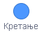

Понављање блокова наредби у програму Скреч
==========================================

.. |olovka| image:: ../../_images/olovka.png
            :width: 60px

.. |ps3| image:: ../../_images/ps3.png
            :width: 50px

.. |ps5| image:: ../../_images/ps5.png
            :width: 120px

.. infonote::

 .. image:: ../../_images/robot31.png
    :height: 120
    :align: left

 Када урадиш све задатке и одговориш на сва питања у лекцији знаћеш да анализираш 
 једноставан програм креиран у визуелном програмском језику и објасниш шта и на 
 који начин тај програм ради. Такође, моћи ћеш да уочиш и исправиш грешке у 
 једноставном програму, провериш ваљаност ново грешења и по потреби га додатно 
 поправиш.

.. questionnote::

 У радној свесци на страници **XX** напиши алгоритам на основу кога ће бити исцртана 
 испрекидана линија љубичасте боје која се састоји од три линије дужине 20 корака 
 (центиметара). Размак између линија је 20 корака.

Користи следеће наредбе:

**И** - иди право 20 корака

**С** - спусти оловку

**П** - подигни оловку

**Љ** - постави ључичасту боју оловке

.. questionnote::

 Уз помоћ учитељице или учитеља покрени Скреч окружење. Помоћу твог алгоритма направи 
 програм за цртање задате испрекидане линије.

|

**Припрема** 

Да би лик могао да пише по позорници потребно је да увезеш групу блокова *Оловка*. 
То чиниш тако што кликнеш на |ps1| и одабереш |ps2|.
Одабери лик |ps3|.

**Програмирање**

Поређај блокове тако да користиш блокове |ps4|, |ps5| и |ps6| из категорије |olovka|. 

Као и блок |ps7| из категорије |kretanje|.

**Тестирање**

Притисни зелену заставицу |zastava|.

.. questionnote::

 У радној свесци на страници **XX** напиши своје запажање о раду програма:

Упореди своје решење са друговима и другарицама. 

---------------

У Скреч окружењу постоје три врсте наредби у које се умећу други блокови чије извршавање треба да се понови:

- одређени број пута: 

|ps8|
 
Овај блок треба да користиш када унапред знаш тачан број понављања (каже се и итерација). 

|

- бесконачан број пута (непрестано, све док корисник не заустави програм): 

|ps9|
 
То је један од најчешће коришћених блокова. Његово извршавање зауставља се кликом на дугме за престанак рада програма (|sstop|). 

|

- све док не буде испуњен одређени услов: 

|ps10|
 
Овај блок треба да користиш када не знаш колико је пута потребно извршити блокове унутар блока за понављање и зато желиш да се оне извршавају све док не буде испуњен одређени услов. 

----------------

Петље су важне јер штеде време, смањују могућност грешака и што је најважније 
чувају нас од потребе да пишемо стотине или чак хиљаде истих редова наредби. 

|

.. quizq::

 Означи кружић испред броја блока који је најбоље да користиш ако желиш да смањиш број блокова наредби од којих се састоји програм за исцртавање испрекидане линије:
 
 |

 .. image:: ../../_images/p331a.png
    :width: 500
    :align: center

 .. mchoice:: p331а
    :hide_labels:
    :answer_a: 1
    :answer_b: 2
    :answer_c: 3
    :correct: a

|

Пажљиво погледај слику програма.

Уз помоћ учитељице или учитеља покрени Скреч окружење. Поређај блокове горњег програма. Тестирај програм.

.. questionnote::

 Да ли слика одговара алгоритму за исцртавање испрекидане линије љубичасте боје. Објасни.

Пажљиво проучи доњи програм.

.. questionnote::

 У радној свесци на страници **XX** напиши своје запажање о програму. Да ли уочаваш кораке који се понављају? Заокружи их.

 
.. fillintheblank:: f331a

    Програм је сачињен од |blank| блокова наредби који су поређани испод блока |ps11|. 

    Једна група блокова понавља се |blank| пута.

    - :^\девет|9\s*$: Први одговор је тачан.
      :x: Први одговор није тачан.

    - :^\три|3\s*$: Други одговор је тачан.
      :x: Други одговор није тачан.

.. quizq::

 Означи кружић испред броја блока који је најбоље да користиш ако желиш да смањиш број блокова наредби од којих је састоји горњи програм.
 
 |

 .. image:: ../../_images/p331b.png
    :width: 500
    :align: center

 .. mchoice:: p331b
    :hide_labels:
    :answer_a: 1
    :answer_b: 2
    :answer_c: 3
    :correct: c

|

.. questionnote::

 .. image:: ../../_images/robot34.png
    :height: 130
    :align: left

 Уз помоћ учитељице или учитеља покрени Скреч окружење. Побољшај горњи програм коришћењем петље.

|

**Припрема**

Одабери лик |maca|.

**Програмирање**

Побољшај горњи програм коришћењем петље.

**Тестирање**

Притисни зелену заставицу |zastava|.

.. questionnote::
 
 У радној свесци на страници **XX** напиши своје запажање о раду програма:

----------

Напиши име сваког геометријског облика. Колико страница и колико углова има сваки правилан многоугао.

|

.. questionnote::

 Креирај програм којим ће лик на позорници исцртати правоугаоник. 

**Решавање задатка**

Правоугаоник је четвороугао који има четири странице и четири угла. 
Има две једнаке дуже странице и две једнаке краће странице.

Можеш да одредиш тако што ћеш поделити 360 са бројем страна. Код правоугаоника то је 
360 : 4 = 90. Ову вредност ћеш користити у блоку   или  тако што ћеш је унети уместо 
броја 15. 

О угловима ћеш учити у старијим разредима.

**Алгоритам**

1. корак: Спусти оловку

2. корак: Понови 2 пута

- 1. корак: Иди право 200 корака

- 2. корак: Окрени за 90 степени

- 3. корак: Иди право 50 корака

- 4. корак: Окрени за 90 степени

**Припрема**

Одабери лик  .

**Програмирање**

Уз помоћ учитељице или учитеља покрени Скреч окружење.

Поређај блокове тако да користиш блокове |ps5| из категорије |olovka|. 

Као и блокове |ps7| и |okret151| из категорије |kretanje|.

**Тестирање**

Притисни зелену заставицу |zastava|.

.. questionnote::

 У радној свесци на страници **XX** напиши своје запажање о раду програма:

Упореди своје решење са својим друговима и другарицама. 

|

.. image:: ../../_images/robot33.png
    :height: 200
    :align: right

--------------

**Домаћи задатак**

|

Одреди вредност коју ћеш уносити у блок |okret151| или |okret152| приликом 
исцртавања одређених геометријских облика. 

------------

У радној свесци на страници **XX** попуни табелу.

.. questionnote::

 Уз помоћ родитеља или блиске одрасле особе покрени окружење Скреч. Креирај програм којим ће лик на позорници да исцрта троугао. 