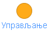
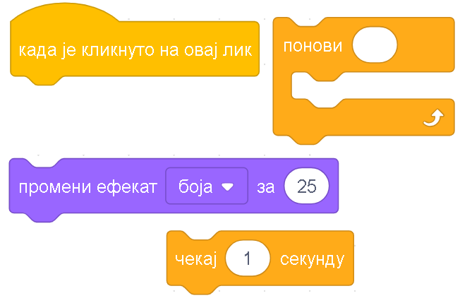
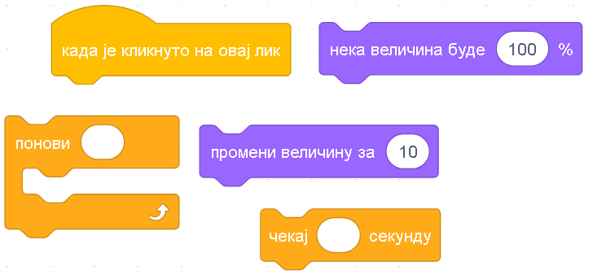

Вежбаоница
==========

.. infonote::

 .. image:: ../../_images/robot31.png
    :height: 120
    :align: left

 До сада си се значајно упознао/ла са програмирањем у Скречу. Сада ти је преостало 
 само да наставиш са вежбањем како би постао/ла мајстор у креирању програма у овом 
 окружењу. Када завршиш са изазовима који следе, бићеш у стању да се са лакоћом 
 сналазиш у програму и решаваш разноврсне изазове.

|

Вежбаоница је право место на коме ћеш унапредити своје знање из програмирања у 
Скреч окружењу. За сваку помоћ обрати се учитељу или учитељици.

.. questionnote::

 Напиши алгоритам, па затим у Скреч окружењу креирај програм којим ће лик на позорници исцртати жути квадрат. Дужина странице је 200 корака.

У радној свесци на страници XX напиши алгоритам на основу кога ће лик исцртати квадрат. 

Користи следеће наредбе:

**И** - иди право 200 корака

**С** - спусти оловку

**П** - подигни оловку

**О90** – окрени се за угао 90

**Ж** - постави жуту боју оловке

----------

Уради задатак низањем корака и коришћењем петље.

----------

.. questionnote::

 Напиши алгоритам, па затим у Скреч окружењу креирај програм којим ће лик на позорници исцртати шестоугао љубичате боје. Дужина странице је 100, а дебљина странице је 4.

**Мала помоћ**: Из категорије |olovka| одабери блок наредби |debljina|.

У радној свесци на страници **XX** напиши алгоритам на основу кога ће бити лик 
исцртати шестоугао. 

Користи следеће наредбе:

**И** - иди право 200 корака

**С** - спусти оловку

**П** - подигни оловку

**О60** – окрени се за угао 60

**З** - постави зелену боју оловке

**Д** – постави дебљину оловке на 4

--------------

Уради задатак низањем корака и коришћењем петље.

----------

.. questionnote::

 Напиши алгоритам, па затим у Скреч окружењу креирај програм којим ће се лик кретати од леве ка десној ивици позорнице. Нека маца увек полази са 
 позиције |idido1|.

**Maла помоћ**: Из категорије |kretanje| превуци блок |idido2|. 

У радној свесци на страници **XX** напиши алгоритам на основу кога ће се лик кретати
 од леве ка десној ивици позорнице. 

Користи следеће наредбе:

**И** - иди право 30 корака

**К** – промени костим

**Ч** – чекај 1 секунду

**П** – постави мацу на почетну позицију

--------------

Уради задатак низањем корака и коришћењем петље.

---------------

.. questionnote::

 Напиши алгоритам, па затим у Скреч окружењу креирај програм којим ћеш пошумити шуму. Нацртај дрво користећи Бојанку. Нека ти учитељ или учитељица помогну да сачуваш своје дрво. 
 
**Мала помоћ**: Из категорије |upravljanje| користи блок |duplikat|.

.. questionnote::

 На основу понуђених блокова наредби креирај програм којим када се кликне на лик маце он мења боју пет пута. 

|

.. questionnote::

 На основу понуђених блокова наредби креирај програм којим када се кликне на лик маце он мења величину три пута за 20. 

