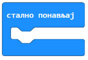

Управљање понашањем дигиталног уређаја
======================================

.. |ob| image:: ../../_images/mb_ob.png
            :width: 120px

.. |pauza| image:: ../../_images/mb_pauza.png
            :width: 120px

.. infonote::

 .. image:: ../../_images/robot31.png
    :height: 120
    :align: left

 Када урадиш све задатке и одговориш на сва питања у лекцији знаћеш да креираш 
 програм у визуелном програмском језику којим управљаш понашањем расположивог 
 физичког дигиталног уређаја.

|

Микробит је једноставан уређај који није тешко програмирати. На забаван и креативан 
начин можеш да користиш овај уређај за прављење различитих предмета или уређаја 
који ти могу помоћу у свакодневном животу. На пример, аларм, термометар, педометар, …

Изглед новог микробит уређаја 

|

|

Изглед старог микробит уређаја

|

Микробит се састоји од следећих физичких компоненти:

|

Мајкрософт МејкKод (енг. *Microsoft MakeCode*) је окружење на интернету које ћеш
 користити за учење програмирања микробит уређај. На доњој слици приказано је 
 радно окружење за програмирање микробит уређаја. 

Уз помоћ учитеља или учитељице покрени интернет прегледач и у адресну линију унеси 
адресу `makecode.microbit.org <https://makecode.microbit.org/>`_. Oтвориће се окружење 
у коме можеш да програмираш микробит. Пре него што покренеш нови пројекат (3), 
подеси језик окружења на српски језик.

Кликни на мали бели зупчаник у горњем десном углу (1). Кликни на *Language* да 
изабереш језик (2). 

|

У листи пронађи српски.

|

Сада можеш да покренеш свој први пројекат.

Отвара се радно окружење за програмирање микробит уређаја.

|

|

.. questionnote::

 Направи програм који ће на екрану микробит уређаја приказивати поруку „Digitalni svet!“. 

**Решавање задатка**

|

**Алгоритам**

1. корак: Прикажи поруку „Digitalni svet!“.

|

**Програмирање**
 
На интернет страници https://makecode.microbit.org  нов пројекат покрећеш кликом на дугме Нови пројекат |np|

У простор за програмирање у блок |poc| превуци блок |pt| из категорије |ob|. У простор за текст, уместо текста „Hello“, унеси жељени текст Digitalni svet!. 

.. infonote::

 Текст који се уноси мора бити написан латиничким писмом.

Изглед програма: 

**Тестирање**

Постоје две могућности за тестирање програма: 

­- да програм покренеш у симулатору, кликом на дугме |play| које се налази испод 
прозора симулатора.
­	
- да га пребациш на микробит. 

-----

.. infonote::

 Када желиш да пребациш програм на микробит уређај, увек тражи помоћ учитеља или учитељице.

.. suggestionnote::

 Микробит уређај може да чува само један програм. Уређај ће извршавати одређени 
 програм све док се не унесе нови програм.

Након тестирања програма можеш да закључиш да микробит „реагује“ баш онако како смо и желели. На екрану микробит уређаја се приказује текст „Digitalni svet!“. 

.. mchoice:: p334а
   :hide_labels:
   :answer_a: Ниједном
   :answer_b: Једном
   :answer_c: Два пута
   :answer_d: Бесконачно много пута
   :correct: b

    Колико пута ће се извршити програм којим приказујете текст *Digitalni svet*!? Означи кружић испред тачног одговора.
    

Уз помоћ учитеља или учитељице покрени радно окружење за програмирање микробит уређаја.

Поређај блокове тако да на екрану микробит уређаја буде приказано твоје име и име 
школе у коју идеш. 

**Разумевање проблема**

У радној свесци на страници **XX** напиши алгоритам којим ће бити приказано твоје 
име и школа у коју идеш.

**Програмирање**

Поређај блокове наредби на основу написаног алгоритма.

**Тестирање програма**

Тестирај програм коришћењем симулатора или физичког уређаја. 

.. questionnote::

 У радној свесци на страници **XX** напиши своје запажање о раду програма.

Упореди своје решење са својим друговима и другарицама. 

|

.. image:: ../../_images/robot23.png
    :height: 200
    :align: right

--------------

**Домаћи задатак**

|

Уз помоћ родитеља или блиске одрасле особе покрени радно окружење за програмирање микробит уређаја.

-------------

.. questionnote::

 Поређај блокове тако да на екрану микробит уређаја буде приказано насмејано лице, 
 а затим, након 3 секунде, љуто лице.

|

**Разумевање проблема**

У радној свесци на страници **XX** напиши алгоритам којим ће бити приказано 
насмејано лице, а затим љуто лице.

**Програмирање**

Поређај блокове наредби на основу написаног алгоритма. Из категорије |ob| користи 
блокове |pi| за приказ сличица насмејаног и љутог лица. У истој категорији се 
налази блок |pauza| којим се дефинише време, тачније пауза од на пример, 3 секунде (3000 милисекунде је 3 секунде). 

**Тестирање програма**

Тестирај програм коришћењем симулатора или физичког уређаја. 
У радној свесци на страници **XX** напиши своје запажање о раду програма:

--------------

У природи постоје процеси који се непрестано или с времена на време понављају. 
За решавање појединих задатака, неопходно да се неки делови програма понове више пута. 
Такви програми се називају циклични програми или програми понављања. 

|

У следеће блокове могу да се умећу други блокови наредби које могу да се понове:

|

- одређени број пута: |ponovi|
 
Овај блок се налази у катагорији |petlje|. Користиш га када унапред знаш тачан број понављања.

|

- бесконачно (непрестано, све док корисник не заустави програм): |sp|

То је један од најчешће коришћених блокова, који се налази у категорији |ob|. 
Његово извршавање зауставља се кликом на дугме за престанак рада програма (|stop|). 
 
-----------------

Уз помоћ учитеља или учитељице покрени радно окружење за програмирање микробит уређаја.

.. questionnote::

 Потребно је да направиш апликацију која ће ти помоћи да побољшаш своју физичку активност. Поређај блокове који ће се понављати.

**Разумевање проблема**

**Алгоритам**

Корак 1. Понављај наредбе

Корак 1. Прикажи слику усправног тела

Корак 2. Чекај 2 секунде

Корак 2. Прикажи слику тела у раскораку

**Програмирање**

Поређај блокове наредби на основу написаног алгоритма. Из категорије |ob| користи 
блок |sp| помоћу кога се понављају блокови бесконачно много пута, затим блок |pd| за 
приказ сличица. Кликом на квадратиће попуњаваш га и креираш нову слику. 
У истој категорији се налази блок |pauza|, којим се дефинише време, 
тачније пауза од на пример, 2 секунде (2000 милисекунди је 2 секунде). 

|

**Изглед програма.**

|

**Тестирање програма**

Тестирај програм коришћењем симулатора или физичког уређаја.

У радној свесци на страници **XX** напиши своје запажање о раду програма.

.. questionnote::

 Унапреди програм тако што ћеш направити да се вежбе понављају тачан број пута. 
 Сваку вежбу радиш 15 пута. 
 
**Мала помоћ**: Употреби блок |ponovi| који се налази у категорији |petlje|. Користиш га када унапред знаш тачан број понављања 
(у нашем случају 15).

Упореди своје решење са решењем твојих другова и другарица.

-----

.. questionnote::
 
 Допуни горњи програм са још две вежбе. Између сваке вежбе је пауза од 5 секунди.

**Разумевање проблема**

У радној свесци на страници **XX** напиши алгоритам којим ћеш унапредити програм за вежбање.

**Програмирање**

Покрени радно окружење и поређај блокове на основу алгоритма.

**Тестирање програма**

Тестирај програм коришћењем симулатора или физичког уређаја. 

.. questionnote::

 У радној свесци на страници **XX** напиши своје запажање о раду програма.

Упореди своје решење са решењем својих другова и другарица.

|

.. image:: ../../_images/robot23.png
    :height: 200
    :align: right

--------------

**Домаћи задатак**

|

Уз помоћ родитеља или блиске одрасле особе покрени радно окружење за програмирање 
микробит уређаја. На интернет страници https://makecode.microbit.org  нов пројекат 
покрећеш кликом на дугме Нови пројекат |np|. 

.. questionnote::

 Напиши програм помоћу кога ћеш на микробит уређају приказати име својих родитеља и 
 колико имају година. 
 
**Мала помоћ**: Из категорије |ob| превлачиш блок |pb| којим се приказује број на 
екрану микробит уређаја.

**Разумевање проблема**

У радној свесци на страници **XX** напиши алгоритам којим ће бити приказана имена твојих родитеља и њихове године.

**Програмирање**

Покрени радно окружење и поређај блокове на основу алгоритма.

**Тестирање програма**

Тестирај програм коришћењем симулатора или физичког уређаја. 

.. questionnote::

 У радној свесци на страници **XX** напиши своје запажање о раду програма.
