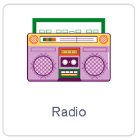
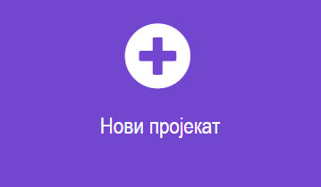
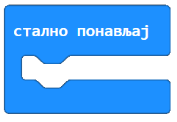
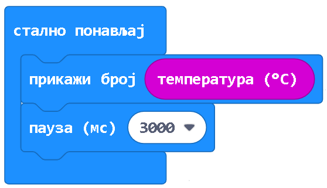

Алгоритамски начин размишљања - систематизација
===============================================

.. |kv| image:: ../../_images/kv.png
            :width: 15px

.. infonote::

 .. image:: ../../_images/robot31.png
    :height: 120
    :align: left

 Поред задатака помоћу којих ћеш да провериш своје знање о програмима који садрже 
 понављања и услове, а којима се решавају различити задаци, на крају ове лекције 
 имаћеш прилику да самопроцениш своје знање о поступцима који садрже понављања 
 одређених радњи и услове, о креирању програма понављања и гранања у  визуелном 
 програмском језику, о уочавању и исправљању грешака у тим програмима, провери 
 исправности програма и исправљању грешака, као и  томе како програми утичу на 
 понашање дигиталних уређаја.

|

.. questionnote::

 Уз помоћ учитеља и учитељице покрени Скреч радно окружење. Креирај програм којим се пет пута понавља ритам *Scratch beatbox* и *Scratch beatbox2*.

**Решавање задатка**

|

**Алгоритам**

Корак 1. Понављај пет пута.

Корак 1. Пуштај звук *Scratch beatbox*.

Корак 2. Чекај 1 секунду.

Корак 3. Пуштај звук *Scratch beatbox2*.

|

**Припрема** 

Одабери лик |radio|.

|

**Програмирање**

Поређај блокове на основу свог алгоритма.
Из категорије |zvuk| превуци блок |reprodukuj| који се користи за пуштање звука.

**Тестирање**

Притисни зелену заставицу |zastava|.

..
   .. questionnote::

 У радној свесци на страници XX напиши своје запажање о раду програма.

.. Упореди своје решење са решењем својих другова и другарица.

--------------------

.. questionnote::

 Уз помоћ учитеља или учитељице покрени радно окружење за програмирање микробит уређаја. 
 Потребно је да поређаш блокове тако да се на екрану микробит уређаја приказује 
 колика је тренутна температура у просторији.

У решавању овог проблема користиш функцију микробит уређаја помоћу које је могуће 
измерити температуру.

**Разумевање проблема** 

Када корисник протресе микробит уређај, на екрану микробит уређаја 
треба да се покаже вредност измерене температуре.

**Алгоритам**

Корак 1. Понављај заувек

Корак 1. Прикажи температуру

Корак 2. Пауза од 3 секунде

**Програмирање**

Уз помоћ учитеља или учитељице на интернет страници https://makecode.microbit.org  
покрећеш нов пројекат кликом на дугме **Нови пројекат** |np|.  
У блоку |sp| који се налази у категорији |ob|, поређај блокове наредби на основу 
написаног алгоритма.

Из категорије |ob| користи блокове |pb| којим се приказује вредности температуре на 
екрану микробит уређаја. У простор за текст из категорије превуци блок |temperatura| 
који „чува“ вредност измерене вредности температуре.

У истој категорији се налази блок |pauza| којим се дефинише време, тачније пауза од 
на пример, 3 секунде (3000 милисекунде је 3 секунде). 

|

**Изглед програма:**

**Тестирање**

Након тестирања програма можемо да закључимо да микробит приказује температуру у просторији. 

-------------------

Прошли сте целокупан курс Дигиталног света 2! Честитамо ти! Био/ла си сјајан/а и 
веома вредан/а. Сигурно си пуно тога научио/ла или додатно увежбао/ла! 
Сада смо хтели да ти помогнемо да још једном процениш колико тога си научио/ла.

Пажљиво прочитај тврђења. У радној свесци обој квадратић зеленом бојом испред 
тврђења које потврђује да то знаш од пре, наранџастом бојом ако о томе још желиш 
да учиш, и црвеном бојом ако је за тебе све било ново и сада си о томе научио/ла.

|

.. csv-table:: 
 :widths: auto
 :align: left

  "|kv|", "Умем својим речима да објасни појам алгоритам."
  "|kv|", "Знам алгоритамски да представим поступак који садржи понављања одређених радњи."
  "|kv|", "Креирам једноставне рачунарске програме у визуелном програмском језику."
  "|kv|", "Умем сам да анализирам једноставан програм креиран у визуелном програмском језику. "
  "|kv|", "Знам да објасним шта и на који начин ради једноставан програм."
  "|kv|", "Умем сам да уочим и исправим грешку у једноставном програму, проверим ваљаност новог решења и по потреби га додатно поправи."
  "|kv|", "Знам да алгоритам одређује понашање дигиталног уређаја."
  "|kv|", "Знам да креирам програм који управља понашањем физичког дигиталног уређаја."

